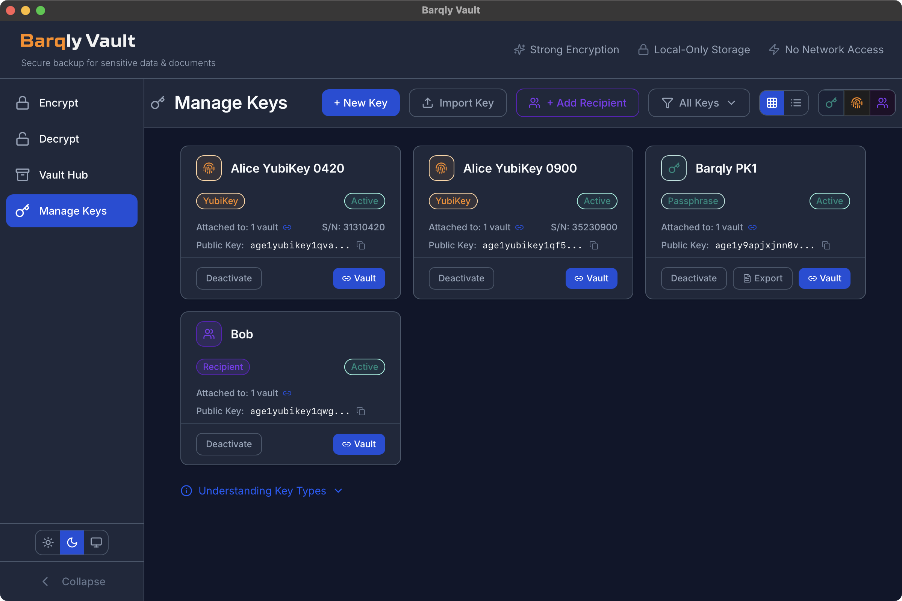
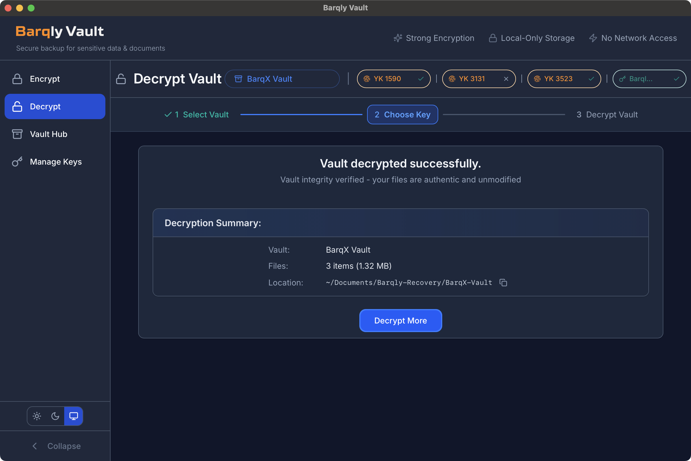

# Barqly Vault

**Status:** v0.2.0 (R2 Release) – offline-first, cross-platform desktop application with hardware-key (YubiKey) support.

Barqly Vault is an **offline-first, open-source desktop application** for encrypting and decrypting sensitive documents — such as Bitcoin wallet descriptors, manifests, and configuration files — using multiple keys (**YubiKeys and/or passphrases**).

---

## ⚠️ Disclaimer
Barqly Vault is **not intended for direct storage of Bitcoin private keys or seed phrases**.  
It is designed to protect related files (e.g., wallet descriptors, configuration manifests, or vault backups) in a simple and auditable way.

---

## 🚀 Quick Start
1. Download the latest release from **[barqly.com/downloads](https://barqly.com/downloads)**.
2. Run the app and select files or folders to encrypt.
3. Choose or create a vault and attach up to 4 keys in any combination (YubiKey or passphrase). Hardware keys are recommended.
4. Export your recovery bundle (`RECOVERY.txt`) and store it safely offline.

---

## 🖼️ Screenshots

### Manage Keys

### Create New Key

### Vault Hub

### Encrypt Files

### Encryption Success

### Decrypt Files

### Decryption Success

---

## 🔐 Why Barqly Vault
- **Offline-first:** All operations are local.  
- **Multi-key model:** Use hardware keys (YubiKey), passphrases, or both.  
- **Cross-platform:** Desktop app for macOS, Linux, and Windows.  
- **Open source:** Transparent codebase and workflows.  

---

## ✨ Features

### Encryption & Security
- **Age encryption standard:** Uses [age](https://github.com/FiloSottile/age) (ChaCha20-Poly1305 + X25519) for modern, auditable encryption.
- **Multi-key encryption:** Each vault supports up to 4 keys in any combination (YubiKey and/or passphrase).
- **Hardware security:** YubiKey support with multi-device detection and management.
- **No network calls:** All operations are local-only; encrypted files never leave your control.

### Key Management
- **Key export/import:** Backup and restore individual keys across machines using standard .agekey.enc format.
- **Key lifecycle tracking:** NIST-aligned states (PreActivation → Active → Suspended → Deactivated).
- **Disaster recovery mode:** Auto-detects when vault metadata is missing; restores from encrypted bundle.

### User Experience
- **Batch encryption:** Encrypt multiple files and folders in a single operation.
- **Integrity verification:** Each vault includes a manifest with file hashes for verification.
- **Portable outputs:** Store encrypted vaults anywhere (USB, cloud, offline backups).
- **Theme support:** Light, dark, or system-based themes.  

---

## 🧠 Development Philosophy
Barqly Vault is developed using **AI-Driven Development (ADD)** — an approach that combines traditional coding practices with AI-assisted design and documentation, powered by the [ZenAI Programming framework](https://github.com/inauman/zenai-programming-rituals).

- Clear project documentation in [`/docs`](docs/) for both humans and AI agents.
- Fully compatible with traditional toolchains (`make`, `npm`, `cargo`).
- AI-aware context for contributors in [`/docs/engineering`](docs/engineering/).

See [CONTRIBUTING.md](CONTRIBUTING.md) for more details.

---

## 🤝 Contributing
Contributions are welcome — open an issue or PR, and please review [SECURITY.md](SECURITY.md) for responsible disclosure guidelines.

---

## 🪐 Contact & Feedback

Barqly Vault is an open-source project maintained by **Mohammad Nauman**.  
If you discover a bug, have a question, or would like to share feedback, you can reach out through:

- **Email:** [nauman@barqly.com](mailto:nauman@barqly.com) 
- **Nostr (@Barqly):** [`npub1y9y7cje0yx26aty28lmr3tr09fgwuym90uslef7e0475m36a97ysr94l54`](nostr:npub1y9y7cje0yx26aty28lmr3tr09fgwuym90uslef7e0475m36a97ysr94l54)  
  ([View on Nostr Web](https://njump.me/npub1y9y7cje0yx26aty28lmr3tr09fgwuym90uslef7e0475m36a97ysr94l54)) 
- **X (Twitter)** [@BarqlyHQ](https://x.com/BarqlyHQ)  
- **GitHub Issues:** [github.com/Barqly/barqly-vault/issues](https://github.com/Barqly/barqly-vault/issues)  

*Responses are handled personally and as time permits.*  
*Barqly Vault is provided on an open-source, best-effort basis — community collaboration and improvements are always welcome.*

---

## ⚖️ License
MIT © 2025 Barqly

---

  <em>Offline-first, open-source file encryption for desktop.</em>

