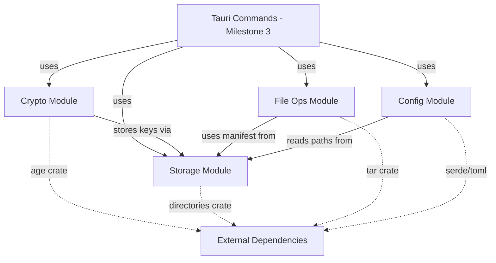

Perfect! Thank you for that clarity. As your architect, I recommend using **platform-native conventions** for the best user experience and consistency:

- **macOS**: `~/Library/Application Support/barqly-vault/` (native macOS convention)
- **Windows**: `%APPDATA%\barqly-vault\`
- **Linux**: `~/.config/barqly-vault/`

This approach:
- ‚úÖ **Follows platform best practices** - Users find files where they expect them
- ‚úÖ **Simplifies support** - "Look in your Application Support folder" is clear
- ‚úÖ **Maintains consistency** - Each OS follows its own standard
- ‚úÖ **Easy for engineers** - Use the `directories` crate which handles this automatically

Using `~/.config/` on macOS would be confusing since macOS users expect app data in Application Support, not hidden Unix directories.

Now I'll create the comprehensive Milestone 2 blueprint with this decision incorporated. The blueprint will be structured, clear, and ready for any engineer to implement.

---

# üìò Milestone 2: Core Rust Modules - Implementation Blueprint

## 🎯 Executive Summary

This blueprint provides a complete, implementable specification for Milestone 2 of Barqly Vault. It defines four core Rust modules (crypto, storage, file_ops, config) with detailed interfaces, security considerations, and testing strategies. Any competent Rust engineer should be able to implement these modules following this blueprint without making architectural decisions.

## üìã Prerequisites

Before starting implementation:
1. Ensure all Milestone 1 tasks are complete
2. Verify development environment:
   - Rust 1.87.0+ (stable)
   - Node.js v22.17.0 LTS
   - Tauri v2.x
3. Run validation setup: `./scripts/setup-hooks.sh`
4. Review security principles in `zenai-programming-rituals/zenai/security_principles.md`

---

## 🏗️ Module Architecture Overview



---

## 📦 Module 2.1: Crypto Module

### Purpose
Provides secure encryption/decryption operations using the `age` encryption standard with passphrase-protected private keys.

### File Structure
```
src-tauri/src/crypto/
├── mod.rs           # Public module interface
├── age_ops.rs       # Core age encryption operations
├── key_mgmt.rs      # Key generation and handling
└── errors.rs        # Crypto-specific error types
```

### Dependencies to Add to Cargo.toml
```toml
[dependencies]
age = "0.10"
secrecy = "0.8"  # For secure string handling
zeroize = "1.8"
thiserror = "1.0"
rand = "0.8"
```

### Module Interface (crypto/mod.rs)
Ran tool
### Detailed Implementation Specification

#### 2.1.1: Core Types (crypto/mod.rs)
```rust
use secrecy::{ExposeSecret, SecretString};
use zeroize::Zeroize;

/// A keypair containing both public and private keys
pub struct KeyPair {
    pub public_key: PublicKey,
    pub private_key: PrivateKey,
}

/// A public key used for encryption
#[derive(Clone, Debug)]
pub struct PublicKey(String);

/// A private key used for decryption (automatically zeroed on drop)
pub struct PrivateKey(SecretString);

impl Drop for PrivateKey {
    fn drop(&mut self) {
        // SecretString already handles zeroization
    }
}

/// Result type for crypto operations
pub type Result<T> = std::result::Result<T, CryptoError>;
```

#### 2.1.2: Key Generation (crypto/key_mgmt.rs)
```rust
/// Generate a new age keypair
/// 
/// # Security
/// - Uses age's X25519 key generation
/// - Private key is immediately wrapped in SecretString
/// 
/// # Example
/// ```
/// let keypair = generate_keypair()?;
/// println!("Public key: {}", keypair.public_key);
/// ```
pub fn generate_keypair() -> Result<KeyPair> {
    // Implementation:
    // 1. Use age::x25519::Identity::generate()
    // 2. Extract public key as string
    // 3. Wrap private key in SecretString
    // 4. Return KeyPair
}

/// Encrypt a private key with a passphrase
/// 
/// # Arguments
/// * `private_key` - The private key to encrypt
/// * `passphrase` - The passphrase for encryption
/// 
/// # Returns
/// Encrypted bytes suitable for file storage
/// 
/// # Security
/// - Uses age's native passphrase encryption
/// - Passphrase is zeroized after use
pub fn encrypt_private_key(
    private_key: &PrivateKey,
    passphrase: SecretString,
) -> Result<Vec<u8>> {
    // Implementation:
    // 1. Create age::Encryptor with scrypt passphrase
    // 2. Encrypt the private key string
    // 3. Return encrypted bytes
}

/// Decrypt a private key with a passphrase
/// 
/// # Security
/// - Validates passphrase before returning key
/// - Returns error on wrong passphrase
pub fn decrypt_private_key(
    encrypted_key: &[u8],
    passphrase: SecretString,
) -> Result<PrivateKey> {
    // Implementation:
    // 1. Create age::Decryptor with passphrase
    // 2. Decrypt the bytes
    // 3. Validate the result is a valid age key
    // 4. Wrap in PrivateKey type
}
```

#### 2.1.3: Encryption Operations (crypto/age_ops.rs)
```rust
/// Encrypt data using a public key
/// 
/// # Arguments
/// * `data` - The data to encrypt
/// * `recipient` - The public key of the recipient
/// 
/// # Returns
/// Encrypted bytes in age format
/// 
/// # Security
/// - Uses age's streaming encryption
/// - Suitable for large files
pub fn encrypt_data(data: &[u8], recipient: &PublicKey) -> Result<Vec<u8>> {
    // Implementation:
    // 1. Parse recipient as age::x25519::Recipient
    // 2. Create age::Encryptor with recipient
    // 3. Use armor(false) for binary output
    // 4. Stream encrypt the data
    // 5. Return encrypted bytes
}

/// Decrypt data using a private key
/// 
/// # Security
/// - Validates age format before decryption
/// - Returns specific error for wrong key
pub fn decrypt_data(encrypted_data: &[u8], private_key: &PrivateKey) -> Result<Vec<u8>> {
    // Implementation:
    // 1. Parse private_key as age::x25519::Identity
    // 2. Create age::Decryptor
    // 3. Decrypt with the identity
    // 4. Return decrypted bytes
}
```

#### 2.1.4: Error Types (crypto/errors.rs)
```rust
use thiserror::Error;

#[derive(Error, Debug)]
pub enum CryptoError {
    #[error("Invalid key format: {0}")]
    InvalidKeyFormat(String),
    
    #[error("Encryption failed: {0}")]
    EncryptionFailed(String),
    
    #[error("Decryption failed: {0}")]
    DecryptionFailed(String),
    
    #[error("Wrong passphrase")]
    WrongPassphrase,
    
    #[error("Invalid recipient key")]
    InvalidRecipient,
    
    #[error("IO error: {0}")]
    IoError(#[from] std::io::Error),
    
    #[error("Age library error: {0}")]
    AgeError(String),
}
```

### Testing Requirements

#### Unit Tests (crypto/mod.rs - test module)
```rust
#[cfg(test)]
mod tests {
    use super::*;
    
    #[test]
    fn test_keypair_generation() {
        // Test successful generation
        // Verify public key format (age1...)
        // Verify private key is properly wrapped
    }
    
    #[test]
    fn test_key_encryption_decryption() {
        // Generate keypair
        // Encrypt private key with passphrase
        // Decrypt with same passphrase - should succeed
        // Decrypt with wrong passphrase - should fail
    }
    
    #[test]
    fn test_data_encryption_decryption() {
        // Test with small data (< 1KB)
        // Test with medium data (1MB)
        // Test with large data (10MB)
        // Verify round-trip encryption/decryption
    }
    
    #[test]
    fn test_wrong_key_decryption() {
        // Encrypt with key A
        // Try to decrypt with key B
        // Should fail with specific error
    }
    
    #[test]
    fn test_memory_zeroization() {
        // Create private key in scope
        // Let it drop
        // Attempt to find key material in memory (best effort)
    }
}
```

#### Integration Tests (tests/crypto_integration.rs)
```rust
#[test]
fn test_full_encryption_workflow() {
    // 1. Generate keypair
    // 2. Save encrypted private key to temp file
    // 3. Load and decrypt private key
    // 4. Encrypt test file
    // 5. Decrypt test file
    // 6. Verify contents match
}
```

---

## 📁 Module 2.2: Storage Module

### Purpose
Manages secure storage of encrypted keys and application data using platform-specific directories.

### File Structure
```
src-tauri/src/storage/
├── mod.rs           # Public module interface
├── paths.rs         # Cross-platform path handling
├── key_store.rs     # Key file operations
└── errors.rs        # Storage-specific errors
```

### Dependencies to Add
```toml
[dependencies]
directories = "5.0"
```

### Module Interface (storage/mod.rs)
Ran tool
### Detailed Implementation Specification

#### 2.2.1: Path Management (storage/paths.rs)
```rust
use directories::ProjectDirs;
use std::path::PathBuf;

/// Get the platform-specific application directory
/// 
/// Returns:
/// - macOS: ~/Library/Application Support/barqly-vault/
/// - Windows: %APPDATA%\barqly-vault\
/// - Linux: ~/.config/barqly-vault/
pub fn get_app_dir() -> Result<PathBuf> {
    // Implementation:
    // 1. Use ProjectDirs::from("com", "barqly", "vault")
    // 2. Get config_dir() from ProjectDirs
    // 3. Create directory if it doesn't exist
    // 4. Return the path
}

/// Get the keys subdirectory
pub fn get_keys_dir() -> Result<PathBuf> {
    // Implementation:
    // 1. Get app_dir
    // 2. Append "keys" subdirectory
    // 3. Create if doesn't exist
    // 4. Return path
}

/// Get the logs directory
pub fn get_logs_dir() -> Result<PathBuf> {
    // Implementation similar to keys_dir but for "logs"
}

/// Ensure a directory exists with proper permissions
/// 
/// # Security
/// - Sets restrictive permissions (700) on Unix systems
/// - Validates path doesn't contain symlinks
fn ensure_dir_exists(path: &Path) -> Result<()> {
    // Implementation:
    // 1. Create dir_all if needed
    // 2. On Unix: set permissions to 0o700
    // 3. Verify path is not a symlink
}
```

#### 2.2.2: Key Storage (storage/key_store.rs)
```rust
use chrono::{DateTime, Utc};

/// Information about a stored key
#[derive(Debug, Clone, Serialize, Deserialize)]
pub struct KeyInfo {
    pub label: String,
    pub created_at: DateTime<Utc>,
    pub file_path: PathBuf,
    pub public_key: Option<String>, // Cached for performance
}

/// Save an encrypted private key
/// 
/// # Arguments
/// * `label` - User-friendly label for the key
/// * `encrypted_key` - The encrypted key bytes
/// * `public_key` - Optional public key to cache
/// 
/// # Returns
/// Path where the key was saved
/// 
/// # Security
/// - Validates label doesn't contain path separators
/// - Sets restrictive file permissions
pub fn save_encrypted_key(
    label: &str,
    encrypted_key: &[u8],
    public_key: Option<&str>,
) -> Result<PathBuf> {
    // Implementation:
    // 1. Validate label (no /, \, .., etc.)
    // 2. Create filename: format!("barqly-{}.agekey.enc", label)
    // 3. Get keys_dir path
    // 4. Write encrypted_key to file
    // 5. Set permissions to 0o600 on Unix
    // 6. Create metadata file with KeyInfo
    // 7. Return full path
}

/// List all available keys
/// 
/// # Returns
/// Vector of KeyInfo for all stored keys
pub fn list_keys() -> Result<Vec<KeyInfo>> {
    // Implementation:
    // 1. Get keys_dir
    // 2. List all *.agekey.enc files
    // 3. For each file:
    //    - Extract label from filename
    //    - Read metadata if available
    //    - Get file creation time
    // 4. Sort by creation time (newest first)
    // 5. Return vector
}

/// Load an encrypted key by label
/// 
/// # Security
/// - Validates file hasn't been tampered with
/// - Checks file permissions before reading
pub fn load_encrypted_key(label: &str) -> Result<Vec<u8>> {
    // Implementation:
    // 1. Validate label
    // 2. Construct expected filename
    // 3. Check file exists and permissions
    // 4. Read and return bytes
}

/// Delete a key by label
/// 
/// # Security
/// - Overwrites file before deletion on supported platforms
pub fn delete_key(label: &str) -> Result<()> {
    // Implementation:
    // 1. Validate label
    // 2. Find key file and metadata
    // 3. Overwrite with random data (best effort)
    // 4. Delete files
}
```

#### 2.2.3: Error Types (storage/errors.rs)
```rust
#[derive(Error, Debug)]
pub enum StorageError {
    #[error("Invalid key label: {0}")]
    InvalidLabel(String),
    
    #[error("Key not found: {0}")]
    KeyNotFound(String),
    
    #[error("Key already exists: {0}")]
    KeyAlreadyExists(String),
    
    #[error("Permission denied: {0}")]
    PermissionDenied(PathBuf),
    
    #[error("IO error: {0}")]
    IoError(#[from] std::io::Error),
    
    #[error("Path traversal attempt detected")]
    PathTraversal,
}
```

### Testing Requirements

#### Unit Tests
```rust
#[cfg(test)]
mod tests {
    #[test]
    fn test_platform_paths() {
        // Verify correct paths for current platform
        // Check directory creation
        // Verify permissions (Unix only)
    }
    
    #[test]
    fn test_label_validation() {
        // Test valid labels
        // Test invalid labels (/, \, .., etc.)
        // Test Unicode labels
    }
    
    #[test]
    fn test_key_storage_lifecycle() {
        // Save key
        // List keys - verify it appears
        // Load key - verify contents
        // Delete key
        // List keys - verify it's gone
    }
}
```

---

## 📄 Module 2.3: File Operations

### Purpose
Handles file/folder selection, staging, archiving, and manifest generation.

### File Structure
```
src-tauri/src/file_ops/
├── mod.rs           # Public module interface
├── staging.rs       # Staging area management
├── archive.rs       # TAR archive operations
├── manifest.rs      # Manifest generation
└── errors.rs        # File operation errors
```

### Dependencies to Add
```toml
[dependencies]
tar = "0.4"
sha2 = "0.10"
hex = "0.4"
tempfile = "3.8"
walkdir = "2.4"
```

### Module Interface (file_ops/mod.rs)
Ran tool
### Detailed Implementation Specification

#### 2.3.1: Staging Operations (file_ops/staging.rs)
```rust
use tempfile::TempDir;

/// Staging area for preparing files for encryption
pub struct StagingArea {
    temp_dir: TempDir,
    manifest: ManifestBuilder,
}

impl StagingArea {
    /// Create a new staging area
    /// 
    /// # Security
    /// - Creates directory with restrictive permissions
    /// - Uses system temp directory
    pub fn new() -> Result<Self> {
        // Implementation:
        // 1. Create TempDir with prefix "barqly-staging-"
        // 2. Initialize empty ManifestBuilder
        // 3. Return StagingArea
    }
    
    /// Stage individual files
    /// 
    /// # Arguments
    /// * `files` - Paths to files to stage
    /// 
    /// # Security
    /// - Validates files exist and are readable
    /// - Preserves file metadata
    /// - Calculates SHA-256 for manifest
    pub fn stage_files(&mut self, files: &[PathBuf]) -> Result<()> {
        // Implementation:
        // 1. For each file:
        //    - Validate it exists and is a file
        //    - Copy to staging dir (preserve name)
        //    - Calculate SHA-256 hash
        //    - Add to manifest
        // 2. Return error if any file fails
    }
    
    /// Stage an entire folder
    /// 
    /// # Security
    /// - Follows symlinks based on config
    /// - Preserves directory structure
    pub fn stage_folder(&mut self, folder: &Path) -> Result<()> {
        // Implementation:
        // 1. Walk directory tree
        // 2. For each file:
        //    - Create relative path structure
        //    - Copy file preserving structure
        //    - Calculate hash
        //    - Add to manifest
        // 3. Skip hidden files based on config
    }
    
    /// Get the staging directory path
    pub fn path(&self) -> &Path {
        self.temp_dir.path()
    }
    
    /// Finalize and get the manifest
    pub fn finalize_manifest(self) -> Manifest {
        self.manifest.build()
    }
}

/// Automatically clean up on drop
impl Drop for StagingArea {
    fn drop(&mut self) {
        // TempDir automatically cleans up
    }
}
```

#### 2.3.2: Archive Operations (file_ops/archive.rs)
```rust
/// Create a TAR archive from a directory
/// 
/// # Arguments
/// * `source_dir` - Directory to archive
/// 
/// # Returns
/// Bytes of the TAR archive
/// 
/// # Security
/// - Validates no path traversal in archive
/// - Sets safe permissions in archive
pub fn create_tar_archive(source_dir: &Path) -> Result<Vec<u8>> {
    // Implementation:
    // 1. Create tar::Builder with Vec<u8>
    // 2. Walk source_dir
    // 3. For each file:
    //    - Create relative path
    //    - Validate no ".." in path
    //    - Add to archive with metadata
    // 4. Finish and return bytes
}

/// Extract a TAR archive to a directory
/// 
/// # Security
/// - Validates archive entries for path traversal
/// - Sets safe permissions on extracted files
/// - Limits extraction size to prevent bombs
pub fn extract_tar_archive(
    archive_data: &[u8],
    destination: &Path,
    max_size: Option<u64>,
) -> Result<()> {
    // Implementation:
    // 1. Create tar::Archive from bytes
    // 2. For each entry:
    //    - Validate path (no .., absolute paths)
    //    - Check cumulative size if max_size set
    //    - Extract with safe permissions
    // 3. Return error on any security violation
}
```

#### 2.3.3: Manifest Generation (file_ops/manifest.rs)
```rust
use serde::{Serialize, Deserialize};
use sha2::{Sha256, Digest};

/// Manifest containing file metadata and hashes
#[derive(Debug, Serialize, Deserialize)]
pub struct Manifest {
    pub version: String,
    pub created_at: DateTime<Utc>,
    pub files: Vec<FileEntry>,
    pub total_size: u64,
}

/// Individual file entry in manifest
#[derive(Debug, Serialize, Deserialize)]
pub struct FileEntry {
    pub path: String,
    pub size: u64,
    pub sha256: String,
    pub modified: DateTime<Utc>,
}

/// Builder for creating manifests
pub struct ManifestBuilder {
    files: Vec<FileEntry>,
    total_size: u64,
}

impl ManifestBuilder {
    pub fn new() -> Self {
        Self {
            files: Vec::new(),
            total_size: 0,
        }
    }
    
    /// Add a file to the manifest
    pub fn add_file(
        &mut self,
        path: &Path,
        content: &[u8],
    ) -> Result<()> {
        // Implementation:
        // 1. Calculate SHA-256 of content
        // 2. Get file metadata
        // 3. Create FileEntry
        // 4. Add to files vec
        // 5. Update total_size
    }
    
    /// Build the final manifest
    pub fn build(self) -> Manifest {
        Manifest {
            version: "1.0".to_string(),
            created_at: Utc::now(),
            files: self.files,
            total_size: self.total_size,
        }
    }
}

/// Verify files against a manifest
pub fn verify_manifest(
    manifest: &Manifest,
    base_path: &Path,
) -> Result<Vec<VerificationError>> {
    // Implementation:
    // 1. For each file in manifest:
    //    - Check it exists
    //    - Calculate current hash
    //    - Compare with manifest hash
    // 2. Return list of any mismatches
}
```

### Testing Requirements

#### Unit Tests
```rust
#[cfg(test)]
mod tests {
    #[test]
    fn test_staging_area_creation() {
        // Create staging area
        // Verify temp directory exists
        // Verify cleanup on drop
    }
    
    #[test]
    fn test_file_staging() {
        // Stage individual files
        // Verify they're copied correctly
        // Verify manifest entries
    }
    
    #[test]
    fn test_folder_staging() {
        // Stage folder with subdirectories
        // Verify structure preserved
        // Verify all files included
    }
    
    #[test]
    fn test_tar_archive_roundtrip() {
        // Create archive from directory
        // Extract to new location
        // Verify contents match
    }
    
    #[test]
    fn test_path_traversal_protection() {
        // Try to create archive with ../.. paths
        // Try to extract archive with malicious paths
        // Both should fail safely
    }
}
```

---

## ⚙️ Module 2.4: Config Module

### Purpose
Manages application configuration, preferences, and cached data.

### File Structure
```
src-tauri/src/config/
├── mod.rs           # Public module interface
├── app_config.rs    # Application configuration
├── cache.rs         # Recent files/folders cache
└── errors.rs        # Config-specific errors
```

### Dependencies to Add
```toml
[dependencies]
toml = "0.8"
```

### Module Interface (config/mod.rs)
Ran tool
### Detailed Implementation Specification

#### 2.4.1: Application Configuration (config/app_config.rs)
```rust
/// Main application configuration
#[derive(Debug, Serialize, Deserialize, Clone)]
pub struct AppConfig {
    pub version: String,
    pub preferences: Preferences,
    pub security: SecuritySettings,
    pub ui: UiSettings,
}

/// User preferences
#[derive(Debug, Serialize, Deserialize, Clone)]
pub struct Preferences {
    pub default_key_label: Option<String>,
    pub remember_last_folder: bool,
    pub max_recent_files: usize,
    pub auto_clear_staging: bool,
}

/// Security-related settings
#[derive(Debug, Serialize, Deserialize, Clone)]
pub struct SecuritySettings {
    pub passphrase_min_length: usize,
    pub require_passphrase_confirmation: bool,
    pub max_file_size_mb: u64,
    pub follow_symlinks: bool,
}

/// UI-related settings
#[derive(Debug, Serialize, Deserialize, Clone)]
pub struct UiSettings {
    pub theme: String,
    pub show_public_key: bool,
    pub confirm_before_delete: bool,
}

impl Default for AppConfig {
    fn default() -> Self {
        Self {
            version: env!("CARGO_PKG_VERSION").to_string(),
            preferences: Preferences {
                default_key_label: None,
                remember_last_folder: true,
                max_recent_files: 10,
                auto_clear_staging: true,
            },
            security: SecuritySettings {
                passphrase_min_length: 12,
                require_passphrase_confirmation: true,
                max_file_size_mb: 100,
                follow_symlinks: false,
            },
            ui: UiSettings {
                theme: "light".to_string(),
                show_public_key: true,
                confirm_before_delete: true,
            },
        }
    }
}

/// Load configuration from disk
pub fn load() -> Result<AppConfig> {
    // Implementation:
    // 1. Get config file path (app_dir/config.toml)
    // 2. If doesn't exist, return Default::default()
    // 3. Read and parse TOML
    // 4. Validate version compatibility
    // 5. Return config
}

/// Save configuration to disk
pub fn save(config: &AppConfig) -> Result<()> {
    // Implementation:
    // 1. Get config file path
    // 2. Serialize to TOML
    // 3. Write atomically (write to temp, rename)
    // 4. Set appropriate permissions
}
```

#### 2.4.2: Recent Files Cache (config/cache.rs)
```rust
/// Recent file/folder entry
#[derive(Debug, Serialize, Deserialize, Clone)]
pub struct RecentEntry {
    pub path: PathBuf,
    pub entry_type: EntryType,
    pub last_used: DateTime<Utc>,
    pub label: Option<String>,
}

#[derive(Debug, Serialize, Deserialize, Clone)]
pub enum EntryType {
    File,
    Folder,
    EncryptedBundle,
}

/// Recent files cache
#[derive(Debug, Serialize, Deserialize, Default)]
pub struct RecentFilesCache {
    pub entries: Vec<RecentEntry>,
}

impl RecentFilesCache {
    /// Add a recent entry
    pub fn add_entry(&mut self, entry: RecentEntry, max_entries: usize) {
        // Implementation:
        // 1. Remove existing entry for same path
        // 2. Insert at beginning
        // 3. Truncate to max_entries
    }
    
    /// Get recent entries by type
    pub fn get_by_type(&self, entry_type: EntryType) -> Vec<&RecentEntry> {
        self.entries
            .iter()
            .filter(|e| e.entry_type == entry_type)
            .collect()
    }
    
    /// Clear all entries
    pub fn clear(&mut self) {
        self.entries.clear();
    }
}

/// Load recent files cache
pub fn load_recent_files() -> Result<RecentFilesCache> {
    // Implementation:
    // 1. Get cache file path (app_dir/recent.toml)
    // 2. Load or return empty cache
    // 3. Validate entries still exist
    // 4. Return cache
}

/// Save recent files cache
pub fn save_recent_files(cache: &RecentFilesCache) -> Result<()> {
    // Implementation similar to save_config
}
```

### Testing Requirements

#### Unit Tests
```rust
#[cfg(test)]
mod tests {
    #[test]
    fn test_default_config() {
        // Verify default values are sensible
        // Check all fields have defaults
    }
    
    #[test]
    fn test_config_serialization() {
        // Create config
        // Serialize to TOML
        // Deserialize back
        // Verify equality
    }
    
    #[test]
    fn test_recent_files_management() {
        // Add entries
        // Verify ordering
        // Test max entries limit
        // Test deduplication
    }
    
    #[test]
    fn test_config_migration() {
        // Test loading older config versions
        // Verify migration to current version
    }
}
```

---

## üß™ Module 2.5: Comprehensive Testing Strategy

### Test Organization
```
src-tauri/
├── src/
│   └── [modules with #[cfg(test)] mod tests]
└── tests/
    ├── common/
    │   └── mod.rs      # Shared test utilities
    ├── crypto_integration.rs
    ├── storage_integration.rs
    ├── file_ops_integration.rs
    └── full_workflow.rs
```

### Test Utilities (tests/common/mod.rs)
```rust
use tempfile::TempDir;

/// Create a test environment with temp directories
pub struct TestEnv {
    pub temp_dir: TempDir,
    pub app_dir: PathBuf,
}

impl TestEnv {
    pub fn new() -> Result<Self> {
        let temp_dir = TempDir::new()?;
        let app_dir = temp_dir.path().join("barqly-vault");
        std::fs::create_dir_all(&app_dir)?;
        Ok(Self { temp_dir, app_dir })
    }
    
    /// Create test files with known content
    pub fn create_test_files(&self, count: usize) -> Vec<PathBuf> {
        // Implementation
    }
    
    /// Generate deterministic test data
    pub fn test_data(size: usize) -> Vec<u8> {
        // Implementation
    }
}
```

### Integration Test Examples

#### Full Workflow Test (tests/full_workflow.rs)
```rust
#[test]
fn test_complete_encryption_workflow() {
    let env = TestEnv::new().unwrap();
    
    // 1. Generate and save key
    let keypair = crypto::generate_keypair().unwrap();
    let encrypted_key = crypto::encrypt_private_key(
        &keypair.private_key,
        "test-passphrase".into()
    ).unwrap();
    
    let key_path = storage::save_encrypted_key(
        "test-key",
        &encrypted_key,
        Some(&keypair.public_key.to_string())
    ).unwrap();
    
    // 2. Stage files
    let mut staging = file_ops::StagingArea::new().unwrap();
    let test_files = env.create_test_files(5);
    staging.stage_files(&test_files).unwrap();
    
    // 3. Create archive
    let archive_data = file_ops::create_tar_archive(
        staging.path()
    ).unwrap();
    
    // 4. Generate manifest
    let manifest = staging.finalize_manifest();
    
    // 5. Encrypt archive
    let encrypted_data = crypto::encrypt_data(
        &archive_data,
        &keypair.public_key
    ).unwrap();
    
    // 6. Save encrypted bundle
    let bundle_path = env.temp_dir.path().join("test.age");
    std::fs::write(&bundle_path, &encrypted_data).unwrap();
    
    // 7. Load and decrypt
    let loaded_key = storage::load_encrypted_key("test-key").unwrap();
    let private_key = crypto::decrypt_private_key(
        &loaded_key,
        "test-passphrase".into()
    ).unwrap();
    
    let decrypted_data = crypto::decrypt_data(
        &encrypted_data,
        &private_key
    ).unwrap();
    
    // 8. Extract and verify
    let extract_dir = env.temp_dir.path().join("extracted");
    file_ops::extract_tar_archive(
        &decrypted_data,
        &extract_dir,
        None
    ).unwrap();
    
    // 9. Verify manifest
    let errors = file_ops::verify_manifest(
        &manifest,
        &extract_dir
    ).unwrap();
    
    assert!(errors.is_empty());
}
```

### Performance Tests
```rust
#[test]
#[ignore] // Run with --ignored flag
fn test_large_file_encryption_performance() {
    // Test with 100MB file
    // Measure encryption time
    // Assert < 10 seconds (10MB/s target)
}
```

### Security Tests
```rust
#[test]
fn test_memory_cleanup() {
    // Test that sensitive data is zeroed
    // Use unsafe to check memory regions
}

#[test]
fn test_path_traversal_protection() {
    // Test various malicious paths
    // Ensure all are rejected
}
```

---

## üìä Module 2.6: Documentation Requirements

### Documentation Structure
Each module should have:

1. **Module-level documentation** (in mod.rs)
```rust
//! # Crypto Module
//! 
//! Provides secure encryption operations using the age encryption standard.
//! 
//! ## Security Considerations
//! - All private keys are automatically zeroed on drop
//! - Passphrases use constant-time comparison
//! 
//! ## Example
//! ```no_run
//! use barqly_vault::crypto;
//! 
//! let keypair = crypto::generate_keypair()?;
//! let encrypted = crypto::encrypt_data(b"secret", &keypair.public_key)?;
//! ```
```

2. **Function documentation** with security notes
```rust
/// Encrypt data using age encryption
/// 
/// # Arguments
/// * `data` - The data to encrypt
/// * `recipient` - The recipient's public key
/// 
/// # Returns
/// The encrypted data in age format
/// 
/// # Security
/// - Uses ChaCha20-Poly1305 for encryption
/// - Includes integrity protection
/// 
/// # Errors
/// - `CryptoError::InvalidRecipient` if the key is malformed
/// - `CryptoError::EncryptionFailed` if encryption fails
```

3. **README.md for each module** explaining:
   - Purpose and responsibilities
   - Key types and functions
   - Security considerations
   - Usage examples

---

## üöÄ Implementation Checklist

### For Each Module:
- [ ] Create file structure as specified
- [ ] Add dependencies to Cargo.toml
- [ ] Implement types and traits
- [ ] Implement core functions with error handling
- [ ] Add comprehensive unit tests
- [ ] Add integration tests
- [ ] Write documentation
- [ ] Run security review
- [ ] Validate with clippy and fmt
- [ ] Commit with conventional message

### Validation Before Completion:
- [ ] All tests pass: `cargo test --all`
- [ ] No clippy warnings: `cargo clippy -- -D warnings`
- [ ] Formatted: `cargo fmt --all -- --check`
- [ ] Documentation builds: `cargo doc --no-deps`
- [ ] Security considerations documented
- [ ] Cross-platform paths tested

---

## 🎯 Success Criteria

The implementation is complete when:
1. All four modules are implemented with full test coverage (>80%)
2. Integration tests demonstrate end-to-end workflows
3. Documentation is comprehensive and includes examples
4. Security review passes with no critical issues
5. Performance meets targets (>10MB/s encryption)
6. Cross-platform compatibility is verified

---

## üîí Security Checklist

Before marking Milestone 2 complete:
- [ ] Private keys are zeroized on drop
- [ ] Path traversal attacks are prevented
- [ ] File permissions are restrictive (Unix)
- [ ] Symlink handling is secure
- [ ] Input validation is comprehensive
- [ ] Error messages don't leak sensitive info
- [ ] Manifest integrity is enforced
- [ ] Memory usage is bounded

---

This blueprint provides everything needed to implement Milestone 2. The implementing engineer should follow this specification exactly, asking for clarification only if something is genuinely ambiguous.

**Is there anything about this blueprint that needs clarification or adjustment before handing it off for implementation?**