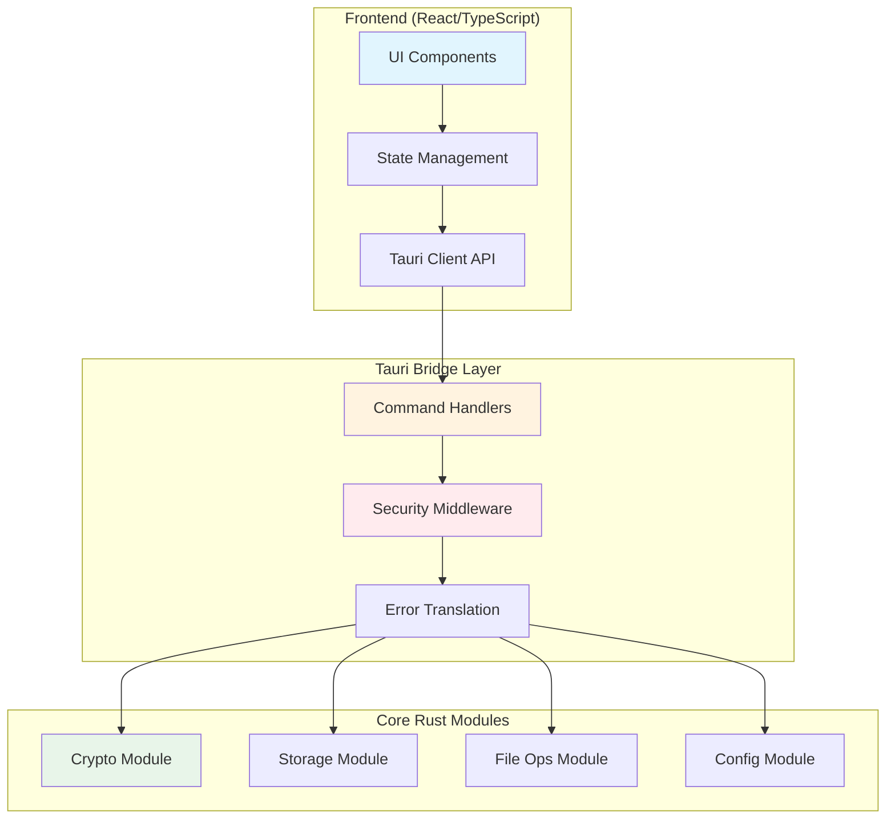
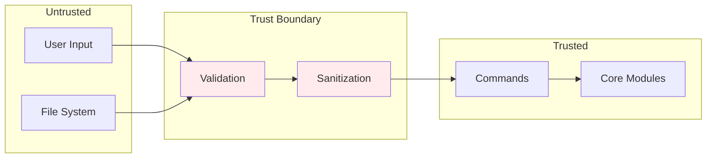

# Technical Blueprint: Milestone 3 - Tauri Bridge & Frontend

## Executive Summary

This blueprint defines the architecture for integrating the core Rust modules (crypto, storage, file_ops) with the Tauri framework to create a secure, cross-platform desktop application. The implementation will expose Rust functionality through Tauri commands, manage frontend state effectively, and provide a user-friendly interface for Bitcoin custody backup operations.

## System Architecture

### High-Level Architecture



### Technology Stack and Rationale

- **Tauri v2**: Latest stable version for security and performance
- **React 18**: Proven UI framework with TypeScript support
- **TypeScript 5.x**: Type safety for frontend development
- **Zustand**: Lightweight state management (4KB) with TypeScript support
- **Vite**: Fast build tool, already integrated with Tauri

### Module Breakdown and Relationships

1. **Command Handlers**: Bridge between frontend and Rust modules
2. **Security Middleware**: Validates all inputs before processing
3. **Error Translation**: Converts Rust errors to user-friendly messages
4. **State Management**: Maintains UI state and caches
5. **UI Components**: Three-tab interface (Setup, Encrypt, Decrypt)

### Data Flow Overview

1. User interacts with UI component
2. UI updates state management store
3. State triggers Tauri command invocation
4. Command handler validates input
5. Security middleware checks permissions
6. Core module processes request
7. Result flows back through error translation
8. UI updates based on response

## Stakeholder Impact

### Primary Stakeholders and Their Needs

#### **Dev Engineers** 🎯 (Contributor)
**Needs**: Clear command interfaces, type definitions, error handling patterns
**Impact Level**: High
**Communication**: Detailed task-level blueprints with implementation examples

#### **Test Automation Engineers** 🧪 (Contributor)
**Needs**: Testable command structure, mock capabilities, E2E test framework
**Impact Level**: High
**Communication**: Testing strategy with command mocking and UI automation

#### **Customer Persona** ⭐ (North Star)
**Needs**: Intuitive UI, clear error messages, secure operations
**Impact Level**: High
**Communication**: User flows, accessibility requirements, performance targets

### Secondary Stakeholders and Considerations

#### **Security Engineers** 🔒 (Contributor)
**Needs**: Input validation, secure IPC, permission model
**Impact Level**: High
**Communication**: Security boundaries, threat model, secure defaults

#### **Tech Operations Engineers** 🔧 (Contributor)
**Needs**: Logging, monitoring, update mechanism
**Impact Level**: Medium
**Communication**: Telemetry design, error tracking, deployment strategy

## Development Roadmap

### Phase 1: Core Command Infrastructure (Week 1)
- Implement command handler structure
- Add security middleware layer
- Create error translation system
- Set up logging infrastructure

### Phase 2: Command Implementation (Week 2)
- Implement crypto commands (generate, encrypt, decrypt)
- Implement storage commands (save, load, list keys)
- Implement file operations commands
- Add progress reporting

### Phase 3: Frontend Development (Week 3)
- Create state management architecture
- Build UI components (Setup, Encrypt, Decrypt tabs)
- Implement command invocation layer
- Add error handling UI

### Phase 4: Integration and Testing (Week 4)
- End-to-end workflow testing
- Security audit
- Performance optimization
- Documentation completion

### Dependencies and Critical Path

**Critical Dependencies**:
- Milestone 2 modules must be complete and tested
- Tauri v2 stable release (already available)
- Security review of command interfaces

**Critical Path**:
1. Command infrastructure → Command implementation
2. State management → UI components
3. All components → Integration testing

## Risk Assessment

### Technical Risks and Mitigations

| Risk | Impact | Likelihood | Mitigation |
|------|--------|------------|------------|
| **IPC Performance** | High | Medium | Stream large files, implement progress callbacks |
| **Type Mismatches** | Medium | High | Generate TypeScript types from Rust, strict validation |
| **Memory Leaks** | High | Low | Careful resource management, automated testing |
| **Cross-Platform Issues** | Medium | Medium | Platform-specific testing, CI/CD matrix |

### Security Considerations Overview

1. **Input Validation**: All commands validate inputs before processing
2. **Path Traversal**: File paths are canonicalized and validated
3. **Command Injection**: No shell commands, only direct API calls
4. **Memory Safety**: Sensitive data cleared after use
5. **Permission Model**: Capabilities-based security in Tauri v2

### Performance Requirements

- **Command Response**: <100ms for key operations
- **File Operations**: Stream progress for files >1MB
- **UI Responsiveness**: 60fps animations, no blocking operations
- **Memory Usage**: <300MB total application footprint

### Operational Considerations

- **Logging**: Structured logs with OpenTelemetry
- **Error Tracking**: User-friendly error codes with details
- **Updates**: Tauri's built-in updater with signature verification
- **Telemetry**: Opt-in anonymous usage statistics

## Integration Strategy

### Tauri Command Interface Design

Commands follow a consistent pattern:
```rust
#[tauri::command]
async fn module_action(
    input: ValidatedInput,
    state: State<'_, AppState>
) -> Result<CommandResponse, CommandError> {
    // Validation
    // Security checks
    // Core module invocation
    // Error translation
}
```

### Frontend-Backend Communication Patterns

1. **Request/Response**: Simple commands with immediate results
2. **Progress Streaming**: Long operations with progress updates
3. **Event Broadcasting**: State changes pushed to frontend
4. **Error Propagation**: Consistent error format across all commands

### State Management Approach

```typescript
interface AppState {
  keys: KeyState;
  encryption: EncryptionState;
  ui: UIState;
  errors: ErrorState;
}
```

### Error Propagation Strategy

```rust
pub enum CommandError {
    Validation(String),
    Permission(String),
    Operation(OperationError),
    Internal(String),
}
```

## Security Architecture

### Threat Model

1. **Malicious Input**: Validated at command boundary
2. **Path Traversal**: Canonicalized paths, sandbox restrictions
3. **Memory Disclosure**: Sensitive data zeroized
4. **Privilege Escalation**: Minimal permissions, no admin required

### Security Boundaries



### Input Validation Strategy

1. **Type Validation**: TypeScript types enforced
2. **Range Validation**: File sizes, string lengths
3. **Format Validation**: Keys, paths, passphrases
4. **Semantic Validation**: Business logic rules

### Secure Communication Channels

- **IPC**: Tauri's secure message passing
- **No Network**: Application is offline-only
- **File Access**: Restricted to user directories
- **No External Processes**: All operations in-process

## Testing Strategy

### Unit Testing Approach

- **Command Handlers**: Mock core modules, test validation
- **State Management**: Test state transitions, side effects
- **UI Components**: Component testing with React Testing Library

### Integration Testing Approach

- **Command Flow**: Full command execution with real modules
- **State Synchronization**: Frontend-backend state consistency
- **Error Scenarios**: Comprehensive error case coverage

### E2E Testing Framework

```typescript
describe('Encryption Workflow', () => {
  it('should encrypt files end-to-end', async () => {
    // Generate key
    // Select files
    // Encrypt
    // Verify output
  });
});
```

### Security Testing Requirements

1. **Fuzzing**: Command inputs with random data
2. **Path Injection**: Various malicious path patterns
3. **Memory Analysis**: Check for sensitive data leaks
4. **Permission Testing**: Verify capability restrictions

## Success Metrics

### Immediate Goals
- **Command Coverage**: 100% of core module functions exposed
- **Type Safety**: Zero runtime type errors
- **Security Validation**: All inputs validated
- **Error Handling**: User-friendly messages for all errors

### Long-term Goals
- **Performance**: Sub-second operations for typical use
- **Reliability**: 99.9% crash-free sessions
- **Security**: Zero security vulnerabilities
- **User Satisfaction**: Intuitive, frustration-free experience

---

*This module-level blueprint provides the architectural foundation for Milestone 3. Detailed implementation specifications are provided in the task-level blueprints.*

## 🧩 Linked Ritual Artifacts

Refer to:
- [Blueprint-Milestone3-Task3.1.md](Blueprint-Milestone3-Task3.1.md) - Tauri Commands Bridge
- [Blueprint-Milestone3-Task3.2.md](Blueprint-Milestone3-Task3.2.md) - Frontend State Management
- [Blueprint-Milestone3-Task3.3.md](Blueprint-Milestone3-Task3.3.md) - User Interface Components
- [Blueprint-Milestone3-Task3.4.md](Blueprint-Milestone3-Task3.4.md) - Integration Testing 