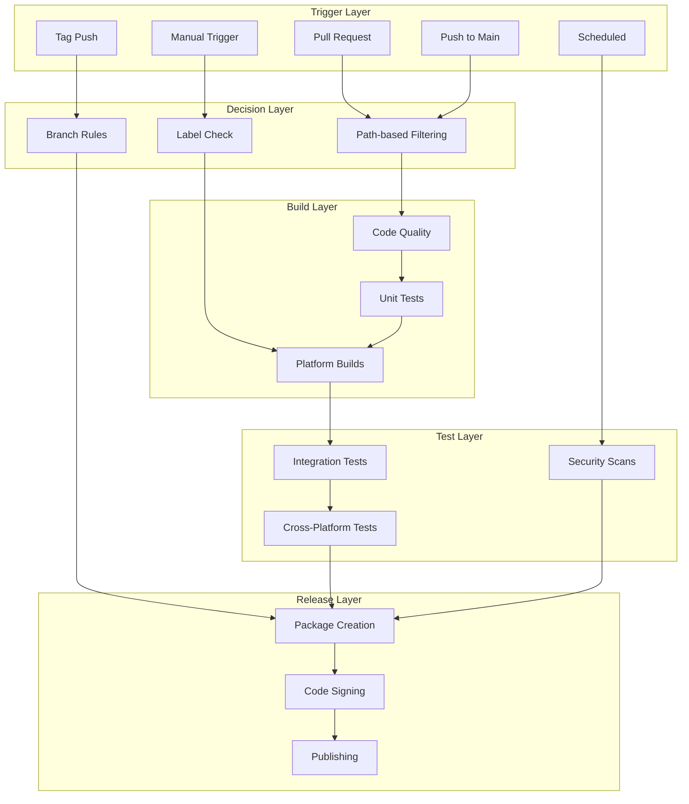
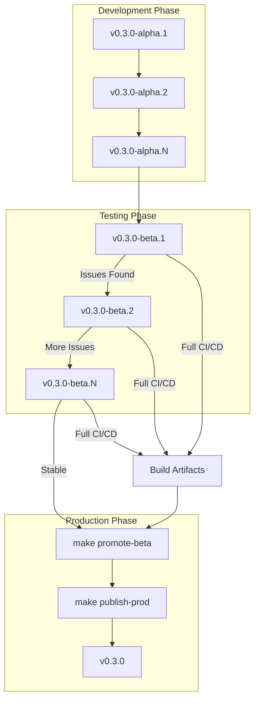

# CI/CD Pipeline Architecture for Barqly Vault (VISION)

**Created**: 2025-08-20
**Updated**: 2025-09-02
**Status**: ⚠️ **ASPIRATIONAL - Not Fully Implemented**
**Archived**: 2025-11-11 (Post-R2 documentation cleanup)
**Author**: System Architect

> **Note:** This document describes the ideal/aspirational CI/CD architecture. Many features described here are not yet implemented. For the **actual current implementation**, see:
> - [release-process.md](./release-process.md) - What actually exists today
> - [README.md](./README.md) - Quick reference for current workflows

## Executive Summary

This document presents the implemented CI/CD architecture for Barqly Vault, a cross-platform desktop encryption application built with Tauri. The architecture implements a three-tier release process (alpha/beta/production) with automated builds, cross-platform distribution, and manual publication gates while maintaining security standards appropriate for a Bitcoin custody backup tool.

**Note**: For detailed release process steps, see [release-process.md](./release-process.md).

## Table of Contents

1. [Architecture Overview](#architecture-overview)
2. [Trigger Strategy](#trigger-strategy)
3. [Build Optimization](#build-optimization)
4. [Cross-Platform Release Pipeline](#cross-platform-release-pipeline)
5. [Testing Strategy](#testing-strategy)
6. [Quality Gates](#quality-gates)
7. [Security Considerations](#security-considerations)
8. [Implementation Roadmap](#implementation-roadmap)

## Architecture Overview

### Design Principles

1. **Intelligent Automation** - Build only what's necessary, when it's necessary
2. **Security-First** - Every step considers the sensitive nature of the application
3. **Developer Experience** - Fast feedback loops and clear visibility
4. **Cost Optimization** - Maximize free tier usage, minimize unnecessary builds
5. **Scalability** - Architecture that grows with the project

### High-Level Pipeline Architecture



## Trigger Strategy

### Recommended Trigger Configuration

Based on industry best practices for desktop applications in 2024, here's the optimal trigger strategy:

#### 1. Development Triggers

```yaml
# Pull Request Triggers
on:
  pull_request:
    types: [opened, synchronize, reopened]
    paths-ignore:
      - 'public-docs/**'
      - '**.md'
      - '.github/workflows/deploy-docs.yml'
```

**Rationale**: 
- PR-based triggers provide better control than push triggers
- Prevents unnecessary builds for WIP branches
- Path filtering reduces noise from documentation changes

#### 2. Main Branch Protection

```yaml
# Main branch push (after PR merge)
on:
  push:
    branches: [main]
    paths-ignore:
      - 'public-docs/**'
      - '**.md'
```

**Rationale**:
- Ensures main branch always has passing builds
- Creates deployment candidates automatically
- Maintains continuous deployment readiness

#### 3. Release Triggers

```yaml
# Tag-based releases - Three-tier system
on:
  push:
    tags:
      - 'v*.*.*-beta.*'  # Beta releases only (triggers full CI/CD)
      # Alpha tags: v*.*.*-alpha.* (no CI/CD trigger - checkpoints only)
      # Production tags: v*.*.* (manual promotion only)
```

**Current Implementation**:
- **Alpha tags** (`v0.3.0-alpha.1`): Development checkpoints, no automated builds
- **Beta tags** (`v0.3.0-beta.1`): Triggers full CI/CD pipeline with macOS notarization
- **Production tags** (`v0.3.0`): Created via manual promotion from beta releases

**Rationale**:
- **Cost efficient**: Only beta tags trigger expensive builds and notarization
- **Flexible iteration**: Alpha tags allow multiple development cycles
- **Security compliance**: Production releases require manual approval gate

#### 4. Manual Triggers

```yaml
# On-demand builds with parameters
on:
  workflow_dispatch:
    inputs:
      platforms:
        description: 'Platforms to build'
        required: true
        default: 'all'
        type: choice
        options:
          - all
          - macos
          - linux
          - windows
      build_type:
        description: 'Build type'
        required: true
        default: 'debug'
        type: choice
        options:
          - debug
          - release
      run_tests:
        description: 'Run full test suite'
        required: false
        default: true
        type: boolean
```

**Rationale**:
- Flexibility for debugging and special builds
- Controlled resource usage
- Useful for release preparation

### Implementation Example

```yaml
# Example workflow structure for selective builds

on:
  pull_request:
    types: [opened, synchronize, reopened]
  push:
    branches: [main]
    tags: ['v*']
  workflow_dispatch:
    inputs:
      # ... input definitions ...

jobs:
  # Determine what needs to be built
  changes:
    runs-on: ubuntu-latest
    outputs:
      rust: ${{ steps.filter.outputs.rust }}
      frontend: ${{ steps.filter.outputs.frontend }}
      docs: ${{ steps.filter.outputs.docs }}
    steps:
      - uses: dorny/paths-filter@v3
        id: filter
        with:
          filters: |
            rust:
              - 'src-tauri/**'
              - 'Cargo.toml'
              - 'Cargo.lock'
            frontend:
              - 'src-ui/**'
              - 'package.json'
              - 'package-lock.json'
            docs:
              - 'docs/**'
              - '**.md'
```

## Build Optimization

### Selective Building Strategy

#### Path-Based Conditional Workflows

```yaml
jobs:
  frontend-checks:
    if: needs.changes.outputs.frontend == 'true'
    runs-on: ubuntu-latest
    steps:
      - name: Checkout
        uses: actions/checkout@v4
      
      - name: Frontend validation
        run: make validate-ui

  rust-checks:
    if: needs.changes.outputs.rust == 'true'
    runs-on: ubuntu-latest
    steps:
      - name: Checkout
        uses: actions/checkout@v4
      
      - name: Rust validation
        run: make validate-rust

  build-desktop:
    needs: [frontend-checks, rust-checks]
    # Only build if either check ran and passed
    if: |
      always() && 
      (needs.frontend-checks.result == 'success' || needs.frontend-checks.result == 'skipped') &&
      (needs.rust-checks.result == 'success' || needs.rust-checks.result == 'skipped') &&
      (needs.frontend-checks.result == 'success' || needs.rust-checks.result == 'success')
```

### Build Matrix Strategy

```yaml
build:
  strategy:
    fail-fast: false
    matrix:
      include:
        - os: ubuntu-22.04
          target: x86_64-unknown-linux-gnu
          artifacts: [AppImage, deb]
        
        - os: macos-13  # Intel
          target: x86_64-apple-darwin
          artifacts: [dmg, app]
        
        - os: macos-14  # Apple Silicon
          target: aarch64-apple-darwin
          artifacts: [dmg, app]
        
        - os: windows-2022
          target: x86_64-pc-windows-msvc
          artifacts: [msi, exe]
    
    runs-on: ${{ matrix.os }}
```

### Caching Strategy

```yaml
- name: Cache Rust dependencies
  uses: Swatinem/rust-cache@v2
  with:
    workspaces: "./src-tauri -> target"
    key: ${{ matrix.os }}-${{ matrix.target }}

- name: Cache node modules
  uses: actions/cache@v4
  with:
    path: |
      ~/.npm
      src-ui/node_modules
    key: ${{ runner.os }}-node-${{ hashFiles('**/package-lock.json') }}
```

## Cross-Platform Release Pipeline

### Platform Distribution Strategy

#### macOS Strategy

**Separate Architecture Builds** (Industry Standard - Sparrow Model):
```yaml
build-macos-separate:
  strategy:
    matrix:
      include:
        - arch: 'intel'
          target: 'x86_64-apple-darwin'
        - arch: 'apple-silicon'
          target: 'aarch64-apple-darwin'
  runs-on: macos-latest
  steps:
    - name: Build ${{ matrix.arch }} DMG
      run: |
        rustup target add ${{ matrix.target }}
        cargo tauri build --target ${{ matrix.target }}
    
    - name: Notarize and Staple
      env:
        APPLE_ID: ${{ secrets.APPLE_ID }}
        APPLE_PASSWORD: ${{ secrets.APPLE_PASSWORD }}
      run: |
        DMG_PATH="target/${{ matrix.target }}/release/bundle/macos/*.dmg"
        xcrun notarytool submit $DMG_PATH \
          --apple-id "$APPLE_ID" \
          --password "$APPLE_PASSWORD" \
          --wait
```

**Distribution**: Separate DMG files for Intel (x86_64) and Apple Silicon (aarch64)

#### Linux Strategy

**Multi-Format Approach**:

1. **AppImage** (Universal, Recommended Primary)
   - Works on most Linux distributions
   - No installation required
   - Portable execution
   - File size: ~60-80MB

2. **.deb Package** (Debian/Ubuntu)
   - Native package manager integration
   - Automatic dependency resolution
   - Better system integration
   - File size: ~40-50MB

3. **Future Considerations**:
   - **Flatpak**: Better sandboxing, growing adoption
   - **Snap**: Ubuntu-focused, automatic updates
   - **.rpm**: For RedHat/Fedora users

```yaml
build-linux:
  runs-on: ubuntu-22.04
  steps:
    - name: Build all Linux formats
      run: |
        # AppImage (universal)
        cargo tauri build --bundles appimage
        
        # .deb package
        cargo tauri build --bundles deb
        
        # Future: Flatpak
        # flatpak-builder --force-clean build-dir com.barqly.vault.yml
```

#### Windows Strategy

**Dual-Format Approach**:

1. **MSIX** (Modern, Recommended for Windows 10/11)
   - Modern packaging format
   - Automatic updates
   - Better security sandboxing
   - Microsoft Store compatible

2. **MSI + EXE** (Traditional, Broader Compatibility)
   - Works on all Windows versions
   - Enterprise deployment friendly
   - Group Policy support

```yaml
build-windows:
  runs-on: windows-latest
  steps:
    - name: Build Windows packages
      run: |
        # Traditional MSI
        cargo tauri build --bundles msi
        
        # Modern MSIX
        cargo tauri build --bundles msix
        
        # Portable EXE
        cargo tauri build --bundles nsis
```

### Release Asset Organization

```yaml
release:
  steps:
    - name: Create Release
      uses: softprops/action-gh-release@v1
      with:
        files: |
          # macOS (separate architecture builds)
          target/x86_64-apple-darwin/release/bundle/macos/*.dmg
          target/aarch64-apple-darwin/release/bundle/macos/*.dmg
          
          # Linux
          target/release/bundle/appimage/*.AppImage
          target/release/bundle/deb/*.deb
          
          # Windows
          target/release/bundle/msi/*.msi
          target/release/bundle/msix/*.msix
          
        body: |
          ## Installation Instructions
          
          ### macOS
          - Download the `.dmg` file
          - Works on both Intel and Apple Silicon Macs
          
          ### Linux
          - **AppImage**: Download, make executable, and run
          - **.deb**: For Debian/Ubuntu systems
          
          ### Windows
          - **MSIX**: For Windows 10/11 (recommended)
          - **MSI**: For all Windows versions
```

## Testing Strategy

### Cross-Platform Testing Solutions

#### 1. GitHub Actions Native Runners (Free Tier)

```yaml
test-matrix:
  strategy:
    matrix:
      os: [ubuntu-22.04, ubuntu-20.04, macos-13, macos-14, windows-2022]
  runs-on: ${{ matrix.os }}
  steps:
    - name: Run platform tests
      run: make test
```

**Coverage**:
- Ubuntu 20.04, 22.04, 24.04
- macOS 13 (Intel), 14 (Apple Silicon)
- Windows Server 2019, 2022

#### 2. Container-Based Testing (Linux Variants)

```yaml
test-linux-distributions:
  runs-on: ubuntu-latest
  strategy:
    matrix:
      distro: [debian:11, fedora:39, archlinux:latest, alpine:3.19]
  container:
    image: ${{ matrix.distro }}
  steps:
    - name: Test AppImage compatibility
      run: |
        ./target/release/bundle/appimage/*.AppImage --appimage-extract-and-run
```

#### 3. Virtual Machine Testing (Self-Hosted)

For comprehensive testing without cloud costs:

```yaml
# Self-hosted runner on your PopOS machine
test-on-vm:
  runs-on: [self-hosted, linux, popos]
  steps:
    - name: Test in Windows VM
      run: |
        vboxmanage startvm "Windows-11-Test" --type headless
        # Run tests via SSH or remote commands
    
    - name: Test in various Linux VMs
      run: |
        for distro in ubuntu fedora manjaro; do
          vboxmanage startvm "$distro-test" --type headless
          # Run distribution-specific tests
        done
```

#### 4. Cloud Testing Integration (Budget-Conscious)

**Free/Low-Cost Options**:

1. **BrowserStack** (Open Source Program)
   - Free for open source projects
   - Real device testing
   - Manual and automated testing

2. **GitHub Codespaces** (Limited Free Tier)
   - Test on different configurations
   - 60 hours free per month

3. **AWS Device Farm** (Pay-per-use)
   - $0.17 per device minute
   - Only pay for actual testing time

### Automated Test Verification

```yaml
verify-installation:
  needs: build
  strategy:
    matrix:
      os: [ubuntu-latest, macos-latest, windows-latest]
  runs-on: ${{ matrix.os }}
  steps:
    - name: Download artifacts
      uses: actions/download-artifact@v4
    
    - name: Install application
      run: |
        if [ "$RUNNER_OS" == "Linux" ]; then
          chmod +x *.AppImage
          ./*.AppImage --appimage-extract
          ./squashfs-root/AppRun --version
        elif [ "$RUNNER_OS" == "macOS" ]; then
          hdiutil attach *.dmg
          cp -R /Volumes/*/Barqly\ Vault.app /Applications/
          /Applications/Barqly\ Vault.app/Contents/MacOS/barqly-vault --version
        elif [ "$RUNNER_OS" == "Windows" ]; then
          msiexec /i *.msi /quiet
          & "$env:ProgramFiles\Barqly Vault\barqly-vault.exe" --version
        fi
    
    - name: Run smoke tests
      run: |
        # Basic functionality tests
        make test-smoke
```

## Quality Gates

### Required Checks Before Merge

```yaml
branch_protection_rules:
  main:
    required_status_checks:
      strict: true
      contexts:
        # Code Quality
        - "lint / frontend"
        - "lint / rust"
        - "format / check"
        
        # Security
        - "security / audit-rust"
        - "security / audit-npm"
        - "security / scan-code"
        
        # Tests
        - "test / unit-tests"
        - "test / integration-tests"
        
        # Build Verification
        - "build / compile-check"
```

### Quality Metrics

```yaml
quality-gates:
  steps:
    - name: Code Coverage
      run: |
        cargo tarpaulin --out Xml
        npm run test:coverage --prefix src-ui
      
    - name: Coverage Gate
      uses: codecov/codecov-action@v4
      with:
        fail_ci_if_error: true
        threshold: 80%  # Minimum coverage
    
    - name: Performance Check
      run: |
        # Bundle size check
        if [ $(stat -c%s target/release/barqly-vault) -gt 52428800 ]; then
          echo "Binary size exceeds 50MB limit"
          exit 1
        fi
        
        # Startup time check
        time_output=$(timeout 5 ./target/release/barqly-vault --benchmark-startup)
        if [ $? -ne 0 ]; then
          echo "Startup time exceeds 2 seconds"
          exit 1
        fi
```

## Security Considerations

### Security Pipeline

```yaml
security-checks:
  runs-on: ubuntu-latest
  steps:
    # 1. Dependency Scanning
    - name: Rust Security Audit
      run: |
        cargo install cargo-audit
        cargo audit
    
    - name: NPM Security Audit
      run: npm audit --audit-level=moderate
    
    # 2. SAST (Static Application Security Testing)
    - name: Semgrep Security Scan
      uses: returntocorp/semgrep-action@v1
      with:
        config: >-
          p/security-audit
          p/crypto
          p/rust
    
    # 3. Secret Scanning
    - name: TruffleHog Secret Scan
      uses: trufflesecurity/trufflehog@main
      with:
        path: ./
        base: ${{ github.event.repository.default_branch }}
    
    # 4. License Compliance
    - name: License Check
      run: |
        cargo install cargo-license
        cargo license --avoid-dev-deps --avoid-build-deps
```

### Code Signing Strategy

#### macOS Code Signing

```yaml
- name: Import Code Signing Certificates
  env:
    MACOS_CERTIFICATE: ${{ secrets.MACOS_CERTIFICATE }}
    MACOS_CERTIFICATE_PWD: ${{ secrets.MACOS_CERTIFICATE_PWD }}
  run: |
    echo $MACOS_CERTIFICATE | base64 --decode > certificate.p12
    security create-keychain -p actions temp.keychain
    security import certificate.p12 -k temp.keychain -P $MACOS_CERTIFICATE_PWD -T /usr/bin/codesign
```

#### Windows Code Signing

```yaml
- name: Sign Windows Binaries
  env:
    WINDOWS_CERTIFICATE: ${{ secrets.WINDOWS_CERTIFICATE }}
    WINDOWS_CERTIFICATE_PWD: ${{ secrets.WINDOWS_CERTIFICATE_PWD }}
  run: |
    $cert = New-Object System.Security.Cryptography.X509Certificates.X509Certificate2
    $cert.Import([Convert]::FromBase64String($env:WINDOWS_CERTIFICATE), $env:WINDOWS_CERTIFICATE_PWD, 'Exportable')
    Set-AuthenticodeSignature -FilePath "target\release\barqly-vault.exe" -Certificate $cert
```

## Implementation Roadmap

### Phase 1: Foundation (Week 1)
- [ ] Set up path-based filtering
- [ ] Implement PR-based triggers
- [ ] Add basic quality gates
- [ ] Configure caching

### Phase 2: Multi-Platform Builds (Week 2)
- [ ] Configure build matrix
- [ ] Set up macOS separate Intel/ARM builds (Sparrow model)
- [ ] Add Linux AppImage + .deb + .rpm
- [ ] Implement Windows MSI + standalone .zip

### Phase 3: Testing Infrastructure (Week 3)
- [ ] Add smoke tests for each platform
- [ ] Set up integration tests
- [ ] Configure coverage reporting
- [ ] Implement performance gates

### Phase 4: Security & Release (Week 4)
- [ ] Add security scanning
- [ ] Implement code signing
- [ ] Set up release automation
- [ ] Add update mechanism

### Phase 5: Optimization (Ongoing)
- [ ] Monitor build times
- [ ] Optimize caching
- [ ] Refine triggers
- [ ] Add monitoring

## Monitoring and Metrics

### Key Performance Indicators

1. **Build Performance**
   - Average build time per platform
   - Cache hit rate
   - Parallel job utilization

2. **Quality Metrics**
   - Test pass rate
   - Code coverage trends
   - Security vulnerability count

3. **Release Metrics**
   - Time from commit to release
   - Release success rate
   - Download/install success rate

### Monitoring Implementation

```yaml
- name: Report Metrics
  if: always()
  run: |
    # Send metrics to monitoring service
    curl -X POST https://api.datadoghq.com/api/v1/series \
      -H "DD-API-KEY: ${{ secrets.DD_API_KEY }}" \
      -d @- << EOF
    {
      "series": [{
        "metric": "ci.build.duration",
        "points": [["$(date +%s)", "${{ steps.build.outputs.duration }}"]],
        "tags": ["platform:${{ matrix.os }}", "branch:${{ github.ref }}"]
      }]
    }
    EOF
```

## Cost Optimization

### GitHub Actions Usage Optimization

1. **Free Tier Maximization**
   - 2,000 minutes/month for free accounts
   - 3,000 minutes/month for Pro accounts
   - Public repositories: unlimited

2. **Minute Multipliers**
   - Linux: 1x (use for most jobs)
   - Windows: 2x (minimize usage)
   - macOS: 10x (use sparingly)

3. **Optimization Strategies**
   - Use Linux runners for non-platform-specific tasks
   - Parallelize independent jobs
   - Aggressive caching
   - Skip unchanged components

### Estimated Monthly Usage

| Workflow | Frequency | Minutes | Platform | Total |
|----------|-----------|---------|----------|-------|
| PR Checks | 50/month | 5 | Linux | 250 |
| Main Builds | 30/month | 10 | Linux | 300 |
| Release Builds | 2/month | 30 | Multi | 600 |
| **Total** | | | | **1,150** |

*Well within free tier limits*

## Current Release Workflow

The implemented workflow follows a three-tier release process:

### Alpha → Beta → Production Pipeline



### Key Implementation Details

1. **Alpha Tags**: Development checkpoints only, no automated processes
2. **Beta Tags**: Trigger complete CI/CD including macOS notarization
3. **Production**: Manual promotion with standardized file naming
4. **Publication**: Manual security gate maintaining branch protection

### Automation vs Manual Control

- **Automated**: Beta builds, artifact generation, notarization
- **Manual**: Production promotion, release publication, documentation updates
- **Rationale**: Balances efficiency with security compliance requirements

## Conclusion

This CI/CD architecture provides:

1. **Intelligent Triggers** - Build only when necessary
2. **Selective Building** - Compile only changed components
3. **Cross-Platform Support** - Comprehensive distribution strategy
4. **Automated Testing** - Multi-platform verification
5. **Security Focus** - Appropriate for crypto applications
6. **Cost Efficiency** - Maximizes free resources
7. **Scalability** - Grows with project needs

The architecture balances automation with control, providing both push-button simplicity and fine-grained manual control when needed. It's designed to support Barqly Vault from its current state through to production readiness and beyond.

## References

- [Tauri GitHub Actions Guide](https://v2.tauri.app/distribute/pipelines/github/)
- [GitHub Actions Best Practices 2024](https://docs.github.com/en/actions/learn-github-actions/best-practices)
- [Cross-Platform Testing Strategies](https://www.browserstack.com/guide/cross-platform-testing)
- [Linux Package Formats Comparison](https://itsfoss.com/flatpak-vs-snap/)
- [Windows MSIX vs MSI](https://learn.microsoft.com/en-us/windows/msix/overview)

---

*This architecture document serves as the blueprint for implementing a production-ready CI/CD pipeline for Barqly Vault. It should be reviewed quarterly and updated based on project evolution and industry best practices.*