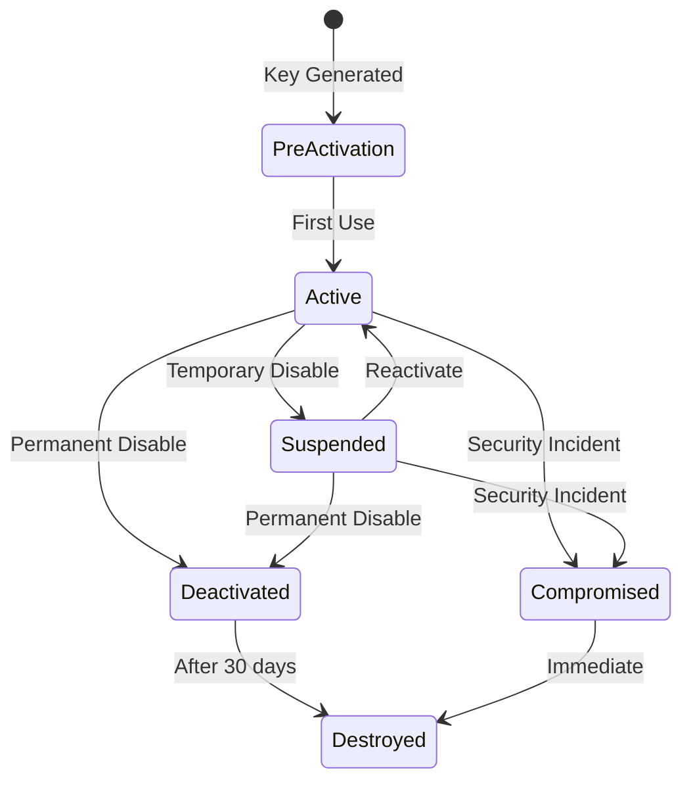

# Key Lifecycle Management Architecture

**Version**: 1.0
**Status**: Approved for Implementation
**Date**: 2025-01-11

---

## Executive Summary

This document defines the unified key lifecycle management system for Barqly Vault, aligning with NIST SP 800-57 guidelines. It replaces the fragmented state systems currently in use and provides a single source of truth for all key types (passphrase, YubiKey, and future hardware tokens).

---

## NIST-Aligned Lifecycle States

### Core States



### State Definitions

| State | Description | User Actions Available | System Behavior |
|-------|-------------|------------------------|-----------------|
| **PreActivation** | Key generated but never used | • Attach to vault<br>• Delete<br>• Export | • Not available for encryption<br>• Shows as "New" in UI |
| **Active** | Currently attached to vault(s) | • Use for encrypt/decrypt<br>• Detach from vault<br>• Suspend<br>• Export | • Available for all operations<br>• Shows as "Active" in UI |
| **Suspended** | Temporarily disabled | • Reactivate<br>• Deactivate permanently<br>• View history | • Cannot encrypt/decrypt<br>• Keeps vault associations<br>• Shows as "Suspended" in UI |
| **Deactivated** | Permanently disabled | • View history<br>• Export (with warning) | • Cannot be reactivated<br>• 30-day retention period<br>• Shows as "Deactivated" in UI |
| **Destroyed** | Cryptographically destroyed | None | • Key material deleted<br>• Only metadata remains<br>• Not shown in UI |
| **Compromised** | Security breach detected | • View incident details | • Immediate deactivation<br>• Audit log entry<br>• Shows as "Compromised" in UI |

---

## Migration from Current States

### Current State Systems

We currently have two conflicting state systems that will be unified:

#### 1. KeyState Enum (General Keys)
```rust
enum KeyState {
    Active,      // Key is available and can be used
    Registered,  // Key is registered but not currently available
    Orphaned,    // Key exists but not associated with any vault
}
```

#### 2. YubiKeyState Enum (YubiKey Specific)
```rust
enum YubiKeyState {
    New,         // Brand new with default PIN
    Reused,      // Custom PIN but no age identity
    Orphaned,    // Has identity but no manifest entry
    Registered,  // Fully configured and ready
}
```

### State Mapping Table

| Current System  | Current State | New NIST State                      | Migration Notes |
|---------------- |---------------|----------------                     |-----------------|
| KeyState        | Active        | **Active**                          | Direct mapping |
| KeyState        | Registered    | **Active**                          | Was confusing - registered means active |
| KeyState        | Orphaned      | **PreActivation** or **Suspended**  | Depends on usage history |
| YubiKeyState    | New           | **PreActivation**                   | Never been used |
| YubiKeyState    | Reused        | **PreActivation**                   | Setup incomplete |
| YubiKeyState    | Registered    | **Active**                          | Ready for use |
| YubiKeyState    | Orphaned      | **Suspended**                       | Was active, now detached |

### Migration Logic

```rust
fn migrate_to_nist_state(current_state: &CurrentState) -> KeyLifecycleStatus {
    match current_state {
        // KeyState migrations
        KeyState::Active => KeyLifecycleStatus::Active,
        KeyState::Registered => KeyLifecycleStatus::Active,
        KeyState::Orphaned => {
            if has_usage_history() {
                KeyLifecycleStatus::Suspended
            } else {
                KeyLifecycleStatus::PreActivation
            }
        },

        // YubiKeyState migrations
        YubiKeyState::New => KeyLifecycleStatus::PreActivation,
        YubiKeyState::Reused => KeyLifecycleStatus::PreActivation,
        YubiKeyState::Registered => KeyLifecycleStatus::Active,
        YubiKeyState::Orphaned => KeyLifecycleStatus::Suspended,
    }
}
```

---

## State Transition Rules

### Valid Transitions

| From | To | Trigger | Validation |
|------|----|---------|-----------|
| PreActivation | Active | Attach to vault | Key must be valid |
| PreActivation | Destroyed | Delete unused key | No vault associations |
| Active | Suspended | User suspends | Warn if attached to vaults |
| Active | Deactivated | User deactivates | Confirm action |
| Active | Compromised | Security event | Automatic |
| Suspended | Active | User reactivates | Security check |
| Suspended | Deactivated | User deactivates | Confirm action |
| Suspended | Compromised | Security event | Automatic |
| Deactivated | Destroyed | 30 days elapsed | Automatic |
| Compromised | Destroyed | Immediate | Automatic |

### Invalid Transitions

- Cannot move backwards (except Suspended → Active)
- Cannot skip states (except security incidents)
- Destroyed state is final

---

## Implementation Details

### Registry Structure Enhancement

```json
{
  "schema": "barqly.vault.registry/2",  // Version bump
  "keys": {
    "key-id": {
      "type": "passphrase|yubikey",
      "label": "User Label",
      "created_at": "2025-01-11T10:00:00Z",
      "last_used": "2025-01-11T11:00:00Z",

      // NEW FIELDS
      "lifecycle_status": "active",  // NIST state
      "status_history": [
        {
          "status": "pre_activation",
          "timestamp": "2025-01-11T10:00:00Z",
          "reason": "Key created",
          "changed_by": "system"
        },
        {
          "status": "active",
          "timestamp": "2025-01-11T10:05:00Z",
          "reason": "Attached to vault",
          "changed_by": "user"
        }
      ],
      "vault_associations": ["vault-id-1", "vault-id-2"],

      // Existing fields preserved
      "public_key": "age1...",
      "key_filename": "key.enc"
    }
  }
}
```

### API Updates

```rust
// New unified lifecycle status enum
#[derive(Debug, Clone, Serialize, Deserialize, specta::Type)]
#[serde(rename_all = "snake_case")]
pub enum KeyLifecycleStatus {
    PreActivation,
    Active,
    Suspended,
    Deactivated,
    Destroyed,
    Compromised,
}

// Status change tracking
#[derive(Debug, Clone, Serialize, Deserialize)]
pub struct StatusHistoryEntry {
    pub status: KeyLifecycleStatus,
    pub timestamp: DateTime<Utc>,
    pub reason: String,
    pub changed_by: String,  // "user", "system", "security"
}
```

---

## Business Rules

### Key Attachment Rules
1. Only keys in `PreActivation` or `Active` state can be attached to vaults
2. `Suspended` keys must be reactivated first
3. Maximum 4 keys per vault (1 passphrase + 3 YubiKeys)

### Deactivation Rules
1. User must confirm deactivation (no accidental deactivation)
2. Warning shown if key is attached to active vaults
3. 30-day grace period before destruction
4. Deactivated keys can be exported (with security warning)

### Security Rules
1. Compromised keys are immediately moved to `Compromised` state
2. All vaults using compromised keys are flagged
3. Audit log entry created with incident details
4. User notified via UI alert

---

## User Experience Mapping

### UI Status Display

| Lifecycle Status | UI Display | Color | Icon | User Message |
|-----------------|------------|--------|------|--------------|
| PreActivation | "New" | Gray | ○ | "Ready to use - attach to a vault" |
| Active | "Active" | Green | ● | "Available for encryption" |
| Suspended | "Suspended" | Yellow | ⏸ | "Temporarily disabled" |
| Deactivated | "Deactivated" | Red | ⊘ | "Permanently disabled - deletion pending" |
| Destroyed | (Hidden) | - | - | - |
| Compromised | "Compromised" | Red | ⚠ | "Security issue - do not use" |

### Status Badges in UI

```typescript
// Frontend status mapping
function getKeyStatusBadge(status: KeyLifecycleStatus): BadgeConfig {
  switch(status) {
    case 'pre_activation':
      return { label: 'New', color: 'gray', icon: 'circle-outline' };
    case 'active':
      return { label: 'Active', color: 'green', icon: 'check-circle' };
    case 'suspended':
      return { label: 'Suspended', color: 'yellow', icon: 'pause-circle' };
    case 'deactivated':
      return { label: 'Deactivated', color: 'red', icon: 'x-circle' };
    case 'compromised':
      return { label: 'Compromised', color: 'red', icon: 'alert-triangle' };
    default:
      return { label: 'Unknown', color: 'gray', icon: 'question' };
  }
}
```

---

## Audit & Compliance

### Audit Requirements
- All state transitions logged with timestamp, reason, and actor
- Status history preserved even after key destruction
- Exportable audit trail for compliance

### Compliance Alignment
- **NIST SP 800-57**: Key Management Recommendations
- **FIPS 140-2**: Security Requirements for Cryptographic Modules
- **ISO 27001**: Information Security Management

---

## Migration Plan

### Phase 1: Add New Fields (Non-Breaking)
1. Add `lifecycle_status` field (default to mapped value)
2. Add `status_history` array
3. Add `vault_associations` array
4. Keep existing state fields for compatibility

### Phase 2: Dual-Write Period
1. Write to both old and new fields
2. Read from new fields with fallback
3. Monitor for issues

### Phase 3: Deprecate Old Fields
1. Stop writing to old state fields
2. Mark old fields as deprecated
3. Update all consumers

### Phase 4: Clean Up
1. Remove old state enums
2. Remove compatibility code
3. Bump registry schema version

---

## Testing Strategy

### Unit Tests
- State transition validation
- Migration logic correctness
- History tracking

### Integration Tests
- Registry persistence
- API compatibility
- UI state display

### Manual Testing
- Key creation → attachment → suspension → reactivation
- Deactivation → 30-day wait → destruction
- Compromise detection → immediate lockdown

---

## Rollback Plan

If issues arise:
1. Registry format is backward compatible
2. Old state fields preserved during migration
3. Can revert to previous version without data loss

---

## Future Enhancements

### Version 2.0 Considerations
- Key rotation scheduling
- Automated lifecycle policies
- Key escrow for enterprise
- Hardware security module (HSM) support
- Multi-party key management

---

## References

- [NIST SP 800-57 Part 1 Rev. 5](https://nvlpubs.nist.gov/nistpubs/SpecialPublications/NIST.SP.800-57pt1r5.pdf)
- [Key Management Lifecycle](https://csrc.nist.gov/projects/key-management/key-management-guidelines)
- [RFC 4880 - OpenPGP Message Format](https://datatracker.ietf.org/doc/html/rfc4880)

---

_This document is the authoritative source for key lifecycle management in Barqly Vault._