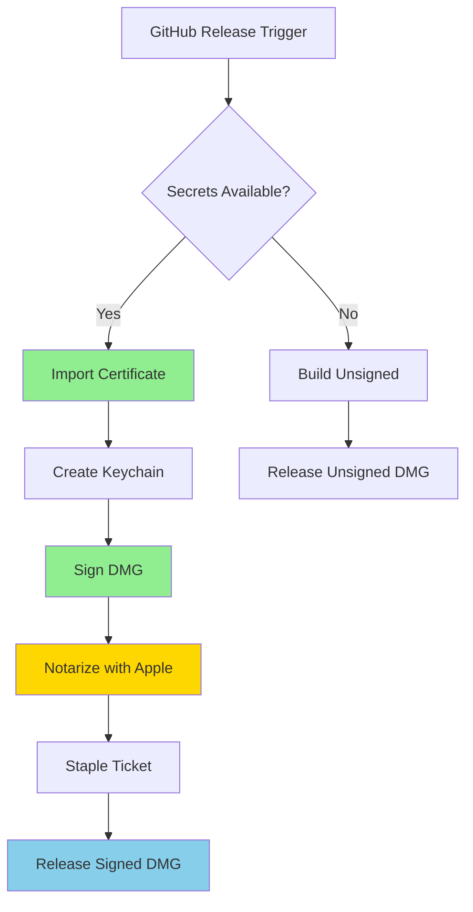

# macOS Code Signing and Notarization Guide

## Overview

This guide documents the automated macOS DMG signing and notarization process for Barqly Vault, ensuring secure distribution through official channels while maintaining flexibility for unsigned development builds.

## Architecture Design

### Signing Flow



### Key Components

1. **Certificate Management**: Secure handling of Apple Developer certificates
2. **Keychain Creation**: Temporary keychain for CI/CD signing operations
3. **Notarization**: Apple's security verification process
4. **Stapling**: Embedding notarization ticket for offline verification

## Configuration

### Required GitHub Secrets

Configure these secrets in GitHub repository settings:

| Secret | Description | How to Obtain |
|--------|-------------|---------------|
| `APPLE_CERTIFICATE_P12` | Base64-encoded Developer ID certificate | Export from Keychain Access as .p12 |
| `APPLE_CERTIFICATE_PASSWORD` | Password for the .p12 certificate | Set during certificate export |
| `APPLE_TEAM_ID` | Apple Developer Team ID | Apple Developer Account page |
| `APPLE_DEVELOPER_ID` | Developer ID Application identity | Certificate Common Name |
| `APPLE_ID` | Apple ID email for notarization | Your Apple Developer email |
| `APPLE_APP_PASSWORD` | App-specific password for notarization | Generate at appleid.apple.com |

### Creating Secrets

#### 1. Export Certificate
```bash
# Export from Keychain Access app
# Select "Developer ID Application" certificate
# Export as .p12 with password

# Convert to base64 for GitHub secret
base64 -i certificate.p12 | pbcopy
```

#### 2. Generate App-Specific Password
1. Visit [appleid.apple.com](https://appleid.apple.com)
2. Sign in and navigate to Security
3. Generate app-specific password
4. Label it "Barqly Vault Notarization"

#### 3. Find Team ID
```bash
# If certificate is installed locally
security find-identity -v -p codesigning | grep "Developer ID"
# Team ID is in parentheses: Developer ID Application: Name (TEAMID)
```

## Local Development

### Building Unsigned DMGs

For local development, builds remain unsigned by default:

```bash
# Quick build for current architecture
make dmg-quick

# Full build with validation
make dmg-all
```

### Testing Signing Locally

To test signing configuration locally:

```bash
# Set environment variables
export APPLE_SIGNING_IDENTITY="Developer ID Application: Your Name"
export APPLE_TEAM_ID="YOUR_TEAM_ID"

# Build with signing
cd src-tauri && cargo tauri build
```

### Verification Commands

```bash
# Verify DMG signature
make verify-dmg path/to/your.dmg

# Check notarization status
make check-notarization path/to/your.dmg

# Detailed signature information
codesign -dv --verbose=4 /path/to/Barqly\ Vault.app
```

## CI/CD Integration

### Automatic Signing

The release pipeline automatically signs when secrets are configured:

1. **Certificate Import**: Securely imports P12 into temporary keychain
2. **Build Process**: Tauri detects signing identity and signs automatically
3. **Notarization**: Submits to Apple for verification
4. **Stapling**: Embeds notarization ticket
5. **Cleanup**: Removes temporary keychain

### Manual Fallback

If automated signing fails, the pipeline continues with unsigned builds:

```yaml
# Pipeline behavior
- Try signing with certificates
- If fails, log warning
- Continue with unsigned build
- Mark release notes with signing status
```

## Troubleshooting

### Common Issues

#### Certificate Not Found
```bash
# Check keychain for certificate
security find-identity -v -p codesigning

# Expected output includes:
# "Developer ID Application: Your Name (TEAMID)"
```

#### Notarization Failures
```bash
# Check notarization log
xcrun notarytool log <submission-id> --apple-id <email> --team-id <team>

# Common causes:
# - Missing entitlements
# - Unsigned libraries
# - Network issues
```

#### Stapling Issues
```bash
# Manually staple ticket
xcrun stapler staple "Barqly Vault.dmg"

# Verify stapling
xcrun stapler validate "Barqly Vault.dmg"
```

### Debug Mode

Enable detailed logging in CI:

```yaml
env:
  RUST_LOG: debug
  TAURI_SIGNING_DEBUG: true
```

## Security Considerations

### Certificate Protection

- Certificates stored as encrypted GitHub secrets
- Temporary keychain created per build
- Automatic cleanup after signing
- No certificates in repository

### Notarization Benefits

- Apple malware scanning
- Gatekeeper approval
- User trust indicators
- Automatic updates to security assessments

### Fallback Strategy

- Unsigned builds clearly marked
- Documentation for manual verification
- Hash verification as alternative
- Clear security warnings

## Maintenance

### Certificate Renewal

Certificates expire annually. To renew:

1. Generate new certificate in Apple Developer portal
2. Export as .p12 with password
3. Update GitHub secrets
4. No code changes required

### Monitoring

Check signing status through:

- GitHub Actions logs
- Release asset names (include signing status)
- Apple Developer notarization history
- User feedback channels

## References

- [Apple Developer - Notarizing macOS Software](https://developer.apple.com/documentation/security/notarizing_macos_software_before_distribution)
- [Tauri - Code Signing](https://tauri.app/v1/guides/distribution/sign-macos)
- [GitHub - Encrypted Secrets](https://docs.github.com/en/actions/security-guides/encrypted-secrets)

---

*This architecture ensures secure, automated distribution while maintaining development flexibility and clear fallback paths.*