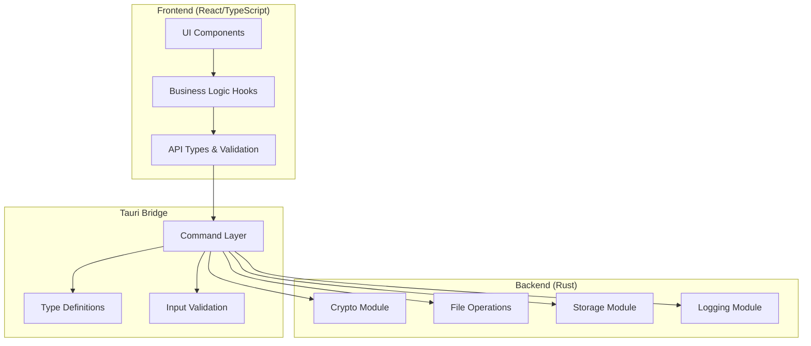

# Barqly Vault Architecture Assessment

## Executive Summary

Barqly Vault demonstrates a well-structured security-focused desktop application built with Tauri v2 and React/TypeScript. The architecture follows clean separation of concerns with clear module boundaries, comprehensive error handling, and security-first design principles appropriate for a Bitcoin custody use case.

### Overall Architecture Score: 8.5/10

**Key Strengths:**
- Clean layered architecture with clear separation between UI and backend
- Security-focused design with proper use of cryptographic libraries
- Comprehensive error handling and user-friendly error messages
- Well-organized module structure with single responsibility principle
- Strong type safety across frontend and backend boundaries

**Areas for Improvement:**
- Limited implementation of SOLID principles in some areas
- Missing abstraction layers for cryptographic operations
- Potential for better domain modeling
- Configuration module not yet implemented

## Current Architecture Analysis

### 1. System Architecture Pattern

The application follows a **Clean Architecture** pattern with clear layers:

### 2. Module Structure Analysis

#### Backend Modules (src-tauri/)

**Commands Module** ✅ Well-designed
- Clear separation of concerns with dedicated command files
- Comprehensive error handling with `CommandError` type
- Progress tracking for long-running operations
- Input validation traits for type safety

**Crypto Module** ✅ Security-focused
- Proper use of `age` encryption library
- Memory zeroization with `secrecy` crate
- Clear public API with private implementation details
- Constant-time operations where applicable

**File Operations Module** ✅ Comprehensive
- Well-structured with sub-modules for different concerns
- Manifest generation for integrity verification
- Staging area management for atomic operations
- Path validation and security checks

**Storage Module** ✅ Platform-aware
- Cross-platform path handling
- Secure key storage with metadata
- File permission management (Unix 600)
- Clear error types for different failure modes

**Logging Module** ✅ Production-ready
- OpenTelemetry integration
- Platform-specific log locations
- Structured logging with span context
- Security-aware (no sensitive data logging)

#### Frontend Architecture (src-ui/)

**Component Structure** ✅ Well-organized
- Clear separation: forms/, ui/, layout/
- Focused single-responsibility components
- Comprehensive test coverage
- TypeScript strict mode enabled

**Hooks Architecture** ✅ Clean abstraction
- Business logic separated from UI
- Consistent state management patterns
- Error handling built into hook interfaces
- Progress tracking integration

**Type Safety** ✅ End-to-end
- Auto-generated types from Rust structures
- Strict TypeScript configuration
- Runtime validation utilities
- Type-safe Tauri command invocation

### 3. Design Patterns Identified

1. **Command Pattern**: Tauri commands encapsulate requests
2. **Repository Pattern**: Storage module abstracts persistence
3. **Factory Pattern**: Test fixtures and data generation
4. **Observer Pattern**: Progress tracking with event emission
5. **Strategy Pattern**: Platform-specific implementations
6. **Facade Pattern**: Simplified crypto API over age library

### 4. Security Architecture

#### Cryptographic Security ✅
- Uses audited `age` encryption library
- Proper key derivation with scrypt
- Memory zeroization for sensitive data
- No custom cryptographic implementations

#### Input Validation ✅
- Comprehensive validation at command boundary
- Path traversal prevention
- Label sanitization for storage
- File size validation

#### Error Handling ✅
- No sensitive data in error messages
- User-friendly error guidance
- Structured error codes for programmatic handling
- Recovery suggestions included

#### Process Security ⚠️
- CSP headers configured but could be stricter
- Missing runtime integrity checks
- No mention of secure random number generation seeding

### 5. Cross-Platform Compatibility

#### Platform Abstraction ✅
- Proper path handling for each OS
- Platform-specific storage locations
- Conditional compilation where needed
- Unified API across platforms

#### Testing Coverage ✅
- Unit tests for all platforms
- Integration tests with platform-specific paths
- Smoke tests for deployment validation

## SOLID Principles Analysis

### Single Responsibility Principle (SRP) ✅
- Each module has a clear, focused purpose
- Commands handle only bridging logic
- Crypto module only handles encryption
- Storage only manages persistence

### Open/Closed Principle (OCP) ⚠️
- Limited use of abstractions
- Direct dependencies on concrete types
- Could benefit from trait-based design

### Liskov Substitution Principle (LSP) ⚠️
- Not extensively used due to limited inheritance
- Trait implementations are correct where used

### Interface Segregation Principle (ISP) ✅
- Small, focused interfaces
- Commands expose only necessary operations
- Modules have clean public APIs

### Dependency Inversion Principle (DIP) ⚠️
- Direct dependencies on concrete implementations
- Missing abstraction layer for crypto operations
- Could benefit from dependency injection

## Clean Architecture Adherence

### Independence of Frameworks ✅
- Core business logic in Rust modules
- UI framework (React) is replaceable
- Tauri abstracted through command layer

### Testability ✅
- Comprehensive test suite
- Modular design enables unit testing
- Integration tests for workflows

### Independence of UI ✅
- Business logic in backend
- UI communicates only through commands
- Type-safe contract between layers

### Independence of Database ✅
- File-based storage abstracted
- Could easily switch storage mechanisms
- Clear storage interface

## Risk Assessment

### High Risks
1. **No runtime integrity verification** - Application could be tampered with
2. **Missing secure wipe for staging area** - Temporary files may leak data
3. **No key rotation mechanism** - Long-term keys could be compromised

### Medium Risks
1. **Limited abstraction** - Tight coupling to specific implementations
2. **No rate limiting** - Potential for brute force on passphrase
3. **Missing audit logging** - No record of security-relevant events

### Low Risks
1. **Configuration not implemented** - May lead to hardcoded values
2. **No dependency injection** - Harder to test in isolation
3. **Limited error recovery** - Some operations not idempotent

## Recommendations Summary

1. **Immediate Security Improvements**
   - Add runtime integrity checks
   - Implement secure file deletion
   - Add rate limiting for passphrase attempts

2. **Architecture Enhancements**
   - Introduce trait-based abstractions
   - Implement dependency injection
   - Add domain modeling layer

3. **Operational Improvements**
   - Complete configuration module
   - Add audit logging
   - Implement key rotation

4. **Code Quality**
   - Increase abstraction usage
   - Reduce direct dependencies
   - Enhanced error recovery

The architecture is solid and production-ready for the Bitcoin custody use case, with room for evolutionary improvements rather than revolutionary changes.