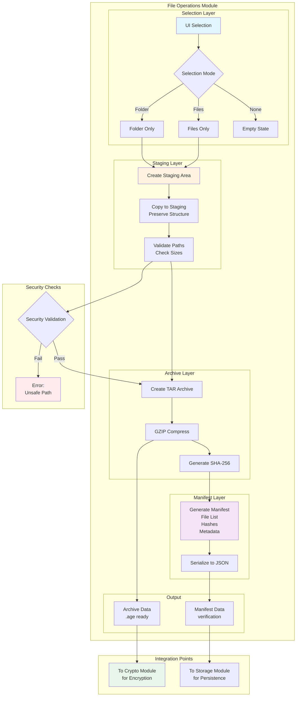
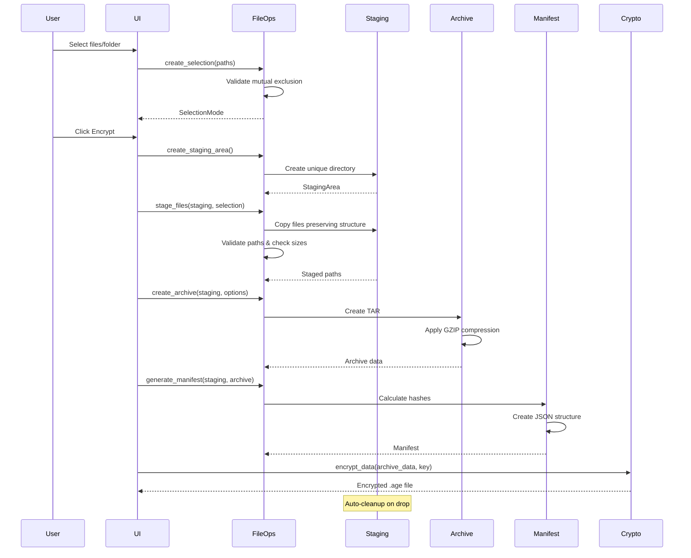

# Blueprint: File Operations Module (Milestone 2, Task 2.3)

## Executive Summary

The File Operations module provides secure, cross-platform file handling for Barqly Vault's encryption workflow. It manages file/folder selection, staging areas, TAR archive creation, and manifest generation while maintaining the security-first approach essential for Bitcoin custody backup scenarios.

## Module Overview

### Purpose

Enable secure file operations for encryption/decryption workflows, preserving folder structures and generating integrity manifests for Bitcoin custody backup and restoration.

### Core Responsibilities

1. **File/Folder Selection** - Mutual exclusion logic for clean UX
2. **Staging Area Management** - Secure temporary workspace
3. **Archive Creation** - TAR.GZ format preserving structure
4. **Manifest Generation** - JSON metadata with SHA-256 hashes

### Integration Points

- **Crypto Module**: Receives data for encryption
- **Storage Module**: Uses app directories for staging
- **Future Tauri Commands**: Provides file operation APIs

## Interface Design

### Public API

```rust
//! File operations module for secure file handling
//!
//! This module provides cross-platform file operations with security-first design.
//! All operations use staging areas to preserve original files and enable atomic operations.

use std::path::{Path, PathBuf};
use serde::{Serialize, Deserialize};
use chrono::{DateTime, Utc};

/// Result type for file operations
pub type Result<T> = std::result::Result<T, FileOpsError>;

/// File selection mode (mutual exclusion)
#[derive(Debug, Clone, PartialEq)]
pub enum SelectionMode {
    /// Single folder selection
    Folder(PathBuf),
    /// Multiple file selection
    Files(Vec<PathBuf>),
    /// No selection
    None,
}

/// Manifest for encrypted archives
#[derive(Debug, Serialize, Deserialize)]
pub struct Manifest {
    /// Version of manifest format
    pub version: String,
    /// Creation timestamp
    pub created_at: DateTime<Utc>,
    /// Original selection mode
    pub selection_mode: String,
    /// Files included in archive
    pub files: Vec<FileEntry>,
    /// Total uncompressed size
    pub total_size: u64,
    /// Archive checksum (SHA-256)
    pub archive_hash: String,
}

/// Individual file entry in manifest
#[derive(Debug, Serialize, Deserialize)]
pub struct FileEntry {
    /// Relative path within archive
    pub path: String,
    /// File size in bytes
    pub size: u64,
    /// SHA-256 hash of file content
    pub hash: String,
    /// Last modified timestamp
    pub modified: DateTime<Utc>,
}

/// Staging area for atomic operations
pub struct StagingArea {
    /// Unique staging directory
    path: PathBuf,
    /// Auto-cleanup on drop
    cleanup_on_drop: bool,
}

/// Archive creation options
pub struct ArchiveOptions {
    /// Enable compression (gzip)
    pub compress: bool,
    /// Compression level (1-9)
    pub compression_level: u32,
    /// Include hidden files
    pub include_hidden: bool,
}

// Main API Functions

/// Validate and create a selection from paths
pub fn create_selection(paths: Vec<PathBuf>) -> Result<SelectionMode>;

/// Create a new staging area
pub fn create_staging_area() -> Result<StagingArea>;

/// Copy files to staging area preserving structure
pub fn stage_files(staging: &StagingArea, selection: &SelectionMode) -> Result<Vec<PathBuf>>;

/// Create TAR.GZ archive from staged files
pub fn create_archive(staging: &StagingArea, options: &ArchiveOptions) -> Result<Vec<u8>>;

/// Generate manifest for archive
pub fn generate_manifest(staging: &StagingArea, archive_data: &[u8]) -> Result<Manifest>;

/// Extract archive to destination
pub fn extract_archive(archive_data: &[u8], destination: &Path) -> Result<Vec<PathBuf>>;

/// Verify manifest against extracted files
pub fn verify_manifest(manifest: &Manifest, extracted_path: &Path) -> Result<bool>;

/// Check if path is safe (no symlinks, within bounds)
pub fn validate_path_safety(path: &Path) -> Result<()>;

/// Get human-readable size with warning for large files
pub fn check_file_size(path: &Path) -> Result<(u64, bool)>;
```

### Error Types

```rust
use thiserror::Error;

#[derive(Error, Debug)]
pub enum FileOpsError {
    #[error("IO error: {0}")]
    IoError(#[from] std::io::Error),

    #[error("Invalid selection: cannot mix files and folders")]
    InvalidSelection,

    #[error("Path validation failed: {0}")]
    UnsafePath(String),

    #[error("Staging area error: {0}")]
    StagingError(String),

    #[error("Archive creation failed: {0}")]
    ArchiveError(String),

    #[error("Manifest error: {0}")]
    ManifestError(String),

    #[error("File too large: {size} bytes (recommended max: 100MB)")]
    FileSizeWarning { size: u64 },

    #[error("Verification failed: {0}")]
    VerificationError(String),
}
```

## Implementation Architecture

### Module Structure

```
src-tauri/src/file_ops/
├── mod.rs          # Public API and types
├── selection.rs    # File/folder selection logic
├── staging.rs      # Staging area management
├── archive.rs      # TAR.GZ operations
├── manifest.rs     # Manifest generation/verification
├── utils.rs        # Path validation, size checks
└── errors.rs       # Error types
```

### Key Implementation Details

#### 1. Selection Logic (selection.rs)

```rust
/// Mutual exclusion implementation
impl SelectionMode {
    pub fn add_path(&mut self, path: PathBuf) -> Result<()> {
        match self {
            SelectionMode::None => {
                if path.is_dir() {
                    *self = SelectionMode::Folder(path);
                } else {
                    *self = SelectionMode::Files(vec![path]);
                }
                Ok(())
            }
            SelectionMode::Folder(_) => {
                Err(FileOpsError::InvalidSelection)
            }
            SelectionMode::Files(files) => {
                if path.is_dir() {
                    Err(FileOpsError::InvalidSelection)
                } else {
                    files.push(path);
                    Ok(())
                }
            }
        }
    }
}
```

#### 2. Staging Area (staging.rs)

```rust
impl StagingArea {
    pub fn new() -> Result<Self> {
        let staging_root = storage::get_app_dir()?.join("staging");
        fs::create_dir_all(&staging_root)?;

        // Create unique subdirectory
        let unique_name = format!("stage_{}", Utc::now().timestamp_nanos());
        let path = staging_root.join(unique_name);
        fs::create_dir_all(&path)?;

        // Set restrictive permissions (Unix)
        #[cfg(unix)]
        {
            use std::os::unix::fs::PermissionsExt;
            fs::set_permissions(&path, fs::Permissions::from_mode(0o700))?;
        }

        Ok(Self {
            path,
            cleanup_on_drop: true,
        })
    }
}

impl Drop for StagingArea {
    fn drop(&mut self) {
        if self.cleanup_on_drop {
            let _ = fs::remove_dir_all(&self.path);
        }
    }
}
```

#### 3. Archive Creation (archive.rs)

```rust
use flate2::Compression;
use tar::Builder;

pub fn create_tar_gz(staging_path: &Path, compression_level: u32) -> Result<Vec<u8>> {
    let mut archive_data = Vec::new();
    let encoder = GzEncoder::new(&mut archive_data, Compression::new(compression_level));
    let mut builder = Builder::new(encoder);

    // Add files preserving structure
    for entry in WalkDir::new(staging_path) {
        let entry = entry?;
        let path = entry.path();
        let relative_path = path.strip_prefix(staging_path)?;

        if path.is_file() {
            builder.append_path_with_name(path, relative_path)?;
        }
    }

    builder.finish()?;
    Ok(archive_data)
}
```

## Security Considerations

### Threat Model

1. **Path Traversal**: Malicious file paths attempting to escape boundaries
2. **Symlink Attacks**: Following symlinks to unauthorized locations
3. **Race Conditions**: TOCTOU attacks during file operations
4. **Resource Exhaustion**: Large files consuming disk/memory

### Mitigations

1. **Path Validation**:
   - Canonicalize all paths
   - Reject paths with `..` components
   - Verify paths stay within expected boundaries

2. **Symlink Protection**:
   - Check for symlinks before operations
   - Option to skip or error on symlinks

3. **Atomic Operations**:
   - Use staging area for all modifications
   - Only move/rename at final step

4. **Resource Limits**:
   - Warn on files >100MB
   - Stream large files instead of loading to memory

## Error Handling Strategy

### User-Friendly Messages

```rust
impl FileOpsError {
    pub fn user_message(&self) -> String {
        match self {
            Self::InvalidSelection =>
                "Please select either a folder or individual files, not both".into(),
            Self::FileSizeWarning { size } =>
                format!("File is large ({:.1}MB). This may take longer to process.",
                    *size as f64 / 1_048_576.0),
            Self::UnsafePath(reason) =>
                format!("Selected path is not allowed: {}", reason),
            _ => "File operation failed. Please try again.".into(),
        }
    }
}
```

### Recovery Strategies

- **Staging Cleanup**: Always clean up staging on error
- **Partial Operations**: Roll back incomplete operations
- **Clear Guidance**: Provide actionable error messages

## Testing Strategy

### Unit Tests

```rust
#[cfg(test)]
mod tests {
    use super::*;
    use tempfile::TempDir;

    #[test]
    fn test_selection_mutual_exclusion() {
        let mut selection = SelectionMode::None;

        // Add folder
        assert!(selection.add_path(PathBuf::from("/tmp/folder")).is_ok());

        // Try to add file - should fail
        assert!(selection.add_path(PathBuf::from("/tmp/file.txt")).is_err());
    }

    #[test]
    fn test_staging_area_cleanup() {
        let staging = create_staging_area().unwrap();
        let path = staging.path.clone();
        assert!(path.exists());

        drop(staging);
        assert!(!path.exists());
    }

    #[test]
    fn test_manifest_generation() {
        // Test manifest creation and serialization
    }
}
```

### Integration Tests

- Full encryption workflow with staging
- Cross-platform path handling
- Large file handling
- Error recovery scenarios

## Cross-Platform Considerations

### Path Handling

- Use `PathBuf` for all paths
- Handle drive letters on Windows
- Normalize path separators

### Permissions

- Unix: Set 700 on staging directories
- Windows: Use default ACLs

### Hidden Files

- Unix: Files starting with `.`
- Windows: Files with hidden attribute

## Performance Considerations

### Optimizations

1. **Streaming**: Process large files in chunks
2. **Parallel Hashing**: Hash multiple files concurrently
3. **Compression Level**: Default to 6 (balanced)
4. **Progress Callbacks**: Simple percentage-based updates

### Benchmarks

- Target: <1s for typical Bitcoin backup files (<10MB)
- Stream files >10MB to avoid memory pressure

## Future Enhancements

1. **Incremental Backups**: Only archive changed files
2. **Encryption Preview**: Show what will be encrypted
3. **Batch Operations**: Multiple archives in one operation
4. **Cloud Integration**: Direct upload to user's cloud storage

## Implementation Checklist

- [ ] Create module structure and error types
- [ ] Implement selection logic with mutual exclusion
- [ ] Build staging area management with cleanup
- [ ] Implement TAR.GZ archive creation
- [ ] Create manifest generation and verification
- [ ] Add comprehensive path validation
- [ ] Write unit tests for each component
- [ ] Add integration tests for workflows
- [ ] Document security considerations
- [ ] Benchmark performance with various file sizes

---

## 📊 Visual Architecture

### File Operations Module Flow



### Encryption Workflow Sequence



## 📦 Dependencies

### Required Dependencies to Add to Cargo.toml

```toml
[dependencies]
# Archive operations
tar = "0.4"
flate2 = "1.0"  # For GZIP compression
walkdir = "2.4"  # For directory traversal

# Hashing and verification
sha2 = "0.10"
hex = "0.4"

# Temporary file handling
tempfile = "3.8"

# Serialization (already present)
serde = { version = "1", features = ["derive"] }
serde_json = "1"
chrono = { version = "0.4", features = ["serde"] }

# Error handling (already present)
thiserror = "1.0"
```

## 📝 Logging Strategy

### OpenTelemetry Integration

Following the existing logging module pattern, implement structured logging with OpenTelemetry:

```rust
use tracing::{info, warn, error, instrument};
use tracing::field::{display, debug};

/// Log file operation events with structured data
#[instrument(skip(staging_path), fields(path = %staging_path.display()))]
pub fn stage_files(staging: &StagingArea, selection: &SelectionMode) -> Result<Vec<PathBuf>> {
    info!(
        operation = "stage_files",
        selection_type = match selection {
            SelectionMode::Folder(_) => "folder",
            SelectionMode::Files(_) => "files",
            SelectionMode::None => "none",
        },
        "Starting file staging operation"
    );

    // Implementation...

    info!(
        operation = "stage_files",
        files_staged = staged_files.len(),
        total_size = total_size,
        "File staging completed successfully"
    );

    Ok(staged_files)
}

/// Log security validation events
#[instrument(skip(path))]
pub fn validate_path_safety(path: &Path) -> Result<()> {
    debug!(
        operation = "validate_path",
        path = %path.display(),
        "Validating path safety"
    );

    // Implementation...

    if let Err(e) = result {
        warn!(
            operation = "validate_path",
            path = %path.display(),
            error = %e,
            "Path validation failed"
        );
        return Err(e);
    }

    debug!(
        operation = "validate_path",
        path = %path.display(),
        "Path validation successful"
    );

    Ok(())
}
```

### Log Levels and Context

- **DEBUG**: Detailed operation steps, path validations, file counts
- **INFO**: Operation start/completion, file sizes, performance metrics
- **WARN**: File size warnings, non-critical validation failures
- **ERROR**: Operation failures, security violations, IO errors

### Structured Fields

```rust
// Common fields for all file operations
tracing::info!(
    operation = "create_archive",
    compression_level = options.compression_level,
    include_hidden = options.include_hidden,
    files_count = file_count,
    total_size = total_size,
    "Archive creation started"
);
```

## 🧪 Enhanced Testing Strategy

### Test-Cases-as-Documentation Philosophy

Following the existing pattern, expand test coverage with comprehensive scenarios:

```rust
#[cfg(test)]
mod tests {
    use super::*;
    use tempfile::TempDir;
    use std::fs;

    /// Test mutual exclusion logic for file/folder selection
    #[test]
    fn test_selection_mutual_exclusion() {
        let mut selection = SelectionMode::None;

        // Add folder first
        let folder_path = PathBuf::from("/tmp/test_folder");
        assert!(selection.add_path(folder_path.clone()).is_ok());
        assert!(matches!(selection, SelectionMode::Folder(_)));

        // Try to add file - should fail
        let file_path = PathBuf::from("/tmp/test_file.txt");
        assert!(selection.add_path(file_path).is_err());
        assert!(matches!(selection, SelectionMode::Folder(_)));

        // Reset and try files first
        selection = SelectionMode::None;
        assert!(selection.add_path(file_path.clone()).is_ok());
        assert!(matches!(selection, SelectionMode::Files(_)));

        // Try to add folder - should fail
        assert!(selection.add_path(folder_path).is_err());
        assert!(matches!(selection, SelectionMode::Files(_)));
    }

    /// Test staging area lifecycle with cleanup
    #[test]
    fn test_staging_area_lifecycle() {
        let staging = create_staging_area().unwrap();
        let path = staging.path.clone();

        // Verify staging area exists
        assert!(path.exists());
        assert!(path.is_dir());

        // Create test file in staging
        let test_file = path.join("test.txt");
        fs::write(&test_file, b"test content").unwrap();
        assert!(test_file.exists());

        // Drop staging area
        drop(staging);

        // Verify cleanup
        assert!(!path.exists());
        assert!(!test_file.exists());
    }

    /// Test file staging with structure preservation
    #[test]
    fn test_file_staging_structure() {
        let mut staging = create_staging_area().unwrap();

        // Create test directory structure
        let test_dir = TempDir::new().unwrap();
        let subdir = test_dir.path().join("subdir");
        fs::create_dir(&subdir).unwrap();

        let file1 = test_dir.path().join("file1.txt");
        let file2 = subdir.join("file2.txt");

        fs::write(&file1, b"content1").unwrap();
        fs::write(&file2, b"content2").unwrap();

        // Stage folder
        let selection = SelectionMode::Folder(test_dir.path().to_path_buf());
        let staged = stage_files(&staging, &selection).unwrap();

        // Verify structure preserved
        assert!(staging.path().join("file1.txt").exists());
        assert!(staging.path().join("subdir").join("file2.txt").exists());

        // Verify manifest contains both files
        let manifest = generate_manifest(&staging, &[]).unwrap();
        assert_eq!(manifest.files.len(), 2);
    }

    /// Test archive creation and extraction roundtrip
    #[test]
    fn test_archive_roundtrip() {
        let staging = create_staging_area().unwrap();

        // Create test files
        let file1 = staging.path().join("test1.txt");
        let file2 = staging.path().join("test2.txt");

        fs::write(&file1, b"content1").unwrap();
        fs::write(&file2, b"content2").unwrap();

        // Create archive
        let options = ArchiveOptions {
            compress: true,
            compression_level: 6,
            include_hidden: false,
        };

        let archive_data = create_archive(&staging, &options).unwrap();
        assert!(!archive_data.is_empty());

        // Extract to new location
        let extract_dir = TempDir::new().unwrap();
        let extracted = extract_archive(&archive_data, extract_dir.path()).unwrap();

        // Verify contents
        assert_eq!(extracted.len(), 2);
        assert!(extract_dir.path().join("test1.txt").exists());
        assert!(extract_dir.path().join("test2.txt").exists());

        let content1 = fs::read_to_string(extract_dir.path().join("test1.txt")).unwrap();
        let content2 = fs::read_to_string(extract_dir.path().join("test2.txt")).unwrap();

        assert_eq!(content1, "content1");
        assert_eq!(content2, "content2");
    }

    /// Test path traversal protection
    #[test]
    fn test_path_traversal_protection() {
        // Test various malicious paths
        let malicious_paths = vec![
            "/etc/passwd",
            "../../../etc/passwd",
            "C:\\Windows\\System32\\config\\SAM",
            "..\\..\\..\\Windows\\System32\\config\\SAM",
            "/tmp/../../../etc/shadow",
        ];

        for path in malicious_paths {
            let result = validate_path_safety(Path::new(path));
            assert!(result.is_err(), "Path should be rejected: {}", path);
        }
    }

    /// Test large file handling
    #[test]
    fn test_large_file_handling() {
        let staging = create_staging_area().unwrap();

        // Create a large file (10MB)
        let large_file = staging.path().join("large.bin");
        let large_data = vec![0u8; 10 * 1024 * 1024]; // 10MB
        fs::write(&large_file, &large_data).unwrap();

        // Check file size warning
        let (size, is_large) = check_file_size(&large_file).unwrap();
        assert_eq!(size, 10 * 1024 * 1024);
        assert!(is_large);

        // Should still work for staging
        let selection = SelectionMode::Files(vec![large_file]);
        let result = stage_files(&staging, &selection);
        assert!(result.is_ok());
    }

    /// Test manifest generation and verification
    #[test]
    fn test_manifest_generation_verification() {
        let staging = create_staging_area().unwrap();

        // Create test files with known content
        let file1 = staging.path().join("file1.txt");
        let file2 = staging.path().join("file2.txt");

        fs::write(&file1, b"content1").unwrap();
        fs::write(&file2, b"content2").unwrap();

        // Generate manifest
        let manifest = generate_manifest(&staging, b"fake_archive_data").unwrap();

        // Verify manifest structure
        assert_eq!(manifest.files.len(), 2);
        assert_eq!(manifest.version, "1.0");
        assert!(manifest.total_size > 0);

        // Verify file entries
        let file1_entry = manifest.files.iter().find(|f| f.path == "file1.txt").unwrap();
        let file2_entry = manifest.files.iter().find(|f| f.path == "file2.txt").unwrap();

        assert_eq!(file1_entry.size, 8); // "content1" = 8 bytes
        assert_eq!(file2_entry.size, 8); // "content2" = 8 bytes

        // Verify verification works
        let is_valid = verify_manifest(&manifest, staging.path()).unwrap();
        assert!(is_valid);
    }

    /// Test error handling scenarios
    #[test]
    fn test_error_handling() {
        // Test invalid selection
        let mut selection = SelectionMode::Folder(PathBuf::from("/nonexistent"));
        let file_path = PathBuf::from("/tmp/test.txt");
        assert!(selection.add_path(file_path).is_err());

        // Test staging with non-existent files
        let staging = create_staging_area().unwrap();
        let bad_selection = SelectionMode::Files(vec![PathBuf::from("/nonexistent/file.txt")]);
        let result = stage_files(&staging, &bad_selection);
        assert!(result.is_err());

        // Test archive creation with empty staging
        let options = ArchiveOptions {
            compress: true,
            compression_level: 6,
            include_hidden: false,
        };
        let result = create_archive(&staging, &options);
        assert!(result.is_ok()); // Should create empty archive
    }
}
```

### Integration Tests

```rust
// tests/file_ops_integration.rs
#[test]
fn test_full_encryption_workflow_integration() {
    use crate::crypto;
    use crate::storage;

    // Create test environment
    let test_env = TestEnv::new().unwrap();

    // 1. Generate key
    let keypair = crypto::generate_keypair().unwrap();

    // 2. Stage files
    let mut staging = create_staging_area().unwrap();
    let test_files = test_env.create_test_files(3);
    let selection = SelectionMode::Files(test_files);
    stage_files(&staging, &selection).unwrap();

    // 3. Create archive
    let options = ArchiveOptions {
        compress: true,
        compression_level: 6,
        include_hidden: false,
    };
    let archive_data = create_archive(&staging, &options).unwrap();

    // 4. Generate manifest
    let manifest = generate_manifest(&staging, &archive_data).unwrap();

    // 5. Encrypt archive
    let encrypted_data = crypto::encrypt_data(&archive_data, &keypair.public_key).unwrap();

    // 6. Decrypt and verify
    let decrypted_data = crypto::decrypt_data(&encrypted_data, &keypair.private_key).unwrap();
    assert_eq!(decrypted_data, archive_data);

    // 7. Extract and verify manifest
    let extract_dir = test_env.temp_dir.path().join("extracted");
    extract_archive(&decrypted_data, &extract_dir).unwrap();

    let is_valid = verify_manifest(&manifest, &extract_dir).unwrap();
    assert!(is_valid);
}
```

## 📋 Blueprint Summary

I've created a comprehensive blueprint for Task 2.3 (File Operations Module) that includes:

1. Complete Interface Design
   Clean, type-safe Rust APIs
   Mutual exclusion for file/folder selection
   Staging area management with auto-cleanup
   Archive creation with compression
   Manifest generation for integrity verification
2. Security-First Architecture
   Staging in App Directory: Based on our discussion, using app-controlled directory for better security
   Path Validation: Protection against traversal attacks
   Atomic Operations: Using staging to ensure consistency
   Resource Limits: Warning for files >100MB
3. Customer-Centric Design Decisions
   Simple Progress: Basic percentage updates (as you requested)
   TAR.GZ Format: Compressed archives for efficient storage
   JSON Manifests: Human-readable and parseable
   Clear Error Messages: User-friendly feedback
4. Implementation Roadmap
   The blueprint includes:
   Module structure with clear file organization
   Detailed implementation examples for key components
   Comprehensive error handling strategy
   Full testing approach (unit + integration)
   Cross-platform considerations
5. Visual Documentation
   Architecture flow diagram showing data flow through the module
   Sequence diagram illustrating the encryption workflow
   Clear integration points with existing modules
   Key Design Highlights
   Mutual Exclusion Logic: Clean UX preventing mixed selections
   Staging Area: Secure, isolated workspace with automatic cleanup
   Streaming Support: Handles large files without memory pressure
   Manifest Format: Includes all necessary metadata for verification
   Error Recovery: Graceful handling with user-friendly messages
   The blueprint is now ready in docs-private/technical/blueprint-milestone2-task3.md. Any engineer joining the team can use this document to implement the file operations module with confidence, knowing that all design decisions have been carefully considered from security, UX, and technical perspectives.
   Next Steps: With this blueprint, the implementation of Task 2.3 can proceed systematically, following the clear specifications and interfaces defined in the document.

_This blueprint provides a complete specification for implementing the file operations module. Any engineer should be able to implement this module following these specifications while maintaining consistency with the existing codebase._
