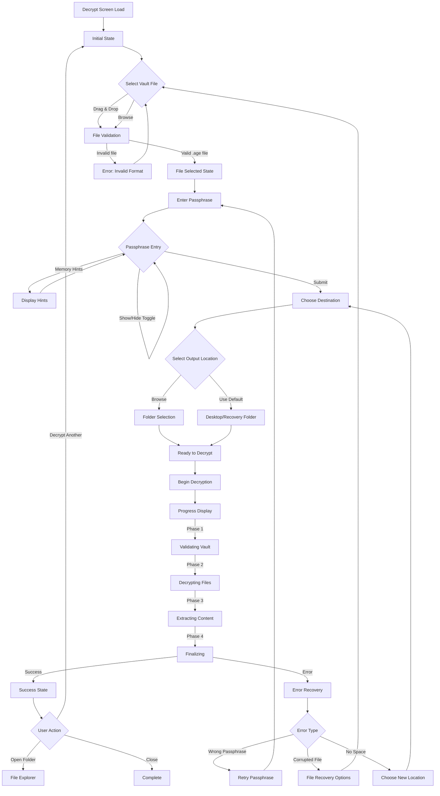
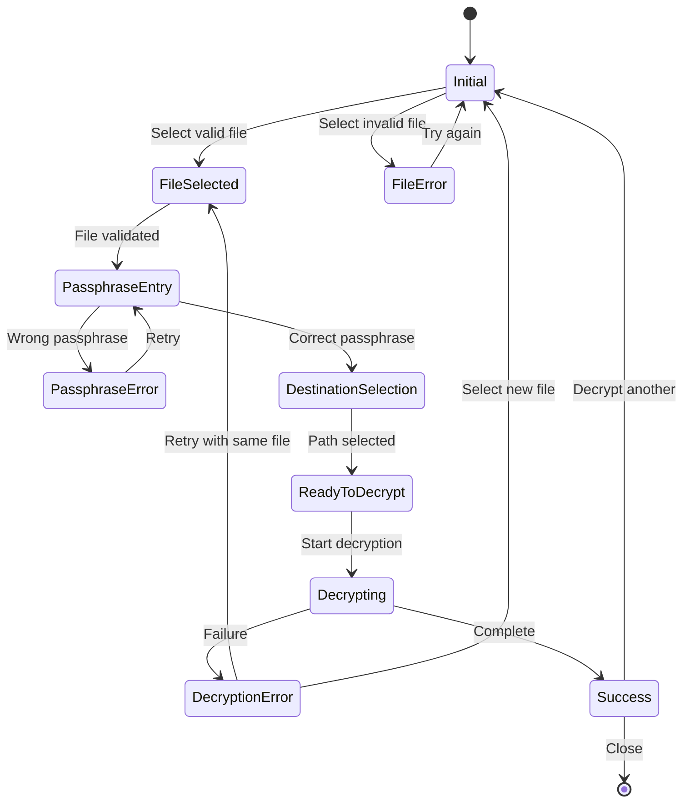
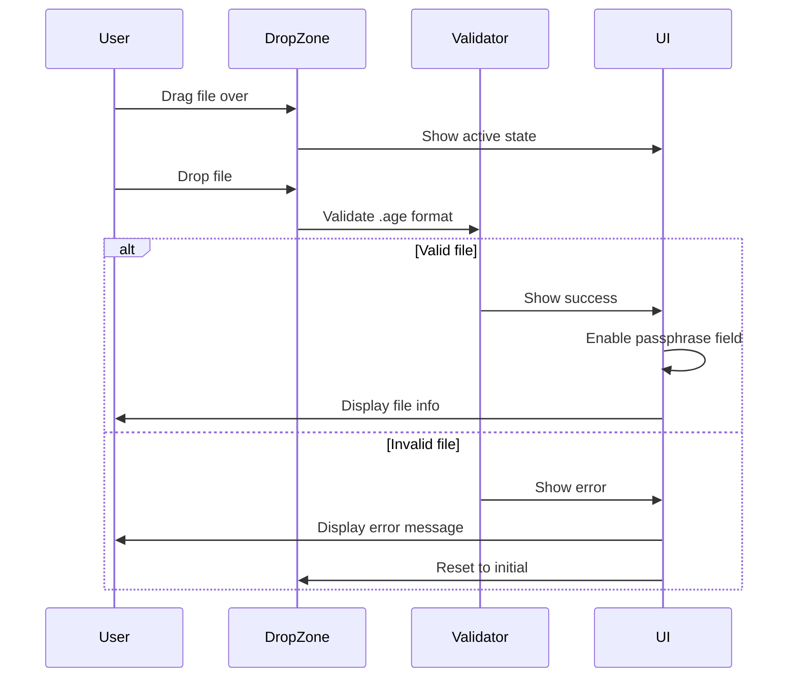
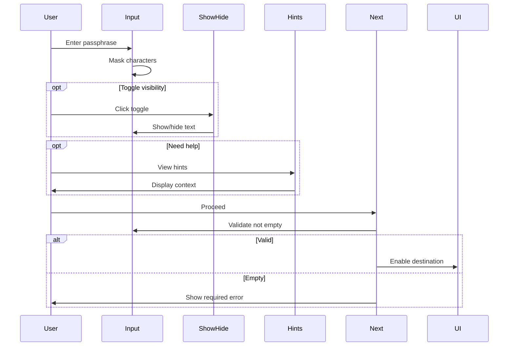

# Decrypt Screen Wireframes

> **Purpose**: Visual representation and interaction flow for the Decrypt screen  
> **Format**: Mermaid diagrams and ASCII wireframes with annotations  
> **Status**: Ready for implementation

## User Flow Diagram



## State Diagrams



## Desktop Wireframe (1024px+)

### Initial State

```
┌───────────────────────────────────────────────────────────────────────┐
│ Barqly Vault - Decrypt                                       [−][□][×]│
├───────────────────────────────────────────────────────────────────────┤
│                                                                         │
│  ┌───────────────────────────────────────────────────────────────┐     │
│  │  🔓  Decrypt Your Vault                                       │     │
│  │      Recover your encrypted Bitcoin custody files             │     │
│  │  ─────────────────────────────────────────────────────────   │     │
│  │  🛡️ Military-grade  |  🔒 Local-only  |  ⏱️ Under 60 seconds  │     │
│  └───────────────────────────────────────────────────────────────┘     │
│                                                                         │
│  ┌───────────────────────────────────────────────────────────────┐     │
│  │ Step 1: Select Vault → Step 2: Enter Passphrase → Step 3:     │     │
│  │ Choose Destination → Ready to Decrypt                         │     │
│  │ ░░░░░░░░░░░░░░░░░░░░░░░░░░░░░░░░░░░░░░░░  0% Complete       │     │
│  └───────────────────────────────────────────────────────────────┘     │
│                                                                         │
│  ┌───────────────────────────────────────────────────────────────┐     │
│  │                                                                │     │
│  │  Select your encrypted vault file                             │     │
│  │  ┌ ─ ─ ─ ─ ─ ─ ─ ─ ─ ─ ─ ─ ─ ─ ─ ─ ─ ─ ─ ─ ─ ─ ─ ─ ─ ─ ┐   │     │
│  │                                                               │     │
│  │  │         🔐 Drop your encrypted vault here               │  │     │
│  │            (or click to browse)                              │     │
│  │  │                                                         │  │     │
│  │                   [ Select Vault File ]                      │     │
│  │  │                                                         │  │     │
│  │                                                               │     │
│  │  └ ─ ─ ─ ─ ─ ─ ─ ─ ─ ─ ─ ─ ─ ─ ─ ─ ─ ─ ─ ─ ─ ─ ─ ─ ─ ─ ┘   │     │
│  │  Looking for .age encrypted files                             │     │
│  │                                                                │     │
│  └───────────────────────────────────────────────────────────────┘     │
│                                                                         │
│  ┌───────────────────────────────────────────────────────────────┐     │
│  │  Enter your vault passphrase                    [Disabled]    │     │
│  │  ┌─────────────────────────────────────────────────────────┐ │     │
│  │  │                                                         │ │     │
│  │  └─────────────────────────────────────────────────────────┘ │     │
│  └───────────────────────────────────────────────────────────────┘     │
│                                                                         │
│  ┌───────────────────────────────────────────────────────────────┐     │
│  │  Choose where to save recovered files          [Disabled]     │     │
│  │  ┌─────────────────────────────────────────────────────────┐ │     │
│  │  │                                                         │ │     │
│  │  └─────────────────────────────────────────────────────────┘ │     │
│  └───────────────────────────────────────────────────────────────┘     │
│                                                                         │
│  ┌───────────────────────────────────────────────────────────────┐     │
│  │              [ Begin Decryption ] (Disabled)                   │     │
│  └───────────────────────────────────────────────────────────────┘     │
│                                                                         │
└───────────────────────────────────────────────────────────────────────┘
```

### File Selected State

```
┌───────────────────────────────────────────────────────────────────────┐
│ Barqly Vault - Decrypt                                       [−][□][×]│
├───────────────────────────────────────────────────────────────────────┤
│                                                                         │
│  [Header section remains the same]                                     │
│                                                                         │
│  ┌───────────────────────────────────────────────────────────────┐     │
│  │ Step 1: Select Vault ✓ → Step 2: Enter Passphrase → Step 3:   │     │
│  │ Choose Destination → Ready to Decrypt                         │     │
│  │ ████████░░░░░░░░░░░░░░░░░░░░░░░░░░░░░░░  25% Complete       │     │
│  └───────────────────────────────────────────────────────────────┘     │
│                                                                         │
│  ┌───────────────────────────────────────────────────────────────┐     │
│  │  ✓ Vault file selected                                        │     │
│  │  ┌─────────────────────────────────────────────────────────┐ │     │
│  │  │ 📄 family-bitcoin-backup-2024-01-15.age           [×]   │ │     │
│  │  │    Size: 2.4 MB · Created: January 15, 2024            │ │     │
│  │  │    ✓ Valid Age encryption format                        │ │     │
│  │  └─────────────────────────────────────────────────────────┘ │     │
│  │  [ Change File ]                                              │     │
│  └───────────────────────────────────────────────────────────────┘     │
│                                                                         │
│  ┌───────────────────────────────────────────────────────────────┐     │
│  │  Enter your vault passphrase                     👈 Active     │     │
│  │  The passphrase you used when creating this vault             │     │
│  │  ┌─────────────────────────────────────────────────────────┐ │     │
│  │  │ ••••••••••••••••                          [👁️ Show]     │ │     │
│  │  └─────────────────────────────────────────────────────────┘ │     │
│  │                                                                │     │
│  │  💡 Memory hints:                                             │     │
│  │  • Vault created on January 15, 2024                         │     │
│  │  • You used the key: "My Bitcoin Vault"                      │     │
│  │                                                                │     │
│  │  [ Need help recovering your passphrase? ]                   │     │
│  └───────────────────────────────────────────────────────────────┘     │
│                                                                         │
└───────────────────────────────────────────────────────────────────────┘
```

### Ready to Decrypt State

```
┌───────────────────────────────────────────────────────────────────────┐
│ Barqly Vault - Decrypt                                       [−][□][×]│
├───────────────────────────────────────────────────────────────────────┤
│                                                                         │
│  [Header section remains the same]                                     │
│                                                                         │
│  ┌───────────────────────────────────────────────────────────────┐     │
│  │ Step 1: Select Vault ✓ → Step 2: Enter Passphrase ✓ → Step 3: │     │
│  │ Choose Destination ✓ → Ready to Decrypt ●                     │     │
│  │ ████████████████████████████████████████████  100% Ready     │     │
│  └───────────────────────────────────────────────────────────────┘     │
│                                                                         │
│  ┌───────────────────────────────────────────────────────────────┐     │
│  │  ✓ Vault file selected                                        │     │
│  │  📄 family-bitcoin-backup-2024-01-15.age (2.4 MB)            │     │
│  └───────────────────────────────────────────────────────────────┘     │
│                                                                         │
│  ┌───────────────────────────────────────────────────────────────┐     │
│  │  ✓ Passphrase entered                                         │     │
│  │  •••••••••••••••••••• (hidden for security)                  │     │
│  └───────────────────────────────────────────────────────────────┘     │
│                                                                         │
│  ┌───────────────────────────────────────────────────────────────┐     │
│  │  ✓ Destination selected                                       │     │
│  │  📁 ~/Desktop/Barqly-Recovery-2025-01-15/                    │     │
│  │  ☑ Create new folder · Space available: 45.2 GB              │     │
│  └───────────────────────────────────────────────────────────────┘     │
│                                                                         │
│  ┌───────────────────────────────────────────────────────────────┐     │
│  │  Ready to decrypt your vault:                                 │     │
│  │  All requirements met. Your files will be recovered to the    │     │
│  │  selected destination.                                        │     │
│  │                                                                │     │
│  │     [ Clear Form ]         [ 🔓 Begin Decryption → ]         │     │
│  └───────────────────────────────────────────────────────────────┘     │
│                                                                         │
└───────────────────────────────────────────────────────────────────────┘
```

### Decryption Progress State

```
┌───────────────────────────────────────────────────────────────────────┐
│ Barqly Vault - Decrypt                                       [−][□][×]│
├───────────────────────────────────────────────────────────────────────┤
│                                                                         │
│  ┌───────────────────────────────────────────────────────────────┐     │
│  │                 Decrypting Your Vault                         │     │
│  │                                                                │     │
│  │  ┌───────────────────────────────────────────────────────┐   │     │
│  │  │ ████████████████████████████████░░░░░░░░░░░  75%      │   │     │
│  │  └───────────────────────────────────────────────────────┘   │     │
│  │                                                                │     │
│  │  Current Operation:                                           │     │
│  │  ┌───────────────────────────────────────────────────────┐   │     │
│  │  │                                                         │   │     │
│  │  │  ✓ Vault integrity verified                            │   │     │
│  │  │  ✓ Passphrase validated                                │   │     │
│  │  │  ⟳ Decrypting files... (75%)                          │   │     │
│  │  │  ○ Extracting to destination                           │   │     │
│  │  │  ○ Finalizing recovery                                 │   │     │
│  │  │                                                         │   │     │
│  │  └───────────────────────────────────────────────────────┘   │     │
│  │                                                                │     │
│  │  Processing: wallet-descriptor.json                          │     │
│  │  Time remaining: ~15 seconds                                  │     │
│  │                                                                │     │
│  │                    [ Cancel ]                                 │     │
│  │                                                                │     │
│  └───────────────────────────────────────────────────────────────┘     │
│                                                                         │
└───────────────────────────────────────────────────────────────────────┘
```

### Success State

```
┌───────────────────────────────────────────────────────────────────────┐
│ Barqly Vault - Decrypt                                       [−][□][×]│
├───────────────────────────────────────────────────────────────────────┤
│                                                                         │
│  ┌───────────────────────────────────────────────────────────────┐     │
│  │                                                                │     │
│  │         ✅  Vault Successfully Decrypted!                     │     │
│  │                                                                │     │
│  │  Your files have been recovered and are ready to use.        │     │
│  │                                                                │     │
│  │  ┌───────────────────────────────────────────────────────┐   │     │
│  │  │ 📍 Files saved to:                                     │   │     │
│  │  │ ~/Desktop/Barqly-Recovery-2025-01-15/                 │   │     │
│  │  │                                                        │   │     │
│  │  │ [ Open Folder ]  [ Copy Path ]                        │   │     │
│  │  └───────────────────────────────────────────────────────┘   │     │
│  │                                                                │     │
│  │  📊 Recovery Summary:                                         │     │
│  │  • 3 files recovered successfully                             │     │
│  │  • Total size: 1.8 MB                                        │     │
│  │  • Folder structure preserved                                 │     │
│  │  • Decryption time: 12 seconds                                │     │
│  │                                                                │     │
│  │  Recovered files:                                             │     │
│  │  ┌───────────────────────────────────────────────────────┐   │     │
│  │  │ 📄 wallet-descriptor.json                             │   │     │
│  │  │ 📄 seed-phrase.txt                                    │   │     │
│  │  │ 📄 xpub-keys.txt                                      │   │     │
│  │  └───────────────────────────────────────────────────────┘   │     │
│  │                                                                │     │
│  │      [ Decrypt Another Vault ]    [ Close ]                  │     │
│  │                                                                │     │
│  └───────────────────────────────────────────────────────────────┘     │
│                                                                         │
└───────────────────────────────────────────────────────────────────────┘
```

## Mobile Wireframe (<768px)

### Initial State (Mobile)

```
┌─────────────────────────┐
│ 🔓 Decrypt Your Vault   │
│                         │
│ Recover your encrypted  │
│ Bitcoin custody files   │
├─────────────────────────┤
│ 🛡️ Military-grade      │
│ 🔒 Local-only recovery  │
│ ⏱️ Under 60 seconds     │
├─────────────────────────┤
│ Step 1 of 3            │
│ Select Vault           │
│ ░░░░░░░░░  0%          │
├─────────────────────────┤
│                         │
│ Select encrypted vault  │
│                         │
│ ┌ ─ ─ ─ ─ ─ ─ ─ ─ ─ ┐ │
│                         │
│ │  🔐 Drop vault     │ │
│      here              │
│ │                    │ │
│                         │
│ └ ─ ─ ─ ─ ─ ─ ─ ─ ─ ┘ │
│                         │
│ [ Select Vault File ]  │
│                         │
│ Looking for .age files  │
│                         │
├─────────────────────────┤
│ Next steps:             │
│ • Enter passphrase      │
│ • Choose destination    │
├─────────────────────────┤
│ [ Begin ] (Disabled)    │
└─────────────────────────┘
```

### Passphrase Entry (Mobile)

```
┌─────────────────────────┐
│ 🔓 Decrypt Your Vault   │
├─────────────────────────┤
│ Step 2 of 3            │
│ Enter Passphrase       │
│ ████████░░  50%        │
├─────────────────────────┤
│ ✓ Vault selected       │
│ 📄 family-backup.age   │
│ 2.4 MB                 │
├─────────────────────────┤
│                         │
│ Enter vault passphrase  │
│                         │
│ ┌─────────────────────┐ │
│ │ ••••••••••   [👁️]   │ │
│ └─────────────────────┘ │
│                         │
│ 💡 Hints:               │
│ • Created Jan 15, 2024  │
│ • Key: My Bitcoin Vault │
│                         │
│ [ Need help? ]          │
│                         │
├─────────────────────────┤
│ [ Back ]    [ Next ]    │
└─────────────────────────┘
```

## Error States

### Wrong Passphrase Error

```
┌───────────────────────────────────────────────────────────────────────┐
│                                                                         │
│  ┌───────────────────────────────────────────────────────────────┐     │
│  │  ⚠️ Unable to decrypt - incorrect passphrase                  │     │
│  │                                                                │     │
│  │  The passphrase doesn't match this vault.                     │     │
│  │  Passphrases are case-sensitive.                              │     │
│  │                                                                │     │
│  │  Attempts: 2 of unlimited                                     │     │
│  │                                                                │     │
│  │  Common issues:                                               │     │
│  │  • Check CAPS LOCK is off                                     │     │
│  │  • Verify spacing between words                               │     │
│  │  • Try variations you might have used                         │     │
│  │                                                                │     │
│  │  [ Try Again ]  [ View Tips ]  [ Get Help ]                   │     │
│  └───────────────────────────────────────────────────────────────┘     │
│                                                                         │
└───────────────────────────────────────────────────────────────────────┘
```

### Corrupted File Error

```
┌───────────────────────────────────────────────────────────────────────┐
│                                                                         │
│  ┌───────────────────────────────────────────────────────────────┐     │
│  │  ⚠️ Vault file appears damaged                                │     │
│  │                                                                │     │
│  │  The file may have been corrupted during storage.             │     │
│  │                                                                │     │
│  │  File: family-bitcoin-backup.age                              │     │
│  │  Issue: Invalid encryption header                              │     │
│  │                                                                │     │
│  │  Recovery options:                                             │     │
│  │  • Try a backup copy if available                             │     │
│  │  • Check if file was fully downloaded                         │     │
│  │  • Attempt partial recovery (may lose some files)             │     │
│  │                                                                │     │
│  │  [ Select Different File ]  [ Attempt Partial Recovery ]      │     │
│  └───────────────────────────────────────────────────────────────┘     │
│                                                                         │
└───────────────────────────────────────────────────────────────────────┘
```

## Component Interaction Specifications

### File Drop Zone Interactions



### Passphrase Validation Flow



## Responsive Breakpoints

### Layout Adjustments

| Breakpoint | Layout Changes |
|------------|---------------|
| < 480px | Single column, stacked buttons, simplified progress |
| 480-768px | Single column, side-by-side small buttons |
| 768-1024px | Two-column for form sections, inline buttons |
| > 1024px | Full desktop layout with optimal spacing |

### Component Scaling

| Component | Mobile | Tablet | Desktop |
|-----------|--------|--------|---------|
| Header height | 60px | 64px | 64px |
| Button height | 48px | 44px | 44px |
| Input height | 48px | 48px | 48px |
| Font size base | 15px | 16px | 16px |
| Touch targets | 48×48px | 44×44px | 40×40px |

## Animation Timings

### Progress Animations

```css
/* Smooth progress bar fill */
.progress-bar {
  transition: width 300ms ease-in-out;
}

/* Step indicator transitions */
.step-indicator {
  transition: all 200ms ease-out;
}

/* Success animation sequence */
@keyframes success-check {
  0% { transform: scale(0) rotate(-45deg); opacity: 0; }
  50% { transform: scale(1.2) rotate(0deg); opacity: 1; }
  100% { transform: scale(1) rotate(0deg); opacity: 1; }
}

/* File drop bounce */
@keyframes file-drop {
  0% { transform: translateY(-10px); opacity: 0; }
  60% { transform: translateY(2px); opacity: 1; }
  100% { transform: translateY(0); opacity: 1; }
}
```

## Accessibility Annotations

### ARIA Labels and Roles

```html
<!-- Main form -->
<form role="form" aria-label="Decrypt vault form">
  
  <!-- File selection -->
  <div role="region" aria-label="Vault file selection">
    <div role="button" 
         tabindex="0" 
         aria-label="Drop files here or click to browse">
    </div>
  </div>
  
  <!-- Passphrase input -->
  <div role="region" aria-label="Passphrase entry">
    <input type="password" 
           aria-label="Vault passphrase"
           aria-describedby="passphrase-hints"
           aria-required="true">
    <button aria-label="Toggle passphrase visibility"
            aria-pressed="false">
    </button>
  </div>
  
  <!-- Progress -->
  <div role="progressbar" 
       aria-valuenow="75" 
       aria-valuemin="0" 
       aria-valuemax="100"
       aria-label="Decryption progress">
  </div>
  
  <!-- Status messages -->
  <div role="status" aria-live="polite" aria-atomic="true">
    <!-- Dynamic status updates -->
  </div>
</form>
```

### Keyboard Navigation Map

```
Tab Order:
1. Skip to main content (hidden)
2. File selection drop zone
3. Browse file button
4. Remove file button (if file selected)
5. Passphrase input
6. Show/hide passphrase toggle
7. Help link
8. Destination path input
9. Browse folder button
10. Create folder checkbox
11. Clear form button
12. Begin decryption button
13. Cancel button (during decryption)
14. Success action buttons
```

## Testing Scenarios

### Critical User Paths

1. **First-time recovery**
   - New user with vault file
   - No prior experience
   - Needs all guidance

2. **Emergency recovery**
   - Stressed user
   - Time pressure
   - Must work first try

3. **Technical user**
   - Wants efficiency
   - Keyboard navigation
   - Batch operations

4. **Family member access**
   - Non-technical
   - Following instructions
   - Needs reassurance

5. **Mobile emergency**
   - Only has phone
   - Limited screen
   - Touch-only input

---

*These wireframes provide the complete visual blueprint for implementing the Decrypt screen, optimized for high-stakes Bitcoin custody recovery scenarios.*