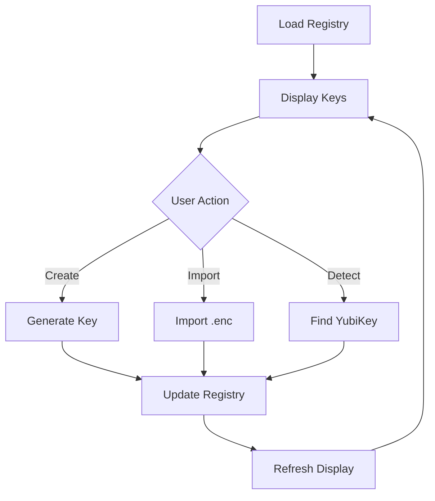

# Phase 2: Manage Keys Redesign

**Timeline:** Day 2 (6-7 hours)
**Priority:** High - Central to vault functionality
**Dependencies:** Phase 1 completion (navigation)

---

## Objectives

1. Transform to registry-based key management
2. Create card-based UI with optional table view
3. Implement inline key operations (no modals)
4. Add YubiKey detection and import features
5. Support orphan key states

---

## Tasks Breakdown

### Task 2.1: Create useManageKeysWorkflow Hook (60 min)
**File:** `src-ui/src/hooks/useManageKeysWorkflow.ts`

**State Management:**
```typescript
interface ManageKeysWorkflowState {
  // View state
  viewMode: 'cards' | 'table';
  searchQuery: string;
  filterType: 'all' | 'passphrase' | 'yubikey';

  // Key operations
  isCreatingKey: boolean;
  isImporting: boolean;
  isDetectingYubiKey: boolean;

  // Selection
  selectedKeys: Set<string>;

  // Error handling
  error: string | null;
}
```

**Operations:**
- Create passphrase key
- Import .enc file
- Detect YubiKey
- Attach/detach keys from vaults
- Delete orphan keys
- Refresh key registry

### Task 2.2: Build KeyCard Component (90 min)
**File:** `src-ui/src/components/keys/KeyCard.tsx`

**Visual Design:**
```
┌─────────────────────────────────────┐
│ [🔑] My Backup Key           [···]  │
│ Passphrase • Created 2 days ago     │
├─────────────────────────────────────┤
│ Identity: age1qy3w...x7sk          │
│ Attached to: 2 vaults               │
├─────────────────────────────────────┤
│ [Attach to Vault] [Export] [Delete] │
└─────────────────────────────────────┘
```

**States:**
- Normal
- Orphan (no vault attachments)
- YubiKey not present
- Selected (for bulk operations)

**Props:**
```typescript
interface KeyCardProps {
  keyRef: KeyReference;
  vaultAttachments: number;
  isOrphan: boolean;
  isSelected?: boolean;
  onSelect?: (keyId: string) => void;
  onAttach?: (keyId: string) => void;
  onDetach?: (keyId: string, vaultId: string) => void;
  onDelete?: (keyId: string) => void;
}
```

### Task 2.3: Build KeyTable Component (60 min)
**File:** `src-ui/src/components/keys/KeyTable.tsx`

**Table Columns:**
- Select checkbox
- Label/Name
- Type (icon + text)
- Identity (truncated)
- Vaults (count with expand)
- Status (Present/Orphan)
- Created date
- Last used
- Actions menu

**Features:**
- Sortable columns
- Filterable by type/status
- Search by label/identity
- Bulk selection
- Expandable vault list

### Task 2.4: Create KeyImportDialog (45 min)
**File:** `src-ui/src/components/keys/KeyImportDialog.tsx`

**Flow:**
1. Select .enc file
2. Verify file format
3. Enter passphrase (if needed)
4. Import to registry
5. Optional: Attach to current vault

**UI:**
- Inline form (not modal)
- Drag & drop zone
- File validation
- Progress indicator
- Success/error feedback

### Task 2.5: Implement YubiKeyDetector (60 min)
**File:** `src-ui/src/components/keys/YubiKeyDetector.tsx`

**Features:**
- Real-time detection
- Show serial/slot info
- Identity tag display
- Add to registry button
- Status indicators

**Visual:**
```
┌─────────────────────────────────────┐
│ 🔑 YubiKey Detected                 │
│                                      │
│ Serial: 15903715                    │
│ Slot: 1                              │
│ Identity: age1yubikey1q...          │
│                                      │
│ [Add to Registry] [Cancel]          │
└─────────────────────────────────────┘
```

### Task 2.6: Update ManageKeysPage (90 min)
**File:** `src-ui/src/pages/ManageKeysPage.tsx`

**Layout Structure:**
```tsx
<div className="min-h-screen bg-gradient-to-b from-gray-50 to-white">
  <UniversalHeader title="Manage Keys" icon={Key} />

  <AppPrimaryContainer>
    {/* Action Bar */}
    <div className="flex justify-between items-center mb-6">
      <div className="flex gap-3">
        <Button onClick={createPassphrase}>+ New Passphrase</Button>
        <Button onClick={importKey}>Import .enc</Button>
        <Button onClick={detectYubiKey}>Detect YubiKey</Button>
      </div>
      <div className="flex gap-3">
        <SearchInput />
        <ViewToggle />
      </div>
    </div>

    {/* Key Display */}
    {viewMode === 'cards' ? (
      <KeyCardGrid keys={filteredKeys} />
    ) : (
      <KeyTable keys={filteredKeys} />
    )}

    {/* Import/Create Forms (inline) */}
    {isCreatingKey && <PassphraseKeyForm />}
    {isImporting && <KeyImportDialog />}
    {isDetectingYubiKey && <YubiKeyDetector />}
  </AppPrimaryContainer>
</div>
```

### Task 2.7: Integrate with VaultContext (45 min)

**Cache Integration:**
```typescript
const ManageKeysPage = () => {
  const { keyCache, refreshKeysForVault, currentVault } = useVault();

  // Display from cache
  const allKeys = Array.from(keyCache.values()).flat();

  // Refresh on mount
  useEffect(() => {
    refreshAllKeys();
  }, []);

  // Update after mutations
  const handleKeyCreated = async () => {
    await createKey(...);
    await refreshAllKeys();
  };
};
```

### Task 2.8: Testing & Polish (60 min)

**Test Scenarios:**
- [ ] Create passphrase key
- [ ] Import .enc file
- [ ] Detect YubiKey
- [ ] Attach key to vault
- [ ] Detach key from vault
- [ ] Delete orphan key
- [ ] Switch between card/table view
- [ ] Search and filter
- [ ] Bulk operations

---

## Component Specifications

### KeyCard Dimensions
- Width: 100% (responsive grid)
- Min-width: 320px
- Padding: 20px
- Border-radius: 12px
- Gap between cards: 16px

### Grid Layout
```css
.key-grid {
  display: grid;
  grid-template-columns: repeat(auto-fill, minmax(320px, 1fr));
  gap: 1rem;
}
```

### Color Coding
- Passphrase keys: Green accent
- YubiKey: Purple accent
- Orphan: Orange warning
- Not present: Gray muted

---

## Backend Integration

### Commands to Use
```typescript
// Key operations
commands.generateKeypairAge({ label, passphrase })
commands.importKeyFile({ file_path })
commands.detectYubikey()
commands.addKeyToVault({ vault_id, key_id })
commands.removeKeyFromVault({ vault_id, key_id })
commands.deleteKey({ key_id }) // Only if orphan

// Registry operations
commands.getKeyRegistry()
commands.refreshKeyRegistry()
```

---

## State Flow



---

## Migration from Current

**Current Issues:**
- Vault dropdown confusion
- Not intuitive for multi-vault
- Keys tied to vault selection

**New Approach:**
- Keys independent of vaults
- Clear attachment UI
- Visual vault associations
- Bulk operations support

---

## Success Criteria

- [ ] All keys visible in one place
- [ ] Clear orphan identification
- [ ] Intuitive attach/detach flow
- [ ] YubiKey detection works
- [ ] Import .enc functional
- [ ] Search/filter responsive
- [ ] View toggle smooth
- [ ] Cache-first performance
- [ ] Components < 200 LOC

---

## Risk Mitigation

1. **Complex State:** Use workflow hook pattern
2. **Performance:** Virtual scroll for large lists
3. **YubiKey Issues:** Graceful fallback
4. **Import Errors:** Clear error messages
5. **Bulk Operations:** Confirmation dialogs

---

## Handoff Notes

Document after completion:
- Any API limitations discovered
- Performance optimizations needed
- UX improvements identified
- Technical debt created
- Next phase dependencies

---

_This plan guides the Manage Keys screen redesign._