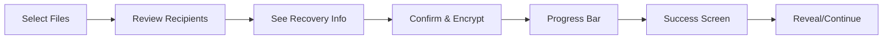

# Phase 4: Encrypt Enhancement with Recovery

**Timeline:** Day 4 (5-6 hours)
**Priority:** High - Core functionality with recovery
**Dependencies:** Phase 3 completion (Vault Hub)

---

## Objectives

1. Keep progressive cards pattern
2. Bundle manifest + .enc files automatically
3. Add "What's included" recovery info panel
4. Visual confirmation of bundled items
5. Improve success feedback

---

## Tasks Breakdown

### Task 4.1: Enhance useEncryptionWorkflow Hook (60 min)
**File:** `src-ui/src/hooks/useEncryptionWorkflow.ts` (existing, enhance)

**Add Recovery State:**
```typescript
interface EncryptionWorkflowState {
  // Existing state...

  // New recovery additions
  includeManifest: boolean; // Always true
  includePassphraseKeys: boolean; // Default true
  includeRecoveryGuide: boolean; // Default true

  // Bundle preview
  bundleContents: {
    userFiles: FileInfo[];
    manifest: boolean;
    passphraseKeys: string[];
    recoveryGuide: boolean;
    totalSize: number;
  };

  // Success details
  encryptionResult: {
    outputPath: string;
    bundleSize: number;
    recoveryItemsIncluded: string[];
  } | null;
}
```

**Operations:**
- Calculate bundle contents
- Generate recovery guide
- Package with manifest
- Track what's included

### Task 4.2: Create RecoveryInfoPanel Component (90 min)
**File:** `src-ui/src/components/encrypt/RecoveryInfoPanel.tsx`

**Visual Design:**
```
┌─────────────────────────────────────┐
│ 📦 What's Included for Recovery     │
├─────────────────────────────────────┤
│ Your encrypted bundle will contain: │
│                                     │
│ ✓ Your Files (42 items, 125 MB)    │
│ ✓ Vault Manifest (vault config)    │
│ ✓ Passphrase Keys (1 .enc file)    │
│ ✓ RECOVERY.txt (instructions)      │
│                                     │
│ ┌───────────────────────────────┐   │
│ │ ℹ️ Recovery Ready               │   │
│ │ This bundle can be decrypted   │   │
│ │ on any device with your key    │   │
│ └───────────────────────────────┘   │
└─────────────────────────────────────┘
```

**Props:**
```typescript
interface RecoveryInfoPanelProps {
  fileCount: number;
  totalSize: number;
  hasPassphraseKeys: boolean;
  vaultName: string;
  isExpanded?: boolean;
}
```

### Task 4.3: Update ProgressiveEncryptionCards (60 min)
**File:** `src-ui/src/components/encrypt/ProgressiveEncryptionCards.tsx`

**Step 2 Enhancement (Review Stage):**
```tsx
// Add recovery info to step 2
{currentStep === 2 && (
  <div className="space-y-6">
    {/* Existing recipient display */}
    <div className="p-4 border rounded-lg">
      <h3 className="font-semibold mb-3">Encryption Recipients</h3>
      <KeyMenuBar keys={getCurrentVaultKeys()} />
    </div>

    {/* NEW: Recovery info panel */}
    <RecoveryInfoPanel
      fileCount={selectedFiles.length}
      totalSize={calculateTotalSize(selectedFiles)}
      hasPassphraseKeys={hasPassphraseKey()}
      vaultName={currentVault.name}
    />

    {/* Continue button */}
    <div className="flex justify-between">
      <button onClick={goBack}>Previous</button>
      <button onClick={startEncryption}>Encrypt Now</button>
    </div>
  </div>
)}
```

### Task 4.4: Create EncryptionSummary Component (45 min)
**File:** `src-ui/src/components/encrypt/EncryptionSummary.tsx`

**Pre-encryption Review:**
```
┌─────────────────────────────────────┐
│ 📋 Encryption Summary                │
├─────────────────────────────────────┤
│ Vault: Personal Documents           │
│ Files: 42 items (125 MB)           │
│ Recipients: 3 keys                  │
│ Recovery: Fully included ✓          │
│                                     │
│ Output: Personal-Documents.age      │
│ Location: ~/Desktop                 │
└─────────────────────────────────────┘
```

### Task 4.5: Enhance EncryptionSuccess Component (45 min)
**File:** `src-ui/src/components/encrypt/EncryptionSuccess.tsx`

**Improved Success Screen:**
```
┌─────────────────────────────────────┐
│         ✅ Encryption Complete       │
├─────────────────────────────────────┤
│ Your vault has been encrypted       │
│                                     │
│ 📄 Personal-Documents.age           │
│ 📁 ~/Desktop                       │
│ 📊 Final size: 124.8 MB            │
│                                     │
│ Recovery items included:            │
│ • Vault manifest ✓                  │
│ • Passphrase key (.enc) ✓          │
│ • Recovery instructions ✓           │
│                                     │
│ [Reveal in Finder] [Encrypt More]   │
└─────────────────────────────────────┘
```

### Task 4.6: Update Backend Integration (60 min)
**File:** Update encryption command calls

**Command Structure:**
```typescript
const encryptWithRecovery = async () => {
  // The backend already handles recovery items
  // Just need to ensure UI shows what's included

  const result = await commands.encryptFilesMulti({
    vault_id: currentVault.id,
    in_file_paths: selectedFiles.map(f => f.path),
    out_encrypted_file_name: generateFileName(),
    out_encrypted_file_path: destinationPath,
    // Backend automatically includes manifest, keys, RECOVERY.txt
  });

  // Track what was included for display
  setEncryptionResult({
    outputPath: result.output_path,
    bundleSize: result.bundle_size,
    recoveryItemsIncluded: [
      'Vault manifest',
      `${passphraseKeyCount} passphrase key(s)`,
      'RECOVERY.txt guide'
    ]
  });
};
```

### Task 4.7: Add Visual Polish (45 min)

**Animations:**
- File addition animation
- Progress bar smooth transitions
- Success checkmark animation
- Panel expand/collapse

**Visual Improvements:**
- Better file icons
- Size formatting (KB, MB, GB)
- Timestamp displays
- Color-coded status

### Task 4.8: Testing & Validation (60 min)

**Test Scenarios:**
- [ ] Files selected and displayed
- [ ] Recovery panel shows correct info
- [ ] Bundle includes all recovery items
- [ ] Success screen accurate
- [ ] File can be revealed in finder
- [ ] Progress bar smooth
- [ ] Error handling works
- [ ] Large file handling

---

## Visual Specifications

### Recovery Panel Colors
```css
.recovery-panel {
  background: linear-gradient(135deg, #EFF6FF 0%, #DBEAFE 100%);
  border: 1px solid #BFDBFE;
}

.recovery-item {
  color: #1E40AF; /* blue-800 */
}

.recovery-check {
  color: #10B981; /* green-500 */
}
```

### Progress Indicators
```css
.progress-step {
  /* Inactive */
  background: #F1F5F9;
  color: #64748B;

  /* Active */
  background: #2563EB;
  color: white;

  /* Complete */
  background: #10B981;
  color: white;
}
```

---

## Backend Context

**What Backend Already Does:**
1. Automatically includes manifest in bundle
2. Copies .enc files if available
3. Generates RECOVERY.txt
4. Creates TAR archive
5. Encrypts with age multi-recipient

**UI Responsibility:**
- Show what's being included
- Provide visual confirmation
- Display success details
- Enable file reveal

---

## Integration Points

### With VaultContext
```typescript
const { currentVault, getCurrentVaultKeys } = useVault();

// Check for passphrase keys
const passphraseKeys = getCurrentVaultKeys()
  .filter(key => key.key_type === 'Passphrase');
```

### With File System
```typescript
// Open output location
await commands.revealInFinder(outputPath);

// Get destination folder
const defaultPath = await commands.getDefaultEncryptionPath();
```

---

## User Flow



---

## Success Criteria

- [ ] Recovery items clearly shown
- [ ] Users understand what's included
- [ ] Visual feedback improved
- [ ] Success details comprehensive
- [ ] Progressive flow maintained
- [ ] No modal dialogs
- [ ] Smooth animations
- [ ] Cache-first performance

---

## Migration Notes

**Keep:**
- Progressive cards pattern
- Three-step flow
- File selection UI
- Destination selector

**Enhance:**
- Add recovery panel
- Improve success screen
- Better visual feedback
- Show bundle contents

**Remove:**
- Nothing (enhancement only)

---

## Handoff Notes

Document after Phase 4:
- Recovery feature understanding
- Any backend limitations
- Performance with large files
- UI/UX improvements needed
- Ready for Phase 5 (Decrypt)

---

_This plan guides the Encrypt enhancement with recovery features._