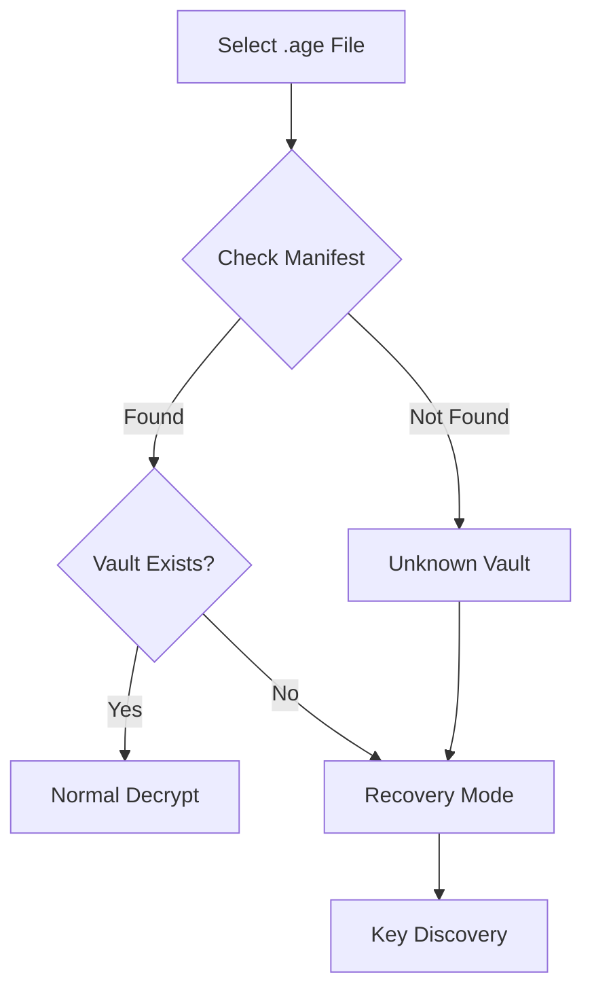
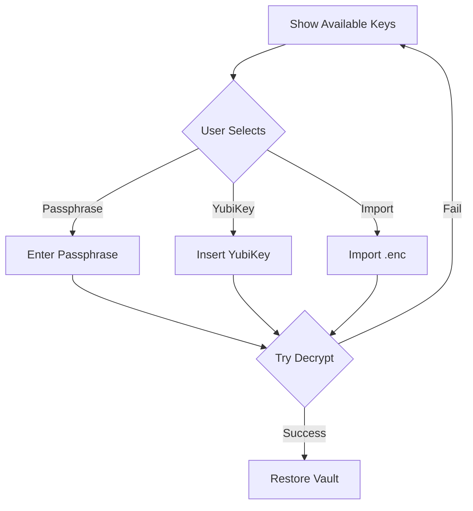

# Phase 5: Decrypt Enhancement with Recovery

**Timeline:** Day 5 (5-6 hours)
**Priority:** High - Critical recovery functionality
**Dependencies:** Phase 4 completion (Encrypt with recovery)

---

## Objectives

1. Seamless recovery without separate mode
2. Auto-detect unknown vaults
3. Guide key discovery process
4. Restore manifest after successful decrypt
5. Maintain progressive card pattern

---

## Tasks Breakdown

### Task 5.1: Enhance useDecryptionWorkflow Hook (60 min)
**File:** `src-ui/src/hooks/useDecryptionWorkflow.ts` (existing, enhance)

**Add Recovery State:**
```typescript
interface DecryptionWorkflowState {
  // Existing state...

  // Vault recognition
  isKnownVault: boolean;
  detectedVaultName: string | null;
  detectedVaultId: string | null;

  // Key discovery
  isDiscoveringKeys: boolean;
  availableKeys: KeyReference[];
  suggestedKeys: KeyReference[];
  keyAttempts: Map<string, boolean>; // keyId -> tried

  // Recovery
  isRecoveryMode: boolean;
  willRestoreManifest: boolean;
  willRestoreKeys: boolean;
  recoveredItems: {
    manifest?: VaultManifest;
    keys?: string[];
    files?: FileInfo[];
  } | null;
}
```

**Operations:**
- Detect if vault is known
- Discover available keys
- Try decryption with different keys
- Restore manifest after success
- Import recovered .enc files

### Task 5.2: Create VaultRecognition Component (60 min)
**File:** `src-ui/src/components/decrypt/VaultRecognition.tsx`

**Unknown Vault Display:**
```
┌─────────────────────────────────────┐
│ 🔍 Unknown Vault Detected            │
├─────────────────────────────────────┤
│ This encrypted file appears to be   │
│ from a vault not on this device.    │
│                                     │
│ File: Personal-Documents.age        │
│ Size: 124.8 MB                     │
│ Created: 2 days ago                │
│                                     │
│ ┌───────────────────────────────┐   │
│ │ ℹ️ Recovery Mode Active        │   │
│ │ We'll help you decrypt and     │   │
│ │ restore this vault             │   │
│ └───────────────────────────────┘   │
│                                     │
│ [Continue to Key Discovery →]       │
└─────────────────────────────────────┘
```

**Known Vault Display:**
```
┌─────────────────────────────────────┐
│ ✅ Vault Recognized                  │
├─────────────────────────────────────┤
│ Vault: Personal Documents           │
│ Last backup: 2 days ago             │
│                                     │
│ [Continue to Decryption →]          │
└─────────────────────────────────────┘
```

### Task 5.3: Create KeyDiscovery Component (90 min)
**File:** `src-ui/src/components/decrypt/KeyDiscovery.tsx`

**Key Discovery Interface:**
```
┌─────────────────────────────────────┐
│ 🔑 Select Decryption Key             │
├─────────────────────────────────────┤
│ Available keys on this device:      │
│                                     │
│ ┌─────────────────────────────────┐ │
│ │ 🔑 My Backup Key                │ │
│ │ Passphrase • Created Oct 2      │ │
│ │ [Try This Key]                  │ │
│ └─────────────────────────────────┘ │
│                                     │
│ ┌─────────────────────────────────┐ │
│ │ 🔐 YubiKey-15903715             │ │
│ │ Not inserted • Slot 1           │ │
│ │ [Insert YubiKey]                │ │
│ └─────────────────────────────────┘ │
│                                     │
│ Don't see your key?                │
│ [Import .enc] [Detect YubiKey]      │
└─────────────────────────────────────┘
```

**Features:**
- Show all available keys
- Indicate which might work
- Allow importing missing keys
- Real-time YubiKey detection
- Track failed attempts

### Task 5.4: Create ManifestRestoration Component (45 min)
**File:** `src-ui/src/components/decrypt/ManifestRestoration.tsx`

**Post-Decrypt Recovery:**
```
┌─────────────────────────────────────┐
│ 📋 Vault Restoration                 │
├─────────────────────────────────────┤
│ Found vault configuration:          │
│                                     │
│ Name: Personal Documents            │
│ Keys: 3 recipients                  │
│ Version: 2                          │
│                                     │
│ ✓ Vault manifest will be restored   │
│ ✓ Passphrase key will be imported  │
│ ✓ Files will be extracted          │
│                                     │
│ [Complete Restoration]              │
└─────────────────────────────────────┘
```

### Task 5.5: Update ProgressiveDecryptionCards (60 min)
**File:** `src-ui/src/components/decrypt/ProgressiveDecryptionCards.tsx`

**Enhanced Flow:**
```tsx
{currentStep === 1 && (
  <div className="space-y-6">
    {/* File selection remains same */}
    <FileDropZone onFilesSelected={handleFileSelect} />

    {selectedFile && (
      <VaultRecognition
        file={selectedFile}
        isKnown={isKnownVault}
        onContinue={goToStep2}
      />
    )}
  </div>
)}

{currentStep === 2 && (
  <div className="space-y-6">
    {isKnownVault ? (
      // Normal key selection
      <KeySelectionDropdown keys={getCurrentVaultKeys()} />
    ) : (
      // Recovery key discovery
      <KeyDiscovery
        availableKeys={getAllKeys()}
        suggestedKeys={suggestedKeys}
        onKeySelected={tryDecryption}
        onImportKey={handleImportKey}
      />
    )}
  </div>
)}

{currentStep === 3 && (
  <div className="space-y-6">
    {willRestoreManifest ? (
      <ManifestRestoration
        manifest={recoveredManifest}
        onConfirm={completeRestoration}
      />
    ) : (
      <DecryptionReadyPanel
        onDecrypt={startDecryption}
      />
    )}
  </div>
)}
```

### Task 5.6: Enhance DecryptSuccess Component (45 min)
**File:** `src-ui/src/components/decrypt/DecryptSuccess.tsx`

**Recovery Success Screen:**
```
┌─────────────────────────────────────┐
│       ✅ Decryption Complete         │
├─────────────────────────────────────┤
│ Files extracted successfully         │
│                                     │
│ 📁 ~/Documents/Barqly-Recovery/     │
│    Personal-Documents/              │
│                                     │
│ Restored items:                    │
│ • 42 files extracted ✓              │
│ • Vault manifest restored ✓         │
│ • Passphrase key imported ✓        │
│                                     │
│ This vault is now available in      │
│ your Vault Hub                      │
│                                     │
│ [Open Vault Hub] [Reveal Files]     │
└─────────────────────────────────────┘
```

### Task 5.7: Backend Integration Updates (60 min)

**Detect Unknown Vault:**
```typescript
const checkVaultRecognition = async (filePath: string) => {
  try {
    // Try to read manifest from encrypted file
    const manifest = await commands.peekEncryptedManifest({
      encrypted_file_path: filePath
    });

    // Check if vault exists locally
    const exists = vaults.find(v => v.id === manifest.vault_id);

    setIsKnownVault(!!exists);
    setDetectedVaultName(manifest.name);
    setDetectedVaultId(manifest.vault_id);
  } catch {
    // Can't peek - need to decrypt first
    setIsKnownVault(false);
  }
};
```

**Try Multiple Keys:**
```typescript
const tryDecryptionWithKey = async (keyId: string) => {
  try {
    setKeyAttempts(prev => ({ ...prev, [keyId]: true }));

    const result = await commands.decryptFiles({
      encrypted_file_path: selectedFile,
      key_id: keyId,
      output_dir: destinationPath,
      // passphrase will be requested via dialog
    });

    // Success - proceed with restoration
    handleDecryptionSuccess(result);
  } catch (error) {
    if (error.code === 'WRONG_KEY') {
      // Try next key
      showKeyError('This key cannot decrypt the file');
    }
  }
};
```

### Task 5.8: Testing & Polish (60 min)

**Test Scenarios:**
- [ ] Known vault decryption
- [ ] Unknown vault recovery
- [ ] Key discovery flow
- [ ] Wrong key handling
- [ ] Manifest restoration
- [ ] Key import during decrypt
- [ ] YubiKey detection
- [ ] Success navigation

---

## Flow Diagrams

### Recognition Flow


### Key Discovery Flow


---

## UI State Management

### Recovery Detection
```typescript
useEffect(() => {
  if (selectedFile) {
    checkVaultRecognition(selectedFile);
  }
}, [selectedFile]);
```

### Progressive Enhancement
- Step 1: Always file selection
- Step 2: Conditional (normal vs recovery)
- Step 3: Conditional (ready vs restore)
- Step 4: Success with appropriate message

---

## Visual Specifications

### Recovery Mode Indicators
```css
.recovery-banner {
  background: linear-gradient(135deg, #FEF3C7 0%, #FDE68A 100%);
  border: 1px solid #F59E0B;
  color: #92400E;
}

.recovery-mode-active {
  border-color: #F59E0B;
  background-color: #FFFBEB;
}
```

### Key Status Colors
- Available: Green border
- Not present: Gray/muted
- Failed attempt: Red border
- Suggested: Blue highlight

---

## Backend Commands

```typescript
// Vault detection
commands.peekEncryptedManifest({ encrypted_file_path })

// Decryption
commands.decryptFiles({
  encrypted_file_path,
  key_id,
  output_dir,
  passphrase? // Will prompt if not provided
})

// Recovery
commands.restoreVaultManifest({ manifest_data })
commands.importRecoveredKeys({ key_paths })
```

---

## Success Criteria

- [ ] Unknown vaults detected
- [ ] Recovery mode seamless
- [ ] Key discovery intuitive
- [ ] Failed attempts handled
- [ ] Manifest restored
- [ ] Keys imported
- [ ] Navigation logical
- [ ] Visual feedback clear

---

## Migration Notes

**Keep:**
- Progressive card pattern
- File selection UI
- Destination selector
- Success screen

**Enhance:**
- Add vault recognition
- Improve key selection
- Add recovery flow
- Better error handling

**New:**
- Key discovery UI
- Manifest restoration
- Recovery indicators

---

## Handoff Notes

After Phase 5:
- Document recovery flow
- Note edge cases found
- List UI improvements
- Prepare for Phase 6
- Update integration tests

---

_This plan guides the Decrypt enhancement with recovery capabilities._