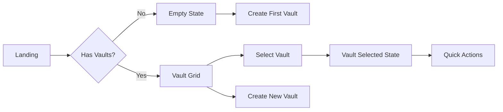
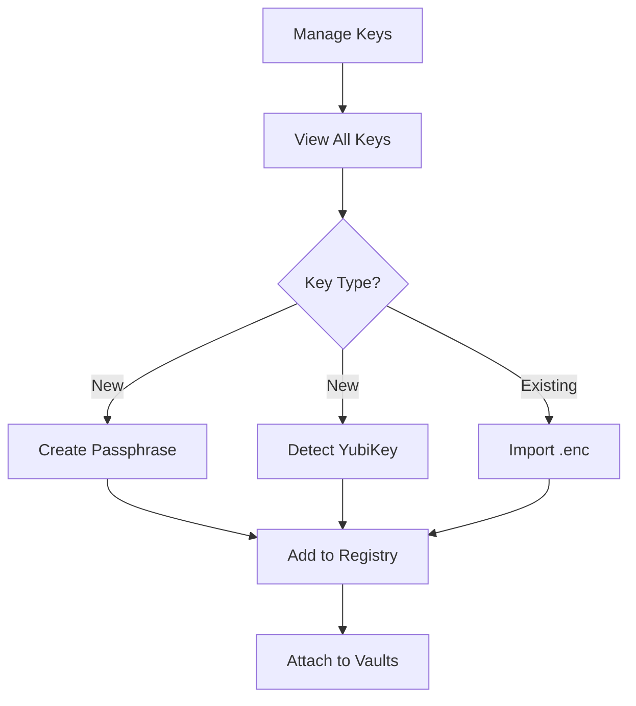
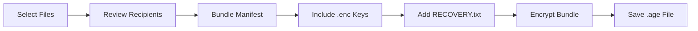
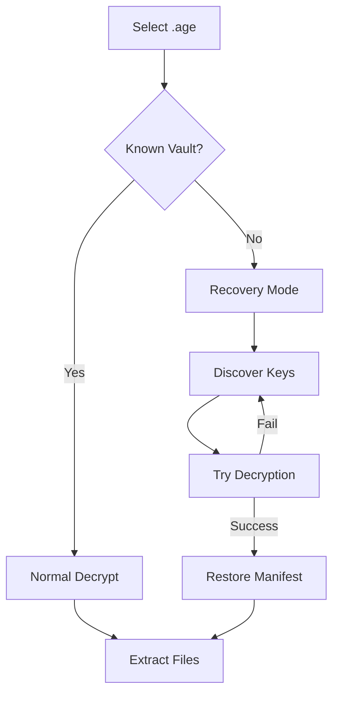

# R2 UI/UX Design Document

**Purpose:** Visual design specifications, user flows, and interaction patterns for R2
**Status:** Implementation guide

---

## Visual Design Language

### Core Aesthetic
- **Minimalist:** Clean, uncluttered interface
- **Professional:** Security-focused appearance
- **Accessible:** Clear visual hierarchy
- **Responsive:** Adaptive to content, not screen size (desktop only)

### Color System

Based on `/docs/architecture/frontend/ui-color-token-map.md`:

#### Primary Palette
```css
--bv-blue-600: #2563EB;  /* Primary actions, CTAs */
--bv-blue-700: #1D4ED8;  /* Hover states */
--bv-blue-50: #EFF6FF;   /* Light backgrounds */
```

#### Neutral Palette
```css
--bv-slate-800: #1E293B;  /* Main headings */
--bv-slate-700: #334155;  /* Body text */
--bv-slate-500: #64748B;  /* Secondary text */
--bv-slate-400: #94A3B8;  /* Muted icons */
--bv-slate-200: #E2E8F0;  /* Borders */
--bv-slate-100: #F1F5F9;  /* Light fills */
```

#### Semantic Colors
```css
/* Key Type Badges */
--passphrase-bg: #DCFCE7;    /* green-100 */
--passphrase-text: #15803D;  /* green-700 */
--yubikey-bg: #F3E8FF;       /* purple-100 */
--yubikey-text: #6B21A8;     /* purple-700 */

/* States */
--success: #10B981;  /* green-500 */
--warning: #F59E0B;  /* amber-500 */
--error: #EF4444;    /* red-500 */
--info: #3B82F6;     /* blue-500 */
```

### Typography Scale
```css
/* Headings */
.h1 { font-size: 2rem; font-weight: 600; color: var(--bv-slate-800); }
.h2 { font-size: 1.5rem; font-weight: 600; color: var(--bv-slate-800); }
.h3 { font-size: 1.25rem; font-weight: 500; color: var(--bv-slate-700); }

/* Body */
.body-lg { font-size: 1.125rem; color: var(--bv-slate-700); }
.body { font-size: 1rem; color: var(--bv-slate-700); }
.body-sm { font-size: 0.875rem; color: var(--bv-slate-500); }

/* Labels */
.label { font-size: 0.875rem; font-weight: 500; color: var(--bv-slate-700); }
.caption { font-size: 0.75rem; color: var(--bv-slate-500); }
```

### Spacing System
```css
/* Based on 4px grid */
--space-1: 0.25rem;  /* 4px */
--space-2: 0.5rem;   /* 8px */
--space-3: 0.75rem;  /* 12px */
--space-4: 1rem;     /* 16px */
--space-6: 1.5rem;   /* 24px */
--space-8: 2rem;     /* 32px */
--space-12: 3rem;    /* 48px */
```

---

## Layout Structure

### Application Frame
```
┌─────────────────────────────────────────────────────────┐
│ [≡] Barqly Vault        Status: 🔐 2 Keys | 🗄️ 3 Vaults │ <- Top Bar
├────┬────────────────────────────────────────────────────┤
│    │                                                     │
│ S  │                  Content Area                       │
│ i  │                                                     │
│ d  │              (max-width: 960px)                     │
│ e  │                                                     │
│ b  │                                                     │
│ a  │                                                     │
│ r  │                                                     │
│    │                                                     │
└────┴────────────────────────────────────────────────────┘
```

### Sidebar Navigation (Collapsible)
```
Expanded (240px):          Collapsed (64px):
┌──────────────┐          ┌────┐
│ 🏠 Vault Hub │          │ 🏠 │
│ 🔑 Manage... │          │ 🔑 │
│ 🔒 Encrypt   │          │ 🔒 │
│ 🔓 Decrypt   │          │ 🔓 │
│ ⚙️ Settings  │          │ ⚙️ │
└──────────────┘          └────┘
```

### Content Container
- Max width: 960px
- Centered with auto margins
- Padding: 24px (1.5rem)
- Consistent vertical spacing: space-y-6

---

## Component Patterns

### Card Component
```
┌─────────────────────────────────────┐
│ ┌─────┐  Vault Name          [···]  │ <- Header
│ │ 🗄️  │  Description text           │
│ └─────┘  ┌──┐ ┌──┐ ┌──┐           │ <- Badges
│          │P1│ │Y2│ │Y1│            │
│          └──┘ └──┘ └──┘            │
├─────────────────────────────────────┤
│ Last encrypted: 2 hours ago         │ <- Meta
│ Size: 125 MB | Files: 42           │
├─────────────────────────────────────┤
│ [Encrypt] [Manage Keys] [Delete]    │ <- Actions
└─────────────────────────────────────┘
```

### Progressive Steps
```
[1 Select Files] ─── [2 Choose Key] ─── [3 Encrypt]
     ▲ Active            Inactive         Inactive

States:
- Active: Blue border, blue text
- Complete: Green check, normal text
- Inactive: Gray text
- Error: Red border, red text
```

### Button Hierarchy
```
Primary:   [█ Action █]  <- Blue bg, white text
Secondary: [┌────────┐]  <- Border only
Tertiary:  [ Action  ]   <- No border, blue text
Danger:    [█ Delete █]  <- Red bg, white text
```

### Form Patterns
```
Label *
┌─────────────────────────┐
│ Input value             │
└─────────────────────────┘
Helper text or error message

States:
- Default: Gray border
- Focus: Blue border + ring
- Error: Red border
- Disabled: Gray background
```

---

## User Flows

### Vault Hub Flow


### Key Management Flow


### Encryption Flow (with Recovery)


### Decryption Flow (with Recovery)


---

## Interaction Patterns

### Hover States
- Cards: Subtle shadow elevation
- Buttons: Darken by 10%
- Links: Underline appears
- Icons: Color shifts to primary

### Active States
- Cards: Blue border
- Buttons: Pressed appearance
- Tabs: Underline indicator
- Inputs: Blue focus ring

### Loading States
- Inline text: "Creating..." instead of "Create"
- Progress bars for multi-step operations
- Skeleton loaders for content areas
- NO full-screen spinners (cache-first)

### Error States
- Inline validation messages
- Red border on invalid inputs
- Toast notifications for system errors
- Recovery guidance in error messages

### Empty States
```
┌─────────────────────────────────┐
│                                 │
│         [ Icon ]                │
│                                 │
│     No vaults yet               │
│                                 │
│  Create your first vault to     │
│  start protecting your data     │
│                                 │
│     [+ Create Vault]            │
│                                 │
└─────────────────────────────────┘
```

---

## Responsive Behavior (Desktop Only)

### Breakpoints
- Small: 1024px (minimum supported)
- Medium: 1280px (default)
- Large: 1920px+ (maximum content width applies)

### Adaptive Layouts
- Sidebar: Auto-collapse below 1280px
- Cards: 1-3 columns based on space
- Forms: Single column always
- Tables: Horizontal scroll if needed

---

## Accessibility Guidelines

### Keyboard Navigation
- Tab order: Left to right, top to bottom
- Enter: Activate primary action
- Escape: Cancel/close modals
- Arrow keys: Navigate within components

### Focus Indicators
```css
:focus-visible {
  outline: 2px solid var(--bv-blue-600);
  outline-offset: 2px;
}
```

### ARIA Labels
- All interactive elements have labels
- Loading states announced
- Error messages associated with inputs
- Live regions for dynamic updates

### Color Contrast
- Normal text: 7:1 minimum
- Large text: 4.5:1 minimum
- Interactive elements: 3:1 minimum
- Never rely on color alone

---

## Animation Guidelines

### Transitions (Minimal)
```css
/* Standard transition */
transition: all 150ms ease-in-out;

/* Hover/focus transitions */
transition: background-color 100ms ease;

/* Layout changes */
transition: transform 200ms cubic-bezier(0.4, 0, 0.2, 1);
```

### When to Animate
- ✅ State changes (hover, active)
- ✅ Progressive disclosure
- ✅ Sidebar collapse/expand
- ❌ Page navigations
- ❌ Data loading
- ❌ Form submissions

---

## Dark Mode Specifications

### Color Inversions
```css
/* Light Mode -> Dark Mode */
--bg-primary: white -> gray-900
--bg-secondary: gray-50 -> gray-800
--text-primary: slate-800 -> slate-100
--text-secondary: slate-600 -> slate-400
--border: slate-200 -> slate-700
```

### Special Considerations
- Reduce contrast slightly in dark mode
- Use warmer grays (slate, not gray)
- Maintain color semantics (green = success)
- Adjust shadows (less prominent)

---

## Icon System

### Icon Library: Lucide React
- Consistent 24px base size
- 1.5px stroke width
- Rounded line caps

### Common Icons
```
Navigation:
- Home → House
- Keys → Key
- Encrypt → Lock
- Decrypt → Unlock
- Settings → Settings

Actions:
- Add → Plus
- Delete → Trash2
- Edit → Pencil
- Close → X
- More → MoreVertical

States:
- Success → CheckCircle
- Error → AlertCircle
- Warning → AlertTriangle
- Info → Info
```

---

## Component Specifications

### VaultCard
- Height: Auto (content-based)
- Padding: 24px
- Border: 1px solid slate-200
- Border-radius: 12px
- Shadow: sm (on hover: md)

### KeyBadge
- Height: 28px
- Padding: 4px 12px
- Border-radius: 14px
- Font-size: 0.875rem
- Colors: Per key type

### SidebarNav
- Width: 240px (expanded) / 64px (collapsed)
- Background: white
- Border-right: 1px solid slate-200
- Item height: 48px
- Icon size: 20px

### Buttons
- Height: 40px (default) / 32px (small)
- Padding: 0 24px
- Border-radius: 8px
- Font-weight: 500
- Min-width: 80px

---

## Design Principles

### 1. Progressive Disclosure
Show only what's needed, reveal complexity gradually

### 2. Visual Hierarchy
Size, color, and spacing create clear importance levels

### 3. Consistency
Same patterns across all screens

### 4. Forgiveness
Always provide undo/recovery options

### 5. Feedback
Every action has immediate visual response

---

## Implementation Notes

### CSS Architecture
- Use Tailwind utility classes
- Extract common patterns to components
- Avoid inline styles
- Use CSS variables for themes

### Component Structure
```tsx
<Card>
  <CardHeader>
    <CardTitle />
    <CardDescription />
  </CardHeader>
  <CardContent>
    {/* Main content */}
  </CardContent>
  <CardFooter>
    <CardActions />
  </CardFooter>
</Card>
```

### State Representation
- Use visual cues (color, icons, position)
- Combine multiple indicators
- Maintain state during transitions
- Clear state recovery paths

---

_This design document guides visual implementation for R2._