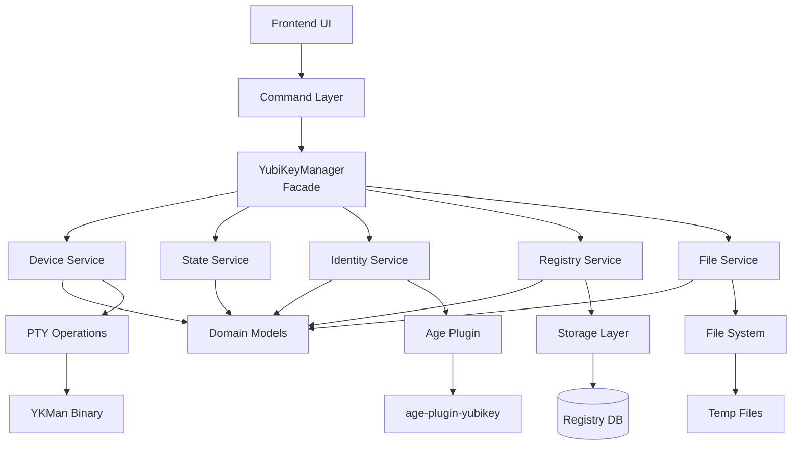

# Centralized Key Management Architecture Design

**Created**: 2025-01-21
**Updated**: 2025-09-24
**Status**: Implemented (Phase 1)
**Parent**: [Technical Debt Analysis](./technical-debt-analysis.md)

## Overview

This document presents a comprehensive architectural design for creating a unified key management system that consolidates all cryptographic key operations. Originally focused on YubiKey refactoring, this has evolved into a centralized architecture supporting multiple key types (YubiKey, passphrase, and future hardware keys).

## ✅ ARCHITECTURAL DECISION UPDATE (September 24, 2025)

**Decision Made**: Unified Key Management Module
During YubiKey refactoring, we recognized the need for a higher-level abstraction to manage all key types. This decision creates:

1. **Centralized Module**: `src/key_management/` as single source of truth
2. **Multi-Key Support**: Unified interface for YubiKey and passphrase operations
3. **Future Extensibility**: Prepared for FIDO2, smart cards, biometric keys
4. **Architectural Consistency**: Same patterns across all key types

**Implementation Status**:
- ✅ Folder structure created
- ✅ YubiKey module moved to `key_management/yubikey/`
- ✅ Passphrase placeholder structure created
- ✅ Import paths updated
- 🔄 Currently: YubiKey service implementation (Week 2)

This architectural decision addresses several critical issues:
- **Security**: Centralizes security policies and eliminates scattered key management
- **Maintainability**: Single location for all key operations reduces cognitive load
- **Future-Proofing**: Extensible design supports new key types and features
- **User Experience**: Enables advanced features like hybrid encryption

## Architecture Principles

### Core Principles
1. **Single Responsibility**: Each component has one clear purpose
2. **Separation of Concerns**: Clear boundaries between layers
3. **Dependency Inversion**: Depend on abstractions, not implementations
4. **Open/Closed**: Open for extension, closed for modification
5. **Don't Repeat Yourself**: Single source of truth for all operations
6. **Limit scope of Yubikey**: for all yubikey operations we must pass --serial in all commands and apis...we want to make sure that whereever we can, we should limit our scope of operations to a selected yubikey and --serial provide this logical boundary across our codebase.  
### Quality Attributes
- **Maintainability**: Easy to modify and extend
- **Testability**: 100% unit and integration test coverage
- **Reliability**: Robust error handling and recovery
- **Performance**: Efficient resource usage for 1M+ users
- **Security**: Proper secret handling and validation

## High-Level Architecture



## Design Patterns Implementation

### 1. Facade Pattern - YubiKeyManager

**Purpose**: Simplify complex subsystem interactions and provide single entry point.

```rust
/// Central facade for all YubiKey operations
/// Reduces 19+ scattered functions to 6 clean operations
pub struct YubiKeyManager {
    device_service: Arc<dyn DeviceService>,
    state_service: Arc<dyn StateService>,
    identity_service: Arc<dyn IdentityService>,
    registry_service: Arc<dyn RegistryService>,
    file_service: Arc<dyn FileService>,
    event_bus: Arc<EventBus>,
}

impl YubiKeyManager {
    /// Initialize a new YubiKey device
    pub async fn initialize_device(&self, params: InitializeParams) -> Result<YubiKeyHandle> {
        // Orchestrate the full initialization flow
        let device = self.device_service.detect_device(&params.serial).await?;
        let handle = self.state_service.transition_to_initialized(device, params).await?;
        let identity = self.identity_service.generate_identity(&handle).await?;
        let entry = self.registry_service.register_device(handle, identity).await?;

        self.event_bus.publish(YubiKeyEvent::DeviceInitialized { entry }).await;
        Ok(handle)
    }

    /// Register an existing YubiKey device
    pub async fn register_device(&self, params: RegisterParams) -> Result<KeyReference> {
        let device = self.device_service.detect_device(&params.serial).await?;
        let state = self.state_service.detect_state(&device).await?;

        match state {
            YubiKeyState::Orphaned => self.register_orphaned_device(device, params).await,
            YubiKeyState::New => Err(YubiKeyError::RequiresInitialization),
            _ => Err(YubiKeyError::InvalidState(state)),
        }
    }

    /// List all available YubiKey devices with their states
    pub async fn list_devices(&self) -> Result<Vec<DeviceInfo>> {
        let devices = self.device_service.list_connected_devices().await?;
        let mut device_info = Vec::new();

        for device in devices {
            let state = self.state_service.detect_state(&device).await?;
            let identity = self.identity_service.get_identity_if_exists(&device).await?;

            device_info.push(DeviceInfo {
                device,
                state,
                identity,
                capabilities: self.device_service.get_capabilities(&device).await?,
            });
        }

        Ok(device_info)
    }

    /// Encrypt data using YubiKey
    pub async fn encrypt_data(&self, key_ref: &KeyReference, data: Vec<u8>) -> Result<Vec<u8>> {
        let entry = self.registry_service.get_entry(key_ref).await?;
        self.identity_service.encrypt_with_recipient(&entry.recipient, data).await
    }

    /// Decrypt data using YubiKey
    pub async fn decrypt_data(&self, key_ref: &KeyReference, encrypted_data: Vec<u8>) -> Result<Vec<u8>> {
        let entry = self.registry_service.get_entry(key_ref).await?;
        let temp_files = self.file_service.create_temp_files_for_decryption().await?;

        self.identity_service.decrypt_with_identity(
            &entry.identity_tag,
            encrypted_data,
            temp_files
        ).await
    }

    /// Validate YubiKey credentials
    pub async fn validate_credentials(&self, key_ref: &KeyReference, pin: &Pin) -> Result<bool> {
        let entry = self.registry_service.get_entry(key_ref).await?;
        self.device_service.validate_pin(&entry.serial, pin).await
    }
}
```

### 2. State Machine Pattern - YubiKeyStateMachine

**Purpose**: Manage YubiKey state transitions with clear rules and validation.

```rust
/// YubiKey state definitions
#[derive(Debug, Clone, PartialEq, Eq, Hash)]
pub enum YubiKeyState {
    /// Device has default PIN, no age identity
    New,
    /// Device has custom PIN but no Barqly identity
    Reused,
    /// Device has age identity and is registered in Barqly
    Registered,
    /// Device has age identity but not registered in Barqly
    Orphaned,
    /// Device is in error state
    Error { reason: String },
}

/// YubiKey events that can trigger state transitions
#[derive(Debug, Clone)]
pub enum YubiKeyEvent {
    Initialize { pin: Pin, label: String },
    Register { pin: Pin, label: String },
    Detect,
    Reset,
    Error { error: YubiKeyError },
}

/// State machine for managing YubiKey state transitions
pub struct YubiKeyStateMachine {
    current_state: YubiKeyState,
    transitions: HashMap<(YubiKeyState, YubiKeyEvent), YubiKeyState>,
    observers: Vec<Arc<dyn StateObserver>>,
}

impl YubiKeyStateMachine {
    pub fn new() -> Self {
        let mut transitions = HashMap::new();

        // Define valid state transitions
        transitions.insert(
            (YubiKeyState::New, YubiKeyEvent::Initialize { .. }),
            YubiKeyState::Registered
        );
        transitions.insert(
            (YubiKeyState::Orphaned, YubiKeyEvent::Register { .. }),
            YubiKeyState::Registered
        );
        transitions.insert(
            (YubiKeyState::Registered, YubiKeyEvent::Reset),
            YubiKeyState::New
        );

        Self {
            current_state: YubiKeyState::New,
            transitions,
            observers: Vec::new(),
        }
    }

    /// Attempt state transition
    pub async fn transition(&mut self, event: YubiKeyEvent) -> Result<YubiKeyState> {
        let key = (self.current_state.clone(), event.clone());

        match self.transitions.get(&key) {
            Some(new_state) => {
                let old_state = self.current_state.clone();
                self.current_state = new_state.clone();

                // Notify observers
                for observer in &self.observers {
                    observer.on_state_changed(&old_state, &new_state, &event).await;
                }

                Ok(new_state.clone())
            }
            None => Err(YubiKeyError::InvalidTransition {
                from: self.current_state.clone(),
                event,
            })
        }
    }

    /// Check if transition is valid without executing it
    pub fn can_transition(&self, event: &YubiKeyEvent) -> bool {
        let key = (self.current_state.clone(), event.clone());
        self.transitions.contains_key(&key)
    }
}
```

### 3. Strategy Pattern - State-Specific Operations

**Purpose**: Handle different YubiKey states with specific logic while maintaining consistent interface.

```rust
/// Strategy for handling state-specific operations
#[async_trait]
pub trait YubiKeyStateStrategy: Send + Sync {
    /// Check if this strategy can handle the given state
    fn can_handle(&self, state: &YubiKeyState) -> bool;

    /// Initialize device (only valid for New state)
    async fn initialize(&self, context: &YubiKeyContext, params: InitializeParams) -> Result<YubiKeyHandle>;

    /// Register device (only valid for Orphaned state)
    async fn register(&self, context: &YubiKeyContext, params: RegisterParams) -> Result<KeyReference>;

    /// Validate device state
    async fn validate(&self, context: &YubiKeyContext) -> Result<ValidationResult>;
}

/// Strategy for handling New YubiKey devices
pub struct NewYubiKeyStrategy {
    ykman_service: Arc<dyn YkmanService>,
    age_service: Arc<dyn AgeService>,
}

#[async_trait]
impl YubiKeyStateStrategy for NewYubiKeyStrategy {
    fn can_handle(&self, state: &YubiKeyState) -> bool {
        matches!(state, YubiKeyState::New)
    }

    async fn initialize(&self, context: &YubiKeyContext, params: InitializeParams) -> Result<YubiKeyHandle> {
        // Initialize from factory default state
        self.ykman_service.change_pin(&DEFAULT_PIN, &params.pin).await?;
        self.ykman_service.change_puk(&DEFAULT_PUK, &params.recovery_code).await?;
        self.ykman_service.change_management_key(&params.pin).await?;

        // Generate age identity
        let identity = self.age_service.generate_identity(&context.device, &params).await?;

        Ok(YubiKeyHandle {
            device: context.device.clone(),
            identity,
            state: YubiKeyState::Registered,
        })
    }

    async fn register(&self, _context: &YubiKeyContext, _params: RegisterParams) -> Result<KeyReference> {
        Err(YubiKeyError::InvalidOperation("Cannot register New device, use initialize instead"))
    }
}

/// Strategy for handling Orphaned YubiKey devices
pub struct OrphanedYubiKeyStrategy {
    identity_service: Arc<dyn IdentityService>,
}

#[async_trait]
impl YubiKeyStateStrategy for OrphanedYubiKeyStrategy {
    fn can_handle(&self, state: &YubiKeyState) -> bool {
        matches!(state, YubiKeyState::Orphaned)
    }

    async fn initialize(&self, _context: &YubiKeyContext, _params: InitializeParams) -> Result<YubiKeyHandle> {
        Err(YubiKeyError::InvalidOperation("Cannot initialize Orphaned device, use register instead"))
    }

    async fn register(&self, context: &YubiKeyContext, params: RegisterParams) -> Result<KeyReference> {
        // Get existing identity from device
        let identity = self.identity_service.get_existing_identity(&context.device).await?;

        // Create registry entry
        Ok(KeyReference {
            id: params.key_id,
            label: params.label,
            state: KeyState::Active,
            key_type: KeyType::YubiKey {
                serial: context.device.serial.clone(),
                identity_tag: identity.tag,
                recipient: identity.recipient,
            },
            created_at: Utc::now(),
            last_used: None,
        })
    }
}

/// Strategy manager for selecting appropriate strategy
pub struct YubiKeyStrategyManager {
    strategies: Vec<Arc<dyn YubiKeyStateStrategy>>,
}

impl YubiKeyStrategyManager {
    pub fn new() -> Self {
        Self {
            strategies: vec![
                Arc::new(NewYubiKeyStrategy::new()),
                Arc::new(OrphanedYubiKeyStrategy::new()),
                Arc::new(RegisteredYubiKeyStrategy::new()),
            ],
        }
    }

    pub fn get_strategy(&self, state: &YubiKeyState) -> Result<Arc<dyn YubiKeyStateStrategy>> {
        self.strategies
            .iter()
            .find(|strategy| strategy.can_handle(state))
            .cloned()
            .ok_or_else(|| YubiKeyError::NoStrategyFound(state.clone()))
    }
}
```

### 4. Repository Pattern - Data Access Layer

**Purpose**: Encapsulate data access logic and provide clean interface for YubiKey registry operations.

```rust
/// Repository interface for YubiKey registry operations
#[async_trait]
pub trait YubiKeyRepository: Send + Sync {
    /// Save YubiKey entry to registry
    async fn save(&self, entry: YubiKeyEntry) -> Result<()>;

    /// Find YubiKey entry by serial number
    async fn find_by_serial(&self, serial: &Serial) -> Result<Option<YubiKeyEntry>>;

    /// Find YubiKey entries by state
    async fn find_by_state(&self, state: YubiKeyState) -> Result<Vec<YubiKeyEntry>>;

    /// Find YubiKey entry by key reference ID
    async fn find_by_key_ref(&self, key_ref: &str) -> Result<Option<YubiKeyEntry>>;

    /// Update existing YubiKey entry
    async fn update(&self, entry: YubiKeyEntry) -> Result<()>;

    /// Delete YubiKey entry
    async fn delete(&self, serial: &Serial) -> Result<bool>;

    /// List all YubiKey entries
    async fn list_all(&self) -> Result<Vec<YubiKeyEntry>>;
}

/// Implementation of YubiKey repository using the existing registry system
pub struct YubiKeyRegistryRepository {
    registry: Arc<Mutex<KeyRegistry>>,
}

#[async_trait]
impl YubiKeyRepository for YubiKeyRegistryRepository {
    async fn save(&self, entry: YubiKeyEntry) -> Result<()> {
        let mut registry = self.registry.lock().await;

        let storage_entry = KeyEntry::Yubikey {
            label: entry.label.clone(),
            created_at: entry.created_at,
            last_used: entry.last_used,
            serial: entry.device.serial.value().to_string(),
            slot: entry.slot,
            piv_slot: entry.piv_slot,
            recipient: entry.identity.recipient,
            identity_tag: entry.identity.tag,
            firmware_version: entry.device.firmware_version.clone(),
            recovery_code_hash: entry.recovery_code_hash,
        };

        registry.register_key(entry.key_ref_id.clone(), storage_entry)?;
        registry.save().await?;

        Ok(())
    }

    async fn find_by_serial(&self, serial: &Serial) -> Result<Option<YubiKeyEntry>> {
        let registry = self.registry.lock().await;

        for (key_id, entry) in &registry.keys {
            if let KeyEntry::Yubikey { serial: entry_serial, .. } = entry {
                if entry_serial == serial.value() {
                    return Ok(Some(self.convert_to_entry(key_id, entry)?));
                }
            }
        }

        Ok(None)
    }

    // ... other methods
}
```

### 5. Factory Pattern - Object Creation

**Purpose**: Centralize object creation and ensure consistent initialization.

```rust
/// Factory for creating YubiKey-related objects
pub struct YubiKeyFactory {
    config: YubiKeyConfig,
}

impl YubiKeyFactory {
    /// Create identity provider based on configuration
    pub fn create_identity_provider(&self) -> Arc<dyn YubiIdentityProvider> {
        match self.config.identity_provider_type {
            IdentityProviderType::AgePlugin => {
                Arc::new(AgePluginProvider::new(self.config.age_plugin_path.clone()))
            }
            IdentityProviderType::Direct => {
                Arc::new(DirectProvider::new())
            }
        }
    }

    /// Create device manager
    pub fn create_device_manager(&self) -> Arc<dyn DeviceManager> {
        Arc::new(YkmanDeviceManager::new(
            self.config.ykman_path.clone(),
            self.config.device_timeout,
        ))
    }

    /// Create temporary file manager
    pub fn create_temp_file_manager(&self) -> Arc<dyn TempFileManager> {
        Arc::new(TempFileManager::new(
            self.config.temp_dir.clone(),
            self.config.cleanup_policy.clone(),
        ))
    }

    /// Create state machine
    pub fn create_state_machine(&self) -> YubiKeyStateMachine {
        YubiKeyStateMachine::new()
    }

    /// Create repository
    pub fn create_repository(&self) -> Arc<dyn YubiKeyRepository> {
        Arc::new(YubiKeyRegistryRepository::new())
    }

    /// Create the complete YubiKey manager
    pub fn create_manager(&self) -> YubiKeyManager {
        YubiKeyManager::new(
            self.create_device_manager(),
            self.create_state_machine(),
            self.create_identity_provider(),
            self.create_repository(),
            self.create_temp_file_manager(),
        )
    }
}
```

### 6. Observer Pattern - Event System

**Purpose**: Decouple components and enable reactive programming for YubiKey operations.

```rust
/// YubiKey events that can be observed
#[derive(Debug, Clone)]
pub enum YubiKeyEvent {
    DeviceDetected { device: YubiKeyDevice },
    DeviceInitialized { entry: YubiKeyEntry },
    DeviceRegistered { entry: YubiKeyEntry },
    StateChanged { old_state: YubiKeyState, new_state: YubiKeyState },
    OperationStarted { operation: Operation },
    OperationCompleted { operation: Operation, result: OperationResult },
    Error { error: YubiKeyError, context: String },
}

/// Observer interface for YubiKey events
#[async_trait]
pub trait YubiKeyEventObserver: Send + Sync {
    async fn on_event(&self, event: YubiKeyEvent);
}

/// Event bus for managing observers and publishing events
pub struct YubiKeyEventBus {
    observers: Arc<Mutex<Vec<Arc<dyn YubiKeyEventObserver>>>>,
}

impl YubiKeyEventBus {
    pub fn new() -> Self {
        Self {
            observers: Arc::new(Mutex::new(Vec::new())),
        }
    }

    /// Subscribe to YubiKey events
    pub async fn subscribe(&self, observer: Arc<dyn YubiKeyEventObserver>) {
        let mut observers = self.observers.lock().await;
        observers.push(observer);
    }

    /// Publish event to all observers
    pub async fn publish(&self, event: YubiKeyEvent) {
        let observers = self.observers.lock().await;

        for observer in observers.iter() {
            observer.on_event(event.clone()).await;
        }
    }
}

/// Example observer for logging YubiKey events
pub struct YubiKeyEventLogger;

#[async_trait]
impl YubiKeyEventObserver for YubiKeyEventLogger {
    async fn on_event(&self, event: YubiKeyEvent) {
        match event {
            YubiKeyEvent::DeviceDetected { device } => {
                info!("YubiKey device detected: serial={}", device.serial.value());
            }
            YubiKeyEvent::DeviceInitialized { entry } => {
                info!("YubiKey device initialized: label={}", entry.label);
            }
            YubiKeyEvent::Error { error, context } => {
                error!("YubiKey error in {}: {:?}", context, error);
            }
            _ => {
                debug!("YubiKey event: {:?}", event);
            }
        }
    }
}
```

## Domain Models

**Purpose**: Replace primitive obsession with rich domain objects that encapsulate validation and behavior.

```rust
/// YubiKey serial number with validation
#[derive(Debug, Clone, PartialEq, Eq, Hash)]
pub struct Serial(String);

impl Serial {
    pub fn new(value: String) -> Result<Self> {
        if value.is_empty() || value.len() < 8 || value.len() > 12 {
            return Err(ValidationError::InvalidSerial(value));
        }

        if !value.chars().all(|c| c.is_ascii_digit()) {
            return Err(ValidationError::InvalidSerial(value));
        }

        Ok(Self(value))
    }

    pub fn value(&self) -> &str {
        &self.0
    }

    /// Create redacted version for logging
    pub fn redacted(&self) -> String {
        format!("***{}", &self.0[self.0.len().saturating_sub(4)..])
    }
}

/// YubiKey PIN with validation
#[derive(Debug, Clone)]
pub struct Pin(SecretString);

impl Pin {
    pub fn new(value: SecretString) -> Result<Self> {
        let pin_str = value.expose_secret();
        if pin_str.len() < 6 || pin_str.len() > 8 {
            return Err(ValidationError::InvalidPin);
        }

        if !pin_str.chars().all(|c| c.is_ascii_digit()) {
            return Err(ValidationError::InvalidPin);
        }

        Ok(Self(value))
    }

    pub fn expose_secret(&self) -> &str {
        self.0.expose_secret()
    }
}

/// YubiKey identity information
#[derive(Debug, Clone)]
pub struct YubiKeyIdentity {
    pub recipient: String,      // age1yubikey...
    pub identity_tag: String,   // AGE-PLUGIN-YUBIKEY-...
    pub slot: u8,               // Slot number (1-20)
    pub piv_slot: u8,           // PIV slot (82-95)
}

/// YubiKey device information
#[derive(Debug, Clone)]
pub struct YubiKeyDevice {
    pub serial: Serial,
    pub firmware_version: Option<String>,
    pub capabilities: Vec<String>,
    pub connected: bool,
}

/// Complete YubiKey entry for registry
#[derive(Debug, Clone)]
pub struct YubiKeyEntry {
    pub key_ref_id: String,
    pub label: String,
    pub device: YubiKeyDevice,
    pub identity: YubiKeyIdentity,
    pub state: YubiKeyState,
    pub created_at: DateTime<Utc>,
    pub last_used: Option<DateTime<Utc>>,
    pub recovery_code_hash: String,
}
```

## Service Layer Architecture

### Device Service
```rust
#[async_trait]
pub trait DeviceService: Send + Sync {
    /// List all connected YubiKey devices
    async fn list_connected_devices(&self) -> Result<Vec<YubiKeyDevice>>;

    /// Detect specific device by serial
    async fn detect_device(&self, serial: &Serial) -> Result<YubiKeyDevice>;

    /// Validate PIN for device
    async fn validate_pin(&self, serial: &Serial, pin: &Pin) -> Result<bool>;

    /// Get device capabilities
    async fn get_capabilities(&self, device: &YubiKeyDevice) -> Result<Vec<String>>;
}
```

### Identity Service
```rust
#[async_trait]
pub trait IdentityService: Send + Sync {
    /// Generate new identity for device
    async fn generate_identity(&self, device: &YubiKeyDevice, params: &InitializeParams) -> Result<YubiKeyIdentity>;

    /// Get existing identity from device
    async fn get_existing_identity(&self, device: &YubiKeyDevice) -> Result<YubiKeyIdentity>;

    /// Check if device has identity
    async fn has_identity(&self, device: &YubiKeyDevice) -> Result<bool>;

    /// Encrypt data with recipient
    async fn encrypt_with_recipient(&self, recipient: &str, data: Vec<u8>) -> Result<Vec<u8>>;

    /// Decrypt data with identity
    async fn decrypt_with_identity(&self, identity_tag: &str, encrypted_data: Vec<u8>, temp_files: TempFiles) -> Result<Vec<u8>>;
}
```

## File Management Service

```rust
/// Centralized file management for YubiKey operations
#[async_trait]
pub trait FileService: Send + Sync {
    /// Create temporary files for decryption operation
    async fn create_temp_files_for_decryption(&self) -> Result<TempFiles>;

    /// Create temporary identity file
    async fn create_temp_identity_file(&self, identity_tag: &str) -> Result<TempFile>;

    /// Clean up temporary files
    async fn cleanup_temp_files(&self, files: TempFiles) -> Result<()>;

    /// Get standard paths for YubiKey operations
    fn get_paths(&self) -> &YubiKeyPaths;
}

/// Temporary files created for YubiKey operations
#[derive(Debug)]
pub struct TempFiles {
    pub encrypted_file: TempFile,
    pub identity_file: TempFile,
    pub output_file: TempFile,
}

/// Standard paths for YubiKey operations
#[derive(Debug)]
pub struct YubiKeyPaths {
    pub temp_dir: PathBuf,
    pub keys_dir: PathBuf,
    pub logs_dir: PathBuf,
}
```

## Error Handling Strategy

```rust
/// Centralized error types for YubiKey operations
#[derive(Debug, thiserror::Error)]
pub enum YubiKeyError {
    #[error("YubiKey device not found: {serial}")]
    DeviceNotFound { serial: String },

    #[error("Invalid YubiKey state transition from {from:?} with event {event:?}")]
    InvalidTransition { from: YubiKeyState, event: YubiKeyEvent },

    #[error("No strategy found for YubiKey state: {0:?}")]
    NoStrategyFound(YubiKeyState),

    #[error("YubiKey requires initialization before use")]
    RequiresInitialization,

    #[error("Invalid operation: {0}")]
    InvalidOperation(&'static str),

    #[error("PTY operation failed: {0}")]
    PtyFailed(String),

    #[error("Identity operation failed: {0}")]
    IdentityFailed(String),

    #[error("Registry operation failed: {0}")]
    RegistryFailed(String),
}

/// Result type alias for YubiKey operations
pub type Result<T> = std::result::Result<T, YubiKeyError>;
```

## Testing Strategy

### Unit Testing
```rust
#[cfg(test)]
mod tests {
    use super::*;
    use tokio_test;

    #[tokio::test]
    async fn test_yubikey_manager_initialize_new_device() {
        // Arrange
        let mock_device_service = MockDeviceService::new();
        let mock_state_service = MockStateService::new();
        // ... other mocks

        let manager = YubiKeyManager::new(/* mocks */);
        let params = InitializeParams {
            serial: Serial::new("12345678".to_string()).unwrap(),
            pin: Pin::new(SecretString::from("123456")).unwrap(),
            label: "test-key".to_string(),
        };

        // Act
        let result = manager.initialize_device(params).await;

        // Assert
        assert!(result.is_ok());
        // Verify all mock interactions
    }

    #[tokio::test]
    async fn test_state_machine_transitions() {
        let mut state_machine = YubiKeyStateMachine::new();

        // Test valid transition
        let result = state_machine.transition(YubiKeyEvent::Initialize {
            pin: Pin::new(SecretString::from("123456")).unwrap(),
            label: "test".to_string(),
        }).await;

        assert_eq!(result.unwrap(), YubiKeyState::Registered);
    }
}
```

### Integration Testing
```rust
#[tokio::test]
async fn test_full_yubikey_initialization_flow() {
    // Test the complete flow from device detection to registry entry
    let factory = YubiKeyFactory::new_for_testing();
    let manager = factory.create_manager();

    // Use real YubiKey device for integration test
    let params = InitializeParams {
        serial: Serial::new("test_serial".to_string()).unwrap(),
        pin: Pin::new(SecretString::from("123456")).unwrap(),
        label: "integration-test".to_string(),
    };

    let result = manager.initialize_device(params).await;
    assert!(result.is_ok());

    // Verify registry entry was created
    let devices = manager.list_devices().await.unwrap();
    assert!(devices.iter().any(|d| d.device.serial.value() == "test_serial"));
}
```

## Migration Strategy

### Phase 1: Foundation Components
1. Create domain models (Serial, Pin, etc.)
2. Implement YubiKeyFactory
3. Create base service interfaces
4. Set up event system

### Phase 2: Core Services
1. Implement DeviceService
2. Implement IdentityService
3. Implement RegistryService (Repository)
4. Implement FileService

### Phase 3: State Management
1. Create YubiKeyStateMachine
2. Implement Strategy pattern
3. Create YubiKeyManager facade

### Phase 4: Command Integration
1. Update command functions to use YubiKeyManager
2. Deprecate old scattered functions
3. Update error handling
4. Add comprehensive testing

## Benefits of New Architecture

### Developer Experience
- **Single Entry Point**: All YubiKey operations through YubiKeyManager
- **Clear Contracts**: Well-defined interfaces for all services
- **Type Safety**: Domain objects prevent invalid states
- **Easy Testing**: Mock all dependencies easily

### Maintainability
- **Single Responsibility**: Each service has one clear purpose
- **Loose Coupling**: Services depend on interfaces, not implementations
- **Easy Extension**: Add new features by extending interfaces
- **Clear Ownership**: Each operation has a clear owning service

### Performance & Scalability
- **Resource Pooling**: PTY operations can be pooled
- **Efficient State Management**: State machine prevents invalid operations
- **Proper Cleanup**: File service ensures no resource leaks
- **Observable Operations**: Event system enables monitoring

### Quality Assurance
- **100% Test Coverage**: All services easily testable
- **Consistent Behavior**: Same interface for all YubiKey operations
- **Robust Error Handling**: Centralized error types and handling
- **Clear Documentation**: Self-documenting code with domain objects

## Conclusion

This centralized architecture design eliminates the technical debt identified in our analysis and creates a solid foundation for YubiKey operations. The use of established design patterns ensures the code is maintainable, testable, and extensible.

**Key Improvements**:
- Reduces 46 scattered files to ~20 organized files
- Reduces 19 public functions to 6 clear operations
- Eliminates all DRY violations with single source of truth
- Provides foundation for scaling to 1M+ users
- Enables 100% test coverage with proper mocking
- Creates clear separation of concerns and ownership

**Next Step**: Implement the refactoring plan with clear phases and priorities as outlined in the main technical debt analysis document.