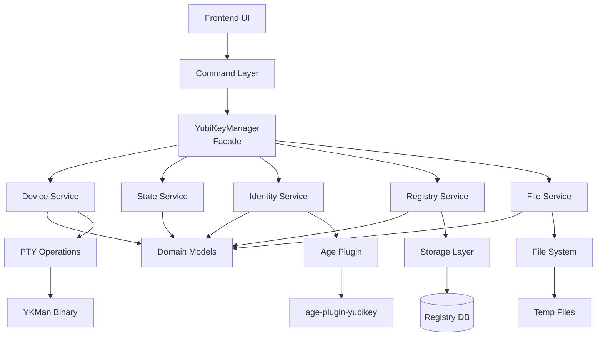
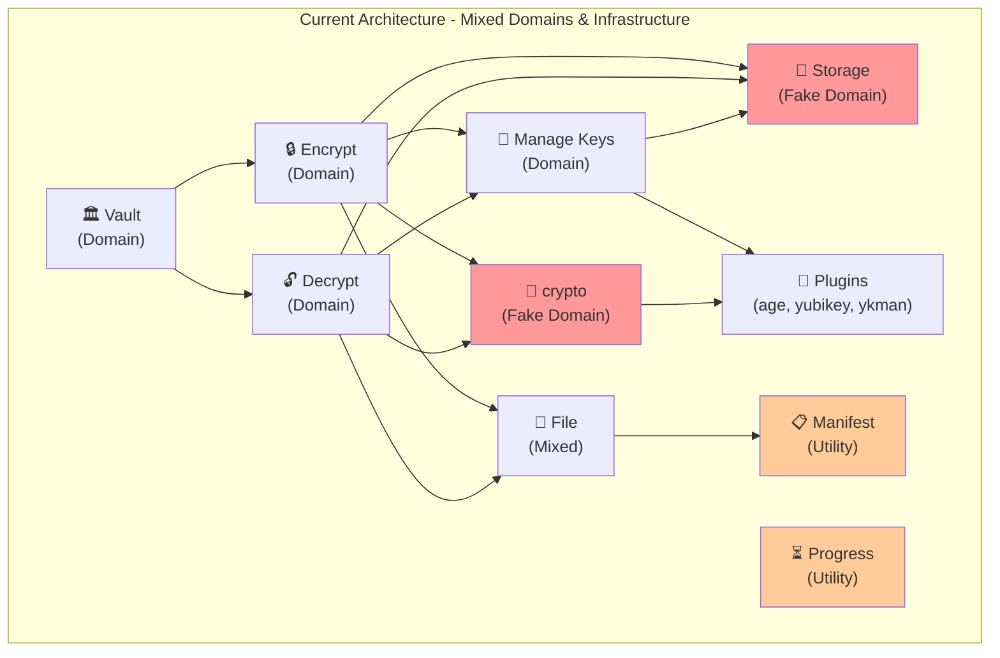
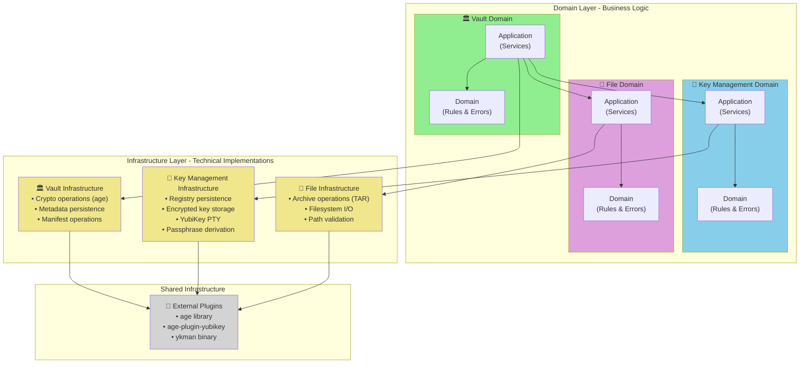

# Key Management Architecture

## What This Is

Unified key management system supporting YubiKey, passphrase keys, and future hardware devices. Single source of truth for all cryptographic operations. Originally focused on YubiKey refactoring, this has evolved into a centralized architecture supporting multiple key types (YubiKey, passphrase, and future hardware keys).

**Location**: `src-tauri/src/key_management/`

## Architecture Pattern

```
UI → Tauri Command → Manager (Facade) → Services → Domain/Infrastructure
```


**Two locations per key type:**
- Commands: `src-tauri/src/commands/{keytype}/` - thin command layer
- DDD: `src-tauri/src/key_management/{keytype}/` - business logic

**Implemented Key Types**:
- ✅ **YubiKey** - Complete DDD implementation (domain, application, infrastructure)
- ✅ **Passphrase** - Complete DDD implementation (domain, application, infrastructure)
- 🔮 **Future**: Smart cards, FIDO2, hardware tokens (follow same pattern)

## Key Principles

1. **No layer mixing** - upper layers never imported by lower layers
2. **Domain-driven** - business logic stays in domain layer
3. **Small files** - backend classes < 300 LOC
4. **Operation scoping** 
    - YubiKey operations always pass `--serial` for logical boundaries
    - One a vault is selelected for operations pass the vault as param
5. **Incremental changes** - small scope, small batch, related items only

## Design Patterns Used

- **Facade**: Manager as single entry point
- **State Machine**: YubiKey state transitions
- **Strategy**: State-specific operations
- **Repository**: Data access abstraction
- **Factory**: Object creation
- **Observer**: Event system

Always look for other relevant patterns to solve the problem more effectively.

## Data Storage (MAC example but Linux/Win would be different)

**Syncable** (`~/Documents/`):
- `Barqly-Vaults/`: Encrypted `.age` files + vault manifests
- `Barqly-Recovery/`: Decrypted output

**Non-Syncable** (`~/Library/Application Support/com.barqly.vault/`):
- `keys/`: Passphrase-encrypted keys + registry JSON
- `logs/`: Application logs

## Development

Read `docs/common/api-types.md` for API workflow.

## Passphrase Module Structure (Reference Implementation)

```
key_management/passphrase/           # DDD business logic
  domain/                            # Pure business logic
    models/
      passphrase_strength.rs         # PassphraseStrength enum
      validation_rules.rs            # Validation scoring logic (284 LOC)
    errors.rs                        # PassphraseError enum
  application/                       # Use cases & orchestration
    manager.rs                       # PassphraseManager facade
    services/
      generation_service.rs          # Key generation workflows
      validation_service.rs          # Passphrase validation
      vault_integration_service.rs   # Vault operations
  infrastructure/                    # External integrations
    key_derivation.rs                # Encryption/decryption (age library)
    storage.rs                       # PassphraseKeyRepository

commands/passphrase/                 # Thin command layer
  generation_commands.rs             # generate_key
  validation_commands.rs             # validate_passphrase*, verify_key_passphrase
  vault_commands.rs                  # add_passphrase_key_to_vault, validate_vault_passphrase_key
```

**Test Coverage**: 27 tests (18 domain + 3 infrastructure + 6 application)

**Code Metrics**:
- Deleted: 1,269 LOC (scattered old code)
- Added: ~900 LOC (organized DDD structure)
- Net: -369 LOC (29% reduction)

## Quality Standards

- Quality test cases (unit + integration). Follow pyramid model.
- No ui content or implementation testing, focus on behavior!
- Proper sensitive data and secret handling.
- Files under 300 LOC

---

## DDD Transformation: Domain vs Infrastructure Separation

### BEFORE: Current State (Mixed Concerns)



**Problems:**
- ❌ `storage` is a fake domain - really infrastructure used by everyone
- ❌ `crypto` is a fake domain - really age library wrappers
- ❌ Multiple domains call `storage` directly (no encapsulation)
- ❌ `manifest` and `progress` scattered as utilities
- ❌ No clear domain boundaries

---

### AFTER: Clean DDD Architecture (Domain + Infrastructure)



**Solutions:**
- ✅ **Storage dissolved**: Registry → key_management/infrastructure, Metadata → vault/infrastructure
- ✅ **Crypto dissolved**: age operations → vault/infrastructure (encryption/decryption)
- ✅ **Clear domain boundaries**: Vault uses Key Management and File domains
- ✅ **Infrastructure encapsulated**: Each domain owns its technical implementations
- ✅ **Single direction dependencies**: Domains → Infrastructure → Plugins (no cycles)

---

### Domain Responsibilities

| Domain | Business Logic | Infrastructure |
|--------|----------------|----------------|
| **Vault** | Create vaults, encrypt files, decrypt vaults, manage vault lifecycle | Age encryption/decryption wrappers, vault metadata persistence, external manifest management |
| **Key Management** | Generate keys, register keys, validate keys, manage key lifecycle, maintain registry | Key registry file I/O, encrypted key storage, YubiKey PTY communication, passphrase derivation (scrypt) |
| **File** | Create archives, extract archives, generate manifests, verify manifests, validate file selections | TAR operations, filesystem I/O, path validation, file staging |

---

### Key Architectural Decisions

**1. Storage Module Dissolution**
```
BEFORE: storage/ (shared by all domains) ❌
AFTER:
  ✅ key_registry.rs → key_management/infrastructure/registry_persistence.rs
  ✅ vault_store.rs → vault/infrastructure/metadata_persistence.rs
  ✅ cache/ → crypto/infrastructure/ (if needed)
  ✅ Eliminated as separate module
```

**2. Crypto Module Transformation**
```
BEFORE: crypto/ (age wrappers called directly by commands) ❌
AFTER:
  ✅ encrypt_data() → vault/infrastructure/crypto_operations.rs
  ✅ decrypt_data() → vault/infrastructure/crypto_operations.rs
  ✅ Encryption/decryption services in vault/application/services/
```

**3. Service-to-Service Communication**
```
✅ vault.encrypt() → key_management.get_vault_keys()
✅ vault.decrypt() → key_management.get_decryption_key()
✅ vault.encrypt() → file.create_archive()
✅ vault.decrypt() → file.extract_archive()
```

**4. Infrastructure Isolation**
```
✅ Commands never call infrastructure directly
✅ Commands → Services → Infrastructure
✅ Infrastructure layer is private to each domain
```