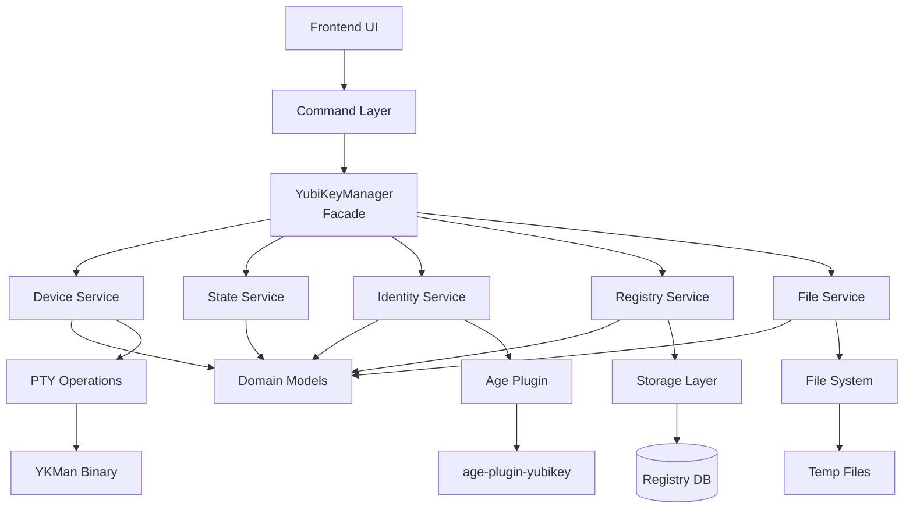

# Key Management Architecture

## What This Is

Unified key management system supporting YubiKey, passphrase keys, and future hardware devices. Single source of truth for all cryptographic operations. Originally focused on YubiKey refactoring, this has evolved into a centralized architecture supporting multiple key types (YubiKey, passphrase, and future hardware keys).

**Location**: `src-tauri/src/key_management/`

## Architecture Pattern

```
UI → Tauri Command → Manager (Facade) → Services → Domain/Infrastructure
```


**Two locations per key type:**
- Commands: `src-tauri/src/commands/{keytype}/` - thin command layer
- DDD: `src-tauri/src/key_management/{keytype}/` - business logic

**Example**: YubiKey follows this pattern. Use as template for vault, passphrase, future devices.

## Key Principles

1. **No layer mixing** - upper layers never imported by lower layers
2. **Domain-driven** - business logic stays in domain layer
3. **Small files** - backend classes < 300 LOC
4. **Operation scoping** 
    - YubiKey operations always pass `--serial` for logical boundaries
    - One a vault is selelected for operations pass the vault as param
5. **Incremental changes** - small scope, small batch, related items only

## Design Patterns Used

- **Facade**: Manager as single entry point
- **State Machine**: YubiKey state transitions
- **Strategy**: State-specific operations
- **Repository**: Data access abstraction
- **Factory**: Object creation
- **Observer**: Event system

Always look for other relevant patterns to solve the problem more effectively.

## Data Storage (MAC example but Linux/Win would be different)

**Syncable** (`~/Documents/`):
- `Barqly-Vaults/`: Encrypted `.age` files + vault manifests
- `Barqly-Recovery/`: Decrypted output

**Non-Syncable** (`~/Library/Application Support/com.barqly.vault/`):
- `keys/`: Passphrase-encrypted keys + registry JSON
- `logs/`: Application logs

## Development

Read `docs/common/api-types.md` for API workflow.

## Quality Standards

- Quality test cases (unit + integration). Follow pyramid model.
- No ui content or implementation testing, focus on behavior!
- Proper sensitive data and secret handling. 
- Files under 300 LOC