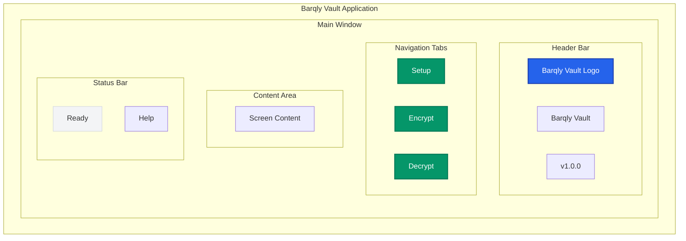

# Component Layout Mockup

> **UX Design**: Overall application layout and navigation structure for Barqly Vault

## 🎯 Layout Purpose
This document defines the overall application structure, navigation patterns, and how the three main screens (Setup, Encrypt, Decrypt) work together as a cohesive application.

## 🎨 Application Structure

## 🧭 Navigation Design

### **Tab-Based Navigation**
- **Three Main Tabs**: Setup, Encrypt, Decrypt
- **Active Tab**: Highlighted with primary color
- **Inactive Tabs**: Subtle gray with hover effects
- **Tab Order**: Logical workflow progression

### **Tab States**
- **Setup Tab**: 
  - Active when no key exists
  - Disabled when key exists (completed)
  - Icon: Key or Settings
  
- **Encrypt Tab**:
  - Active when key exists
  - Disabled when no key exists
  - Icon: Lock or Shield
  
- **Decrypt Tab**:
  - Always available
  - Icon: Unlock or File

## 📱 Responsive Layout

### **Window Sizing**
- **Minimum Size**: 800x600 pixels
- **Default Size**: 1000x700 pixels
- **Maximum Size**: 1200x800 pixels
- **Resizable**: Yes, with minimum constraints

### **Content Scaling**
- **Form Fields**: Maintain minimum 44px touch targets
- **Buttons**: Consistent sizing across all screens
- **Text**: Scalable with system font settings
- **Spacing**: Proportional scaling with window size

## 🎨 Visual Design System

### **Color Palette**
- **Primary Blue**: #2563eb (headers, active elements)
- **Success Green**: #059669 (positive actions, success states)
- **Warning Red**: #dc2626 (destructive actions, errors)
- **Neutral Gray**: #6b7280 (secondary elements, disabled states)
- **Background**: #ffffff (main content area)
- **Surface**: #f3f4f6 (status areas, cards)

### **Typography**
- **Headers**: System font, bold, 24px/20px/16px hierarchy
- **Body Text**: System font, regular, 14px
- **Labels**: System font, medium, 14px
- **Status Text**: System font, regular, 12px

### **Spacing System**
- **Small**: 8px (between related elements)
- **Medium**: 16px (between form sections)
- **Large**: 24px (between major sections)
- **Extra Large**: 32px (page margins)

## 🔄 Screen Transitions

### **Setup → Encrypt**
- **Trigger**: Successful key generation
- **Animation**: Smooth tab switch with success feedback
- **State**: Encrypt tab becomes active

### **Encrypt → Decrypt**
- **Trigger**: User clicks Decrypt tab
- **Animation**: Standard tab switch
- **State**: Decrypt tab becomes active

### **Error States**
- **Validation Errors**: Inline error messages
- **System Errors**: Modal dialogs with recovery options
- **Network Errors**: Status bar notifications

## ♿ Accessibility Features

### **Keyboard Navigation**
- **Tab Order**: Logical progression through form elements
- **Tab Key**: Navigate between tabs
- **Enter Key**: Activate buttons and form submission
- **Escape Key**: Close dialogs and clear selections

### **Screen Reader Support**
- **Tab Labels**: Descriptive labels for each tab
- **Form Labels**: Proper labeling for all form elements
- **Status Updates**: Announcements for state changes
- **Error Messages**: Clear error descriptions

### **Visual Accessibility**
- **High Contrast**: Support for high contrast mode
- **Font Scaling**: Respect system font size preferences
- **Focus Indicators**: Clear focus indicators for all interactive elements
- **Color Independence**: Information not conveyed by color alone

## 🔧 Technical Implementation Notes

### **Component Architecture**
- **Tab Container**: Main navigation wrapper
- **Screen Components**: Individual screen implementations
- **Shared Components**: Buttons, inputs, status areas
- **State Management**: Application state and navigation state

### **Data Flow**
- **Setup State**: Key generation and storage
- **Encrypt State**: File selection and encryption
- **Decrypt State**: File selection and decryption
- **Shared State**: User preferences and settings

### **Error Boundaries**
- **Screen-Level**: Catch and handle screen-specific errors
- **Application-Level**: Global error handling and recovery
- **User Feedback**: Clear error messages and recovery guidance 