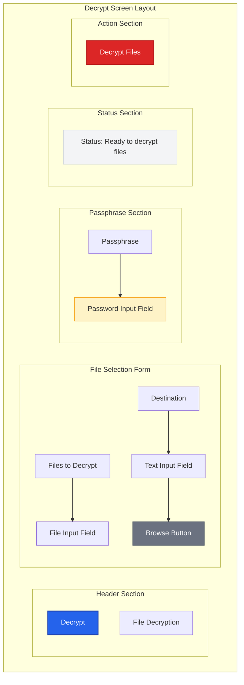

# Decrypt Screen Mockup

> **UX Design**: File decryption interface for Barqly Vault

## 🎯 Screen Purpose

The Decrypt screen allows users to decrypt previously encrypted files using their passphrase, enabling recovery of Bitcoin custody data when needed.

## 📋 User Goals

- Select encrypted files to decrypt
- Enter passphrase securely
- Monitor decryption progress
- Access decrypted files safely

## 🎨 Layout Structure

## 🎨 Visual Design Elements

### **Header**

- **Title**: "Decrypt" (large, bold)
- **Subtitle**: "File Decryption" (medium, secondary color)
- Clear visual hierarchy with proper spacing

### **Form Fields**

- **Files to Decrypt**: File selection input
  - Multiple file selection support
  - Drag & drop functionality
  - File type validation (`.age` encrypted files)
  - File size display
- **Destination**: Output directory selection
  - Text input showing selected path
  - Browse button for folder selection
  - Default: Desktop or Documents folder
  - Path validation and error handling
- **Passphrase**: Password input field
  - Placeholder: "Enter your passphrase"
  - Show/hide toggle
  - Critical security field (highlighted border)
  - Clear button for security

### **Status Area**

- **Background**: Light gray with subtle border
- **Text**: Dynamic status messages
- **States**:
  - "Ready to decrypt files"
  - "Validating files..."
  - "Decrypting [filename]... (X of Y)"
  - "Decryption completed successfully!"
  - "Error: Invalid passphrase"
  - "Error: [specific error message]"

### **Action Button**

- **Primary Button**: "Decrypt Files"
- **States**:
  - Enabled (red, when files and passphrase provided)
  - Disabled (gray, when missing required fields)
  - Loading (spinner + "Decrypting...")

## 🔄 User Flow

1. **Initial State**: No files selected, button disabled
2. **File Selection**: User selects encrypted files
3. **Destination Selection**: User chooses output directory
4. **Passphrase Entry**: User enters passphrase securely
5. **Validation**: System validates files and passphrase
6. **Decryption**: Progress tracking for each file
7. **Completion**: Success confirmation with file locations
8. **Error Handling**: Clear error messages with recovery options

## 🔐 Security Considerations

### **Passphrase Security**

- **Visual Feedback**: Subtle highlighting to indicate security field
- **Clear Option**: Button to clear passphrase field
- **No Persistence**: Passphrase never stored in memory longer than necessary
- **Rate Limiting**: Prevent brute force attempts

### **File Validation**

- **Age Format**: Validate files are proper `.age` encrypted format
- **Integrity Check**: Verify file integrity before decryption
- **Safe Extraction**: Prevent path traversal attacks

## 📁 File Support

### **Supported File Types**

- Age-encrypted files (`.age` extension)
- Multiple file selection for batch decryption
- Automatic file type detection

### **Output Handling**

- **Original Names**: Restore original filenames when possible
- **Conflict Resolution**: Handle filename conflicts gracefully
- **Directory Structure**: Preserve original directory structure

## ♿ Accessibility Considerations

- **Security Fields**: Clear indication of sensitive input fields
- **Error Messages**: Specific guidance for passphrase errors
- **Progress Tracking**: Screen reader announcements for decryption progress
- **Keyboard Navigation**: Full keyboard accessibility
- **Focus Management**: Logical tab order with security field emphasis

## 🚨 Error Handling

### **Common Error Scenarios**

- **Invalid Passphrase**: Clear message with retry guidance
- **Corrupted Files**: Specific error for file integrity issues
- **Permission Errors**: Guidance for file system permissions
- **Disk Space**: Warning for insufficient storage space

### **Recovery Guidance**

- **Passphrase Issues**: Reminder about key generation process
- **File Issues**: Suggestions for file validation
- **System Issues**: Clear next steps for resolution
