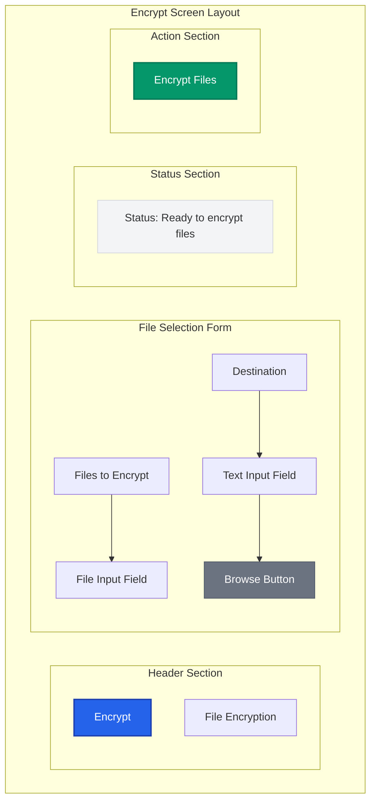

# Encrypt Screen Mockup

> **UX Design**: File encryption interface for Barqly Vault

## 🎯 Screen Purpose
The Encrypt screen allows users to select files and encrypt them using their previously generated encryption key, creating secure backups of sensitive Bitcoin custody data.

## 📋 User Goals
- Select files to encrypt (output descriptors, wallet databases, etc.)
- Choose encryption settings and destination
- Monitor encryption progress
- Receive confirmation of successful encryption

## 🎨 Layout Structure

## 🎨 Visual Design Elements

### **Header**
- **Title**: "Encrypt" (large, bold)
- **Subtitle**: "File Encryption" (medium, secondary color)
- Clear visual hierarchy with proper spacing

### **Form Fields**
- **Files to Encrypt**: File selection input
  - Multiple file selection support
  - Drag & drop functionality
  - File type validation (common Bitcoin files)
  - File size display and limits
  
- **Destination**: Output directory selection
  - Text input showing selected path
  - Browse button for folder selection
  - Default: Desktop or Documents folder
  - Path validation and error handling

### **Status Area**
- **Background**: Light gray with subtle border
- **Text**: Dynamic status messages
- **States**: 
  - "Ready to encrypt files"
  - "Validating files..."
  - "Encrypting [filename]... (X of Y)"
  - "Encryption completed successfully!"
  - "Error: [specific error message]"

### **Action Button**
- **Primary Button**: "Encrypt Files"
- **States**: 
  - Enabled (green, when files selected)
  - Disabled (gray, when no files selected)
  - Loading (spinner + "Encrypting...")

## 🔄 User Flow

1. **Initial State**: No files selected, button disabled
2. **File Selection**: User selects files via input or drag & drop
3. **Destination Selection**: User chooses output directory
4. **Validation**: System validates files and destination
5. **Encryption**: Progress tracking for each file
6. **Completion**: Success confirmation with file locations
7. **Error Handling**: Clear error messages with recovery options

## 📁 File Support

### **Supported File Types**
- Output descriptors (`.json`, `.txt`)
- Wallet databases (`.db`, `.sqlite`)
- Recovery information (`.txt`, `.md`)
- Configuration files (`.conf`, `.toml`)
- Any file type (universal encryption)

### **File Size Limits**
- **Soft Limit**: 100MB (Bitcoin custody use case)
- **Hard Limit**: 1GB (with warning)
- **Progress Tracking**: For large files

## ♿ Accessibility Considerations

- **File Input**: Proper labeling and keyboard navigation
- **Progress Indicators**: Screen reader announcements
- **Error Messages**: Clear, actionable error descriptions
- **Keyboard Shortcuts**: Common file operations
- **Focus Management**: Logical tab order through form

## 🔒 Security UX

- **File Validation**: Check for sensitive file types
- **Progress Feedback**: Real-time encryption status
- **Success Confirmation**: Clear indication of completion
- **Error Recovery**: Specific guidance for common issues 