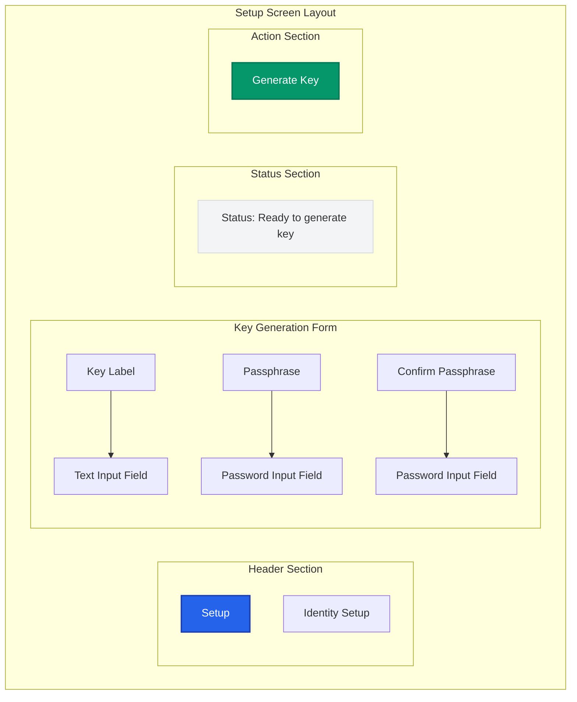

# Setup Screen Mockup

> **UX Design**: Key generation and setup workflow for Barqly Vault

## 🎯 Screen Purpose

The Setup screen allows users to generate their first encryption key, which is the foundation for all encryption/decryption operations in Barqly Vault.

## 📋 User Goals

- Generate a secure encryption key with a memorable passphrase
- Understand the security implications of key generation
- Complete the setup process with confidence

## 🎨 Layout Structure

## 🎨 Visual Design Elements

### **Header**

- **Title**: "Setup" (large, bold)
- **Subtitle**: "Identity Setup" (medium, secondary color)
- Clear visual hierarchy with proper spacing

### **Form Fields**

- **Key Label**: Single-line text input
  - Placeholder: "Enter a label for your key (e.g., 'My Bitcoin Wallet')"
  - Validation: Required, max 50 characters
- **Passphrase**: Password input field
  - Placeholder: "Enter a strong passphrase"
  - Show/hide toggle
  - Strength indicator
- **Confirm Passphrase**: Password input field
  - Placeholder: "Confirm your passphrase"
  - Show/hide toggle
  - Real-time validation against first field

### **Status Area**

- **Background**: Light gray with subtle border
- **Text**: Dynamic status messages
- **States**:
  - "Ready to generate key"
  - "Generating key..."
  - "Key generated successfully!"
  - "Error: [specific error message]"

### **Action Button**

- **Primary Button**: "Generate Key"
- **States**:
  - Enabled (green)
  - Disabled (gray, when form invalid)
  - Loading (spinner + "Generating...")

## 🔄 User Flow

1. **Initial State**: Form empty, button disabled
2. **Input Validation**: Real-time validation as user types
3. **Form Complete**: Button enabled when all fields valid
4. **Generation**: Button shows loading state, status updates
5. **Success**: Success message, option to proceed to next screen
6. **Error**: Clear error message with recovery guidance

## ♿ Accessibility Considerations

- **Labels**: Proper form labels for screen readers
- **Focus Management**: Logical tab order
- **Error Announcements**: Screen reader announcements for errors
- **Keyboard Navigation**: Full keyboard accessibility
- **Color Contrast**: WCAG AA compliant contrast ratios
