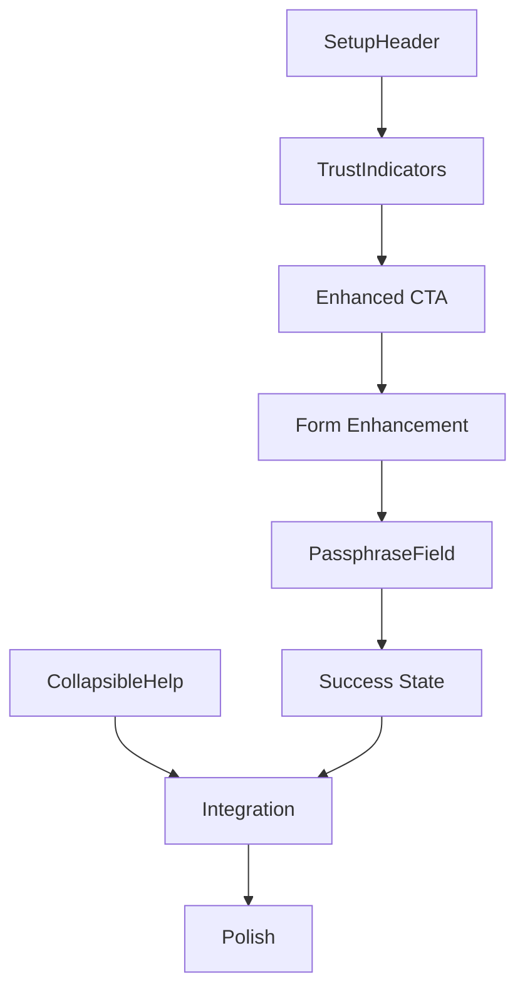

# Setup Screen Implementation Roadmap

> **Purpose**: Phased approach to implementing UX improvements  
> **Timeline**: 2-3 development sprints  
> **Approach**: Iterative with measurable milestones

## Implementation Overview

### Total Estimated Effort
- **Phase 1 (Quick Wins)**: 2-3 days
- **Phase 2 (Core UX)**: 4-5 days  
- **Phase 3 (Polish)**: 3-4 days
- **Total**: 9-12 days

### Success Criteria
- Setup completion rate: 85%+ (from ~65%)
- Time to complete: <90 seconds (from 2-3 minutes)
- Error rate: <10% (from ~20%)
- Trust score: 8+/10 (from ~6/10)

## Phase 1: Quick Wins (2-3 days)

### Day 1: Header & Trust Building
**Morning (4 hours)**
- [ ] Create `SetupHeader` component with shield icon
- [ ] Implement compact header design
- [ ] Add "Secure Your Bitcoin Legacy" messaging
- [ ] Update spacing to reclaim ~7% viewport

**Afternoon (4 hours)**
- [ ] Create `TrustIndicators` component
- [ ] Add security badges below header
- [ ] Implement responsive behavior
- [ ] Write component tests

**Deliverables**:
- SetupHeader.tsx with tests
- TrustIndicators.tsx with tests
- Updated SetupPage integration

### Day 2: CTA & Core Improvements
**Morning (4 hours)**
- [ ] Update CTA button text and styling
- [ ] Increase button size to 48px height
- [ ] Add hover animations
- [ ] Implement loading state improvements

**Afternoon (4 hours)**
- [ ] Add progress context bar
- [ ] Create collapsible help section
- [ ] Update success message copy
- [ ] Basic animation implementation

**Deliverables**:
- Enhanced button component
- CollapsibleHelp.tsx
- ProgressContext.tsx
- Updated animations

### Day 3: Testing & Measurement
**Morning (4 hours)**
- [ ] Set up analytics tracking
- [ ] Create A/B test framework
- [ ] Document baseline metrics
- [ ] Deploy Phase 1 changes

**Afternoon (4 hours)**
- [ ] Monitor initial metrics
- [ ] Gather team feedback
- [ ] Fix any critical issues
- [ ] Plan Phase 2 based on data

**Deliverables**:
- Deployed Phase 1 improvements
- Metrics dashboard setup
- Initial performance data

## Phase 2: Core UX Enhancements (4-5 days)

### Day 4-5: Form Enhancement
**Tasks**:
- [ ] Create `EnhancedInput` component
- [ ] Add form section title
- [ ] Implement better visual hierarchy
- [ ] Enhance field helper text
- [ ] Add inline validation
- [ ] Create loading states
- [ ] Implement error handling improvements

**Components**:
```tsx
// New components to create
- EnhancedInput.tsx
- FormSection.tsx
- ValidationMessage.tsx
- InputGroup.tsx
```

### Day 6-7: Advanced Passphrase UX
**Tasks**:
- [ ] Create `PassphraseField` component
- [ ] Implement strength indicator
- [ ] Add real-time match validation
- [ ] Create show/hide animation
- [ ] Add passphrase tips
- [ ] Implement zxcvbn integration
- [ ] Create strength calculation logic

**Components**:
```tsx
// New components to create
- PassphraseField.tsx
- PassphraseStrength.tsx
- PassphraseMatch.tsx
- StrengthMeter.tsx
```

### Day 8: Integration & Testing
**Tasks**:
- [ ] Integrate all new components
- [ ] Update SetupPage.tsx
- [ ] Write comprehensive tests
- [ ] Perform accessibility audit
- [ ] Fix any integration issues
- [ ] Update documentation

**Deliverables**:
- Fully integrated Phase 2
- Test coverage >90%
- Accessibility report

## Phase 3: Polish & Optimization (3-4 days)

### Day 9-10: Visual Polish
**Tasks**:
- [ ] Implement smooth transitions
- [ ] Add micro-interactions
- [ ] Polish loading states
- [ ] Enhance focus states
- [ ] Add subtle animations
- [ ] Implement reduced motion
- [ ] Create delightful details

**Animations**:
```css
/* Transitions to implement */
- Button hover effects
- Input focus rings
- Collapsible sections
- Success celebrations
- Progress updates
```

### Day 11: Mobile Optimization
**Tasks**:
- [ ] Test all breakpoints
- [ ] Optimize touch targets
- [ ] Enhance mobile layout
- [ ] Test with real devices
- [ ] Fix responsive issues
- [ ] Optimize performance
- [ ] Test landscape mode

**Breakpoints**:
- Mobile: <768px
- Tablet: 768px-1023px
- Desktop: 1024px+

### Day 12: Final Testing & Launch
**Tasks**:
- [ ] Complete accessibility testing
- [ ] Cross-browser testing
- [ ] Performance optimization
- [ ] Final metrics review
- [ ] Team review & approval
- [ ] Production deployment
- [ ] Monitor launch metrics

**Testing Matrix**:
| Browser | Desktop | Mobile | Status |
|---------|---------|--------|--------|
| Chrome | ✓ | ✓ | - |
| Firefox | ✓ | ✓ | - |
| Safari | ✓ | ✓ | - |
| Edge | ✓ | ✓ | - |

## Component Development Order

### Critical Path
1. SetupHeader (reduces space, adds trust)
2. TrustIndicators (builds confidence)
3. Enhanced CTA (improves conversion)
4. PassphraseField (reduces errors)
5. CollapsibleHelp (reduces clutter)

### Dependencies


## Risk Mitigation

### Technical Risks
| Risk | Mitigation | Owner |
|------|------------|-------|
| Animation performance | CSS-only, GPU-accelerated | Frontend |
| Accessibility regression | Automated testing | QA |
| Mobile compatibility | Early device testing | UX |
| Metric tracking | Implement early | Analytics |

### Rollback Plan
1. Feature flag all changes
2. Keep original components
3. A/B test implementation
4. Monitor error rates
5. One-click rollback ready

## Success Tracking

### Daily Metrics
- Setup completion rate
- Average time to complete
- Error frequency by type
- Drop-off points
- Device/browser breakdown

### Weekly Review
- User feedback analysis
- A/B test results
- Performance metrics
- Accessibility compliance
- Team retrospective

### Sprint Goals
| Sprint | Goal | Success Criteria |
|--------|------|------------------|
| Sprint 1 | Quick wins deployed | +10% completion |
| Sprint 2 | Core UX complete | <10% error rate |
| Sprint 3 | Full implementation | 85%+ completion |

## Resource Requirements

### Team Allocation
- **Frontend Developer**: 80% (9-12 days)
- **UX Designer**: 20% (reviews, testing)
- **QA Engineer**: 20% (testing, validation)
- **Product Owner**: 10% (approval, metrics)

### Technical Requirements
- React 18+ with TypeScript
- Tailwind CSS v4
- Lucide React icons
- Vitest for testing
- Analytics platform

## Post-Launch Plan

### Week 1
- Monitor all metrics daily
- Gather user feedback
- Fix critical issues
- Document learnings

### Week 2-4
- Analyze long-term impact
- Plan next iterations
- Share success metrics
- Update documentation

### Future Enhancements
1. Personalization based on usage
2. Advanced security indicators
3. Multi-language support
4. Enhanced mobile experience
5. AI-powered help

## Conclusion

This implementation roadmap provides a structured approach to transforming the Setup screen. By focusing on quick wins first, we can validate improvements early while building toward the comprehensive enhanced experience. Each phase builds on the previous, ensuring steady progress toward our goal of creating a trust-inspiring, conversion-optimized setup experience.

---

*For implementation details, refer to the component specifications and design documentation. Track progress using the provided metrics dashboard.*